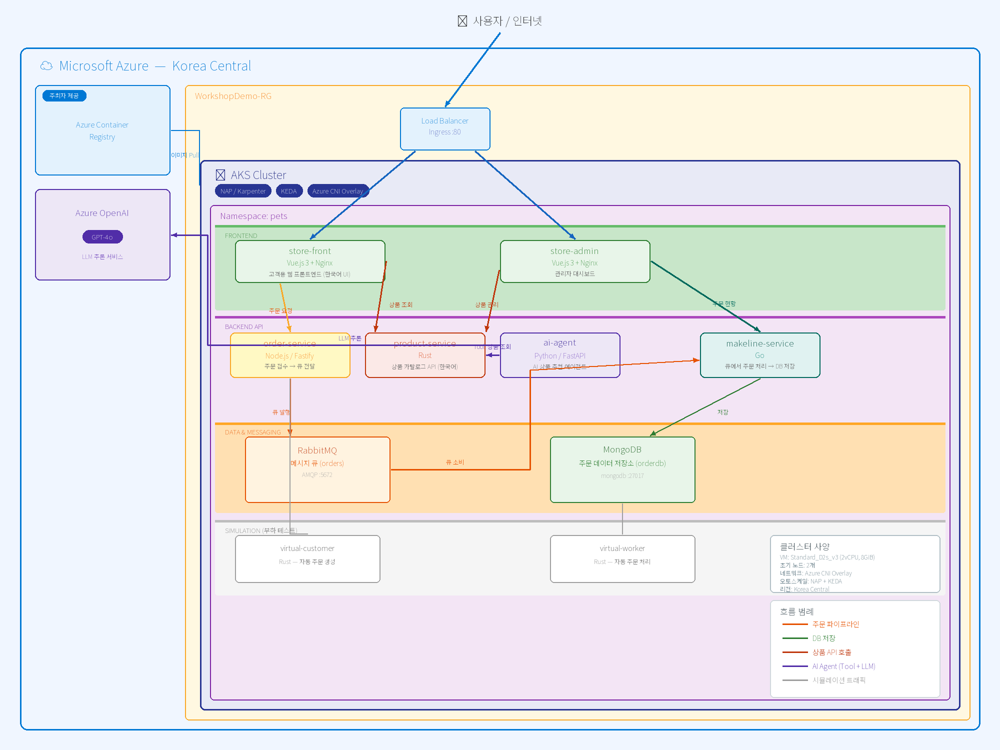
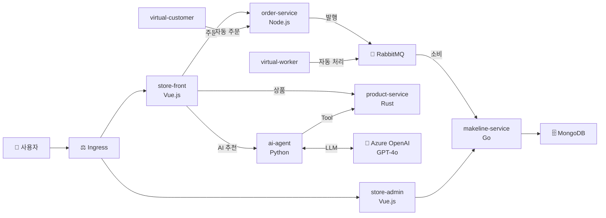

<div align="center">

# 🐾 AKS 펫 스토어 워크샵

**마이크로서비스 · 오토스케일링 · GitOps · AI Agent**


</div>

---

AKS(Azure Kubernetes Service) 핸즈온 워크샵입니다.  
마이크로서비스 기반 펫 스토어 애플리케이션을 AKS에 배포하고, 오토스케일링 · 노드 자동 프로비저닝 · 모니터링 · GitOps를 직접 체험합니다.

### 이 워크샵에서 체험하는 것

| | 항목 | 설명 |
|---|------|------|
| 📦 | **컨테이너 빌드 & 배포** | ACR Task로 이미지 빌드, 10개 마이크로서비스 한 번에 배포 |
| ⚖️ | **Ingress 라우팅** | Web App Routing으로 단일 IP 경로 기반 통합 |
| 📈 | **HPA 오토스케일링** | CPU 기반 Pod 수평 확장/축소 실시간 관찰 |
| 🚀 | **NAP 노드 확장** | Karpenter 기반 ~60초 내 노드 자동 프로비저닝 |
| 📊 | **모니터링 & 트러블슈팅** | Prometheus/Grafana + 실제 오류 재현 실습 |
| 🔄 | **GitOps** | Flux v2로 Git 커밋 → 클러스터 자동 반영 & 드리프트 복구 |
| 🤖 | **AI Agent** (선택) | Azure OpenAI 기반 LLM 상품 추천 에이전트 |

## 아키텍처



<details>
<summary><strong>📐 서비스 흐름도 (Mermaid)</strong></summary>



</details>

## 실습 환경

- **Azure Cloud Shell (Bash)** — 별도의 로컬 도구 설치 없이 브라우저에서 바로 실습
- 클러스터 생성: **Azure CLI** 또는 **Terraform** 선택 가능
- 리전: **Korea Central**
- 예상 비용: **~$0.73 (≈ ₩1,000)** / 워크샵 1회 (2시간)

### 권장 진행 경로

| 경로 | 구성 | 예상 시간 |
|------|------|----------|
| 🟢 **기본** (권장) | 01 → 02 → 03 → 04(Ingress) → 06 → 07 → 10 | **~115분** |
| 🟡 **표준** | 기본 + 08(모니터링 & 트러블슈팅) | **~140분** |
| 🟠 **심화** | 표준 + 09(GitOps) | **~165분** |
| 🟣 **풀코스** | 심화 + 05(AI Agent) | **~185분** |

## 워크샵 가이드

| # | 섹션 | 설명 | 경로 |
|---|------|------|------|
| 00 | [개요](docs/00-overview.md) | 아키텍처, 서비스 구성, 학습 목표 | — |
| 01 | [사전 준비](docs/01-prerequisites.md) | Cloud Shell, 구독 설정, ACR 생성 | 🟢 필수 |
| 02 | [클러스터 생성](docs/02-create-cluster.md) | AKS + NAP + KEDA + Azure CNI Overlay | 🟢 필수 |
| 03 | [빌드 & 푸시](docs/03-build-and-push.md) | 소스 커스터마이징, ACR Task 이미지 빌드 | 🟢 필수 |
| 04 | [앱 배포](docs/04-deploy-app.md) | K8s 배포 (LoadBalancer), Windows(선택) | 🟢 필수 |
| 05 | [Ingress](docs/05-ingress.md) | Web App Routing / AGC / approuting-istio 비교 + 핸즈온 | 🟢 필수 |
| 06 | [AI Agent](docs/06-ai-agent.md) | Azure OpenAI + AI 상품 추천 에이전트 | 🟣 선택 |
| 07 | [HPA 오토스케일링](docs/07-hpa-autoscaling.md) | CPU 기반 Pod 수평 확장 + 부하 실험 | 🟢 필수 |
| 08 | [NAP 노드 확장](docs/08-nap-node-scaling.md) | Karpenter 기반 노드 자동 프로비저닝 | 🟢 필수 |
| 09 | [모니터링 & 트러블슈팅](docs/09-monitoring-troubleshooting.md) | Prometheus/Grafana + 오류 재현 실습 | 🟡 권장 |
| 10 | [GitOps](docs/10-gitops-flux.md) | Flux v2 선언적 배포 & 드리프트 복구 | 🟡 권장 |
| 11 | [정리](docs/11-cleanup.md) | 리소스 삭제 | 🟢 필수 |

## 프로젝트 구조

```
azure-aks-workshop/
├── README.md
├── docs/                              # 워크샵 가이드 (섹션별)
│   ├── 00-overview.md ~ 11-cleanup.md
│   ├── architecture.drawio            # draw.io 아키텍처 다이어그램
│   └── images/                        # 스크린샷 및 다이어그램
├── aks-store-demo-ko/                 # 애플리케이션 소스
│   └── src/
│       ├── store-front/               # Vue.js 3 — 고객 웹 UI
│       ├── store-admin/               # Vue.js 3 — 관리자 대시보드
│       ├── ai-agent/                  # Python / FastAPI — AI 상품 추천
│       ├── product-service/           # Rust — 상품 카탈로그 API
│       ├── order-service/             # Node.js / Fastify — 주문 처리
│       ├── order-service-dotnet/      # .NET 8 — 주문 API (Windows 컨테이너)
│       ├── makeline-service/          # Go — 큐 소비 & DB 저장
│       ├── virtual-customer/          # Rust — 부하 생성기
│       └── virtual-worker/            # Rust — 자동 주문 처리기
├── terraform/                         # Terraform IaC (클러스터 생성 옵션 B)
│   ├── main.tf                        # AKS 클러스터 리소스 정의
│   ├── variables.tf                   # 변수 (구독, 리전, K8s 버전 등)
│   └── outputs.tf                     # 출력 (클러스터명, kubeconfig 명령)
├── gitops-manifests/                  # GitOps 매니페스트 (10절에서 생성)
└── workshop-manifests/                # Kubernetes 매니페스트
    ├── aks-store-all-in-one-ko.yaml   # 전체 스택 배포
    ├── 55-hpa-store.yaml              # HPA 설정
    ├── 60-ingress.yaml                # Ingress (Web App Routing)
    ├── 61-agc-gateway.yaml            # Gateway API (AGC)
    ├── 65-order-service-dotnet-windows.yaml  # .NET order-service (Windows)
    ├── 70-nap-nodepool.yaml           # NAP NodePool
    └── 90-ai-agent.yaml               # AI Agent (Azure OpenAI)
```

## 기술 스택

| 영역 | 기술 |
|------|------|
| **오케스트레이션** | AKS — NAP (Karpenter), KEDA, Azure CNI Overlay |
| **Ingress** | Web App Routing (관리형 NGINX) / AGC (Application Gateway for Containers) |
| **GitOps** | AKS Flux v2 확장 (선언적 배포, 드리프트 자동 복구) |
| **모니터링** | Azure 매니지드 Prometheus + 매니지드 Grafana |
| **IaC** | Azure CLI / Terraform (선택) |
| **프론트엔드** | Vue.js 3 + Vite + Nginx |
| **백엔드** | Rust, Node.js/Fastify, Go, Python/FastAPI, .NET 8 |
| **AI** | Azure OpenAI (GPT-4o) |
| **인프라** | MongoDB, RabbitMQ |
| **컨테이너** | Azure Container Registry (공용 + 개인) |
| **리전** | Korea Central |

## 🚀 시작하기

```bash
# 1. Azure Portal에서 Cloud Shell(Bash)을 엽니다
#    https://portal.azure.com → 상단 터미널 아이콘 클릭

# 2. 워크샵 저장소 클론
git clone https://github.com/bbiggum/azure-aks-workshop.git
cd azure-aks-workshop

# 3. 00. 워크샵 개요부터 순서대로 진행합니다
```

👉 **[00. 워크샵 개요부터 시작하기](docs/00-overview.md)**

## 대상

- Kubernetes 기본 개념(Pod, Deployment, Service)을 알고 있는 개발자/인프라 엔지니어
- Azure 구독이 있고 Cloud Shell을 사용할 수 있는 분
- AKS의 운영 기능(NAP, HPA, GitOps, 모니터링)을 실습으로 배우고 싶은 분

## 참고

이 워크샵은 [Azure-Samples/aks-store-demo](https://github.com/Azure-Samples/aks-store-demo)를 기반으로 워크샵 커리큘럼을 추가하여 작성되었습니다.
