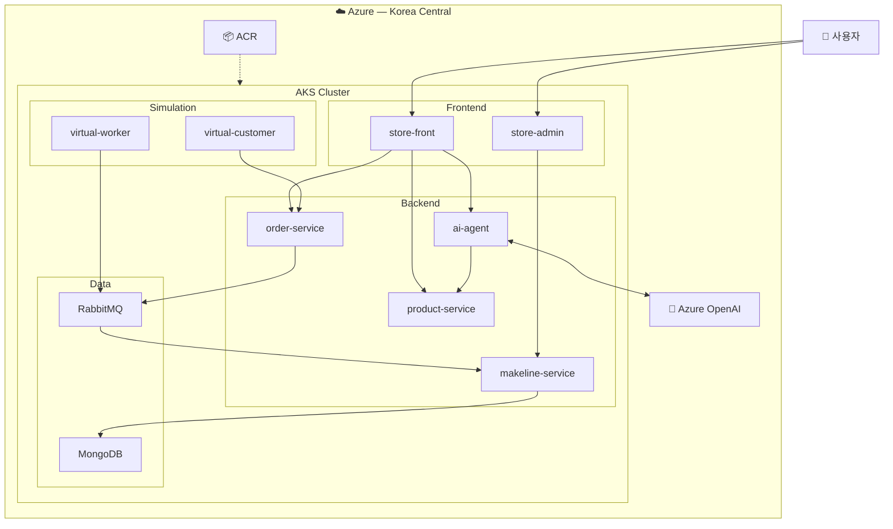

# 00. 워크샵 개요

## 목표

이 워크샵은 **AKS(Azure Kubernetes Service)** 위에 마이크로서비스 기반 펫 스토어 애플리케이션을 배포하고, 오토스케일링과 노드 자동 프로비저닝(NAP)을 직접 체험하는 핸즈온 과정입니다.

### 워크샵을 완료하면

- ✅ **AKS 클러스터를 직접 생성**하고 프로덕션급 기능(NAP, KEDA, CNI Overlay)을 활성화할 수 있습니다
- ✅ **컨테이너 이미지를 빌드**하고 ACR에 푸시하여 AKS에서 실행할 수 있습니다
- ✅ **10개 마이크로서비스를 한 번에 배포**하고 Ingress로 단일 IP로 통합할 수 있습니다
- ✅ **HPA로 Pod를 수평 확장**하고, **NAP(Karpenter)로 노드를 자동 추가**하는 과정을 실시간으로 관찰할 수 있습니다
- ✅ **Prometheus/Grafana로 모니터링**하고, 실제 오류 상황을 재현하여 **트러블슈팅**할 수 있습니다
- ✅ **GitOps(Flux v2)** 로 Git 커밋만으로 클러스터를 자동 업데이트하고 드리프트를 복구할 수 있습니다
- ✅ (선택) **Azure OpenAI 기반 AI Agent**를 배포하여 LLM 상품 추천 패턴을 체험할 수 있습니다

### 대상

- Kubernetes 기본 개념(Pod, Deployment, Service)을 알고 있는 개발자/인프라 엔지니어
- Azure 구독이 있고 Cloud Shell을 사용할 수 있는 분
- AKS의 운영 기능(NAP, HPA, GitOps, 모니터링)을 실습으로 배우고 싶은 분

## 학습 내용

| 섹션 | 주제 | 예상 시간 | 경로 |
|------|------|-----------|------|
| [01](01-prerequisites.md) | 사전 준비 — 구독, CLI, ACR | 10분 | 🟢 필수 |
| [02](02-create-cluster.md) | AKS 클러스터 생성 (NAP + KEDA + Azure CNI Overlay) | 15분 | 🟢 필수 |
| [03](03-build-and-push.md) | 애플리케이션 빌드 & ACR 푸시 | 15분 | 🟢 필수 |
| [04](04-deploy-app.md) | 펫 스토어 배포 + Ingress 설정 | 20분 | 🟢 필수 |
| [05](05-ai-agent.md) | AI Agent 배포 (Azure OpenAI) | 20분 | 🔵 선택 |
| [06](06-hpa-autoscaling.md) | HPA 오토스케일링 관찰 | 15분 | 🟢 필수 |
| [07](07-nap-node-scaling.md) | NAP(Karpenter) 노드 자동 확장 | 15분 | 🟢 필수 |
| [08](08-monitoring-troubleshooting.md) | 모니터링 & 트러블슈팅 실습 | 25분 | 🟡 권장 |
| [09](09-gitops-flux.md) | GitOps — Flux v2 배포 자동화 | 25분 | 🟡 권장 |
| [10](10-cleanup.md) | 정리 (리소스 삭제) | 5분 | 🟢 필수 |

### 권장 진행 경로

| 경로 | 구성 | 예상 시간 |
|------|------|-----------|
| 🟢 **기본** (권장) | 01 → 02 → 03 → 04(Ingress) → 06 → 07 → 10 | **~115분** |
| 🟡 **표준** | 기본 + 08(모니터링 & 트러블슈팅) | **~140분** |
| 🟠 **심화** | 표준 + 09(GitOps) | **~165분** |
| 🔵 **풀코스** | 심화 + 05(AI Agent) | **~185분** |

> [!TIP]
> 워크샵 시간이 2시간이라면 **기본** 경로를, 3시간이라면 **표준 + AI Agent** 조합을 권장합니다.
> 04절의 AGC(4-5)와 Windows 노드풀(4-6)은 시간 여유가 있을 때만 진행하세요.


### 서비스 흐름도



### 데이터 흐름 요약

| 흐름 | 경로 |
|------|------|
| **주문** | 사용자 → store-front → order-service → RabbitMQ → makeline-service → MongoDB |
| **AI 추천** | 사용자 → store-front → ai-agent → product-service(Tool) + Azure OpenAI(LLM) |
| **관리자** | 관리자 → store-admin → makeline-service → MongoDB |
| **부하 생성** | virtual-customer → order-service, virtual-worker → RabbitMQ |

### 서비스 구성

| 서비스 | 언어 | 역할 |
|--------|------|------|
| **store-front** | Vue.js 3 + Nginx | 고객용 웹 프론트엔드 |
| **store-admin** | Vue.js 3 + Nginx | 관리자 대시보드 |
| **product-service** | Rust | 상품 카탈로그 API |
| **order-service** | Node.js / Fastify | 주문 접수 → RabbitMQ 큐 전달 |
| **makeline-service** | Go | 큐에서 주문 처리 → MongoDB 저장 |
| **ai-agent** | Python / FastAPI | AI 상품 추천 에이전트 (Azure OpenAI) |
| **MongoDB** | — | 주문 데이터 저장소 |
| **RabbitMQ** | — | 메시지 큐 |
| **virtual-customer** | Rust | 부하 생성 (자동 주문) |
| **virtual-worker** | Rust | 자동 주문 처리 |

### Terraform 지원

| 항목 | 설명 |
|------|------|
| Terraform 파일 | `terraform/` 디렉터리 (main.tf, variables.tf, outputs.tf) |
| Azure CLI 대안 | 02절에서 CLI / Terraform 선택 가능 |

### 클러스터 구성

| 항목 | 설정 |
|------|------|
| VM SKU | Standard_D2s_v3 (2 vCPU, 8 GiB) |
| 초기 노드 수 | 2 |
| 네트워크 | Azure CNI Overlay |
| 노드 오토스케일링 | NAP (Node Auto Provisioning / Karpenter) |
| 이벤트 기반 스케일링 | KEDA |
| Ingress 컨트롤러 | Web App Routing (관리형 NGINX Ingress) |
| 컨테이너 레지스트리 | 공용 ACR (사전 제공) + 개인 ACR (참가자 생성) |

### 리소스 그룹 구성

| 리소스 그룹 | 포함 리소스 | 정리 정책 |
|-------------|-----------|-----------|
| `WorkshopDemo-RG` | AKS 클러스터, 개인 ACR, 노드 VMSS, LoadBalancer, Public IP 등 | 워크샵 종료 시 **삭제** |

> 워크샵 정리 시 `WorkshopDemo-RG`만 삭제하면 모든 워크샵 리소스가 한 번에 정리됩니다.  
> 대부분의 서비스 이미지는 **공용 ACR**(`aksworkshopkoea6e`)에 사전 빌드되어 있으며, 참가자는 `store-admin` 커스터마이징을 위해 **개인 ACR**을 `WorkshopDemo-RG`에 생성합니다 (01절 참조).

## 예상 비용

> 모든 비용은 Korea Central 리전, Linux, 종량제(Pay-As-You-Go) 기준 **추정치**입니다.  
> 실제 비용은 구독 유형, 예약 할인, 사용 패턴에 따라 달라질 수 있습니다.

### 워크샵 1회 실행 비용 (~2시간)

| 리소스 | 사양 | 시간당 비용 | 2시간 예상 |
|--------|------|-----------|-----------|
| AKS 컨트롤 플레인 | Free tier | $0 | $0 |
| 노드 VM × 2 | Standard_D2s_v3 (2 vCPU, 8 GiB) | ~$0.114 × 2 | ~$0.46 |
| NAP 자동 추가 노드 | Standard_D8als_v6 (일시적, ~15분) | ~$0.35 | ~$0.09 |
| Standard Load Balancer | 규칙 1개 (Ingress) | ~$0.025 | ~$0.05 |
| Public IP × 1 | Standard Static (Ingress) | ~$0.005 | ~$0.01 |
| OS 디스크 × 2 | 128GB Managed | ~$0.005 × 2 | ~$0.02 |
| Azure Monitor Workspace | 매니지드 Prometheus | ~$0.10/GB 수집 | ~$0.01 |
| Azure 매니지드 Grafana | Essential tier | ~$0.05 | ~$0.10 |
| **소계 (워크샵 1회)** | | | **~$0.73** |

### 상시 유지 비용

> 공용 ACR은 워크샵 주최자가 사전 제공하며, 개인 ACR은 `WorkshopDemo-RG`에 포함되므로 리소스 그룹 삭제 시 함께 정리됩니다.

### 비용 요약

```
워크샵 1회 (2시간):  약 $0.73  (≈ ₩1,000)
```

> [!TIP]
> **비용 절감 팁**
> - 워크샵 종료 후 반드시 `WorkshopDemo-RG`를 삭제하세요 (10-cleanup 참조)
> - NAP 노드는 부하 제거 시 자동으로 축소되므로 별도 조치 불필요

---

| | |
|:---|---:|
| | [01. 사전 준비 ➡️](01-prerequisites.md) |
