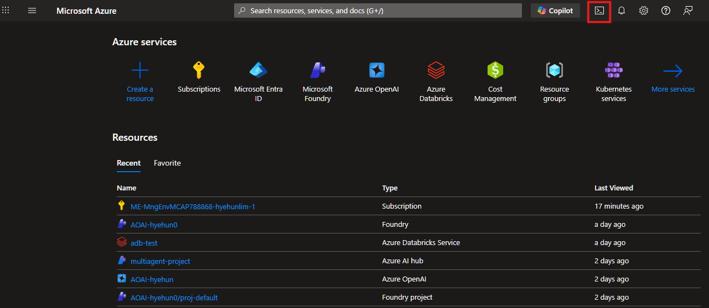
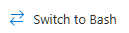
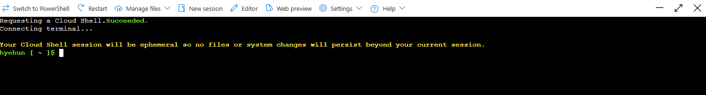

# 01. 사전 준비

워크샵을 시작하기 전에 Azure 구독, CLI 도구, 컨테이너 레지스트리를 준비합니다.  
모든 실습은 **Azure Cloud Shell**에서 진행하므로 로컬 환경에 별도 설치가 필요 없습니다.

### 이 섹션에서 수행하는 작업

- **Cloud Shell 접속** — 브라우저에서 바로 사용 가능한 Azure 관리 터미널
- **구독 설정** — 워크샵에 사용할 Azure 구독 선택
- **리소스 그룹 생성** — `WorkshopDemo-RG`에 모든 워크샵 리소스를 한 곳에 관리
- **개인 ACR 생성** — `store-admin` 커스터마이징 이미지를 저장할 컨테이너 레지스트리
- **환경 변수 설정** — 이후 섹션에서 반복 사용할 변수 (`RESOURCE_GROUP`, `CLUSTER_NAME` 등)

## 실습 환경: Azure Cloud Shell

이 워크샵은 **Azure Cloud Shell (Bash)** 환경에서 진행합니다.  
Cloud Shell에는 `az`, `kubectl`, `helm` 등 필요한 도구가 **사전 설치**되어 있어 별도의 로컬 설치가 필요 없습니다.

### Cloud Shell 시작 방법

1. [Azure Portal](https://portal.azure.com)에 로그인합니다.
2. 상단 메뉴바의 **Cloud Shell 아이콘** (터미널 모양 `>_`)을 클릭합니다.

   

3. 처음 실행 시 **Bash**를 선택하고, 스토리지 계정 생성을 안내에 따라 진행합니다.

   

4. 하단에 Cloud Shell 터미널이 열리면 준비 완료입니다.

   

> [!TIP]
> Cloud Shell 터미널 크기가 작으면, 상단의 **최대화** 버튼으로 전체 화면으로 전환할 수 있습니다.

## 1-1. 구독 확인 & 설정

먼저 사용 가능한 Azure 구독 목록을 확인합니다.

```bash
# 구독 목록 확인
az account list -o table
```

출력 예시:

```
Name              CloudName    SubscriptionId                        TenantId                              State    IsDefault
----------------  -----------  ------------------------------------  ------------------------------------  -------  ---------
워크샵 구독        AzureCloud   xxxxxxxx-xxxx-xxxx-xxxx-xxxxxxxxxxxx  xxxxxxxx-xxxx-xxxx-xxxx-xxxxxxxxxxxx  Enabled  True
다른 구독          AzureCloud   yyyyyyyy-yyyy-yyyy-yyyy-yyyyyyyyyyyy  xxxxxxxx-xxxx-xxxx-xxxx-xxxxxxxxxxxx  Enabled  False
```

워크샵에 사용할 구독을 선택하고 설정합니다.

```bash
# 사용할 구독 설정 (위 목록에서 확인한 SubscriptionId 사용)
az account set --subscription "<구독 ID>"

# 설정된 구독 확인
az account show -o table
```

## 1-2. 리소스 그룹 생성

```bash
# 워크샵 리소스 그룹 생성 (AKS 클러스터 등 모든 워크샵 리소스가 여기에 생성됩니다)
az group create --name WorkshopDemo-RG --location koreacentral -o table

# 리소스 그룹 이름을 환경 변수로 설정 (이후 명령에서 사용)
export RESOURCE_GROUP="WorkshopDemo-RG"
```

## 1-3. Azure Container Registry 생성

`store-admin` 이미지를 직접 빌드하고 푸시하기 위해 **개인 ACR**을 생성합니다.

```bash
# 고유한 ACR 이름 생성 (영소문자+숫자만, 글로벌 유일)
MY_ACR_NAME="workshop$(whoami | tr -d '.-_')$(openssl rand -hex 2)"
echo "내 ACR 이름: $MY_ACR_NAME"

# ACR 생성 (WorkshopDemo-RG에 함께 생성 — 워크샵 종료 시 자동 삭제)
az acr create \
  --resource-group $RESOURCE_GROUP \
  --name $MY_ACR_NAME \
  --sku Basic \
  --location koreacentral \
  -o table
```

> [!NOTE]
> 개인 ACR은 `WorkshopDemo-RG`에 생성하므로, 워크샵 종료 시 리소스 그룹 삭제와 함께 자동 정리됩니다.

## 1-4. 환경 변수 설정 (이후 섹션에서 재사용)

```bash
# RESOURCE_GROUP은 1-2에서, MY_ACR_NAME은 1-3에서 이미 설정했으므로
# 새 Cloud Shell 세션에서만 다시 실행하세요
export RESOURCE_GROUP="WorkshopDemo-RG"
export CLUSTER_NAME="workshop-demo"
export LOCATION="koreacentral"

# 개인 ACR 이름을 Azure CLI로 조회하여 설정
export MY_ACR_NAME=$(az acr list --resource-group $RESOURCE_GROUP --query "[?starts_with(name,'workshop')].name" -o tsv)
echo "MY_ACR_NAME=$MY_ACR_NAME"
```

## 사전 점검 체크리스트

```bash
az account show -o table                  # 올바른 구독 선택됨
az group show -n WorkshopDemo-RG -o table # 워크샵 리소스 그룹 존재
echo "MY_ACR_NAME=$MY_ACR_NAME"           # 개인 ACR 이름이 출력되는지 확인
az acr show -n $MY_ACR_NAME -o table      # 개인 ACR 생성 확인
```

> [!WARNING]
> `MY_ACR_NAME`이 비어있으면 1-3 단계를 다시 실행하세요.

---

| | |
|:---|---:|
| [⬅️ 00. 워크샵 개요](00-overview.md) | [02. 클러스터 생성 ➡️](02-create-cluster.md) |
