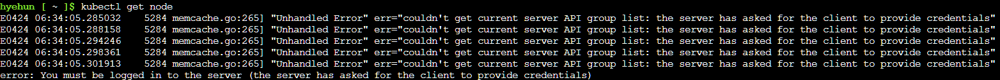

# 02. AKS 클러스터 생성

## 2-1. 클러스터 생성

NAP(Node Auto Provisioning), KEDA, Azure CNI Overlay를 활성화한 AKS 클러스터를 생성합니다.

```bash
az aks create \
  --name $CLUSTER_NAME \
  --resource-group $RESOURCE_GROUP \
  --location $LOCATION \
  --node-count 2 \
  --node-vm-size Standard_D2s_v3 \
  --enable-keda \
  --node-provisioning-mode Auto \
  --network-plugin azure \
  --network-plugin-mode overlay \
  --generate-ssh-keys \
  -o table
```

> ⏱ 클러스터 생성에 약 5~10분 소요됩니다.

### 주요 옵션 설명

| 옵션 | 설명 |
|------|------|
| `--node-provisioning-mode Auto` | NAP(Karpenter 기반) 활성화 — 워크로드에 맞춰 노드를 자동 생성/삭제 |
| `--enable-keda` | KEDA(이벤트 기반 오토스케일러) 활성화 |
| `--network-plugin azure --network-plugin-mode overlay` | Azure CNI Overlay 네트워크 (Pod IP ↔ 노드 IP 분리) |
| `--generate-ssh-keys` | 노드 VM용 SSH 키 쌍을 `~/.ssh/id_rsa`에 자동 생성 (이미 있으면 기존 키 재사용) |

> **💡 Cilium 옵션**: Linux 전용 클러스터에서 고성능 eBPF 네트워크가 필요하면 `--network-dataplane cilium`을 추가할 수 있습니다.  
> 단, **Cilium은 Windows 노드를 지원하지 않으므로**, 4-6절(Windows .NET 배포) 핸즈온을 진행하려면 Cilium 없이 클러스터를 생성하세요.

> **💡 Tip**: 클러스터 생성 시 `--enable-app-routing` 옵션을 추가하면 Web App Routing(관리형 NGINX Ingress)이 함께 활성화됩니다. 이후 [04. 펫 스토어 배포](04-deploy-app.md)의 Ingress 핸즈온에서 사용합니다.
> ```bash
> # 기존 클러스터에 나중에 활성화하려면:
> az aks approuting enable --name $CLUSTER_NAME --resource-group $RESOURCE_GROUP
> ```

## 2-2. ACR 연결

AKS 클러스터가 ACR에서 이미지를 풀(pull) 할 수 있도록 연결합니다.

```bash
# 공용 ACR 연결 (주최자 제공 이미지)
az aks update \
  --name $CLUSTER_NAME \
  --resource-group $RESOURCE_GROUP \
  --attach-acr aksworkshopkoea6e

# 개인 ACR 연결 (store-admin 이미지)
az aks update \
  --name $CLUSTER_NAME \
  --resource-group $RESOURCE_GROUP \
  --attach-acr $MY_ACR_NAME
```

## 2-3. kubeconfig 설정

```bash
az aks get-credentials \
  --name $CLUSTER_NAME \
  --resource-group $RESOURCE_GROUP \
  --overwrite-existing
```

## 2-4. 클러스터 상태 확인

```bash
# 노드 상태
kubectl get nodes -o wide

# NAP/Karpenter NodePool 확인
kubectl get nodepools.karpenter.sh
kubectl get aksnodeclasses.karpenter.azure.com
```

> **⚠️ 아래와 같은 에러가 나타나면** 2-3의 `az aks get-credentials` 가 정상 실행되지 않은 것입니다.  
> 2-3 단계를 다시 실행한 후 재시도하세요.
>
> 

### 예상 출력

```
NAME                                STATUS   ROLES    AGE   VERSION
aks-nodepool1-21419660-vmss000000   Ready    <none>   68m   v1.34.4
aks-nodepool1-21419660-vmss000001   Ready    <none>   68m   v1.34.4
```

```
NAME           NODECLASS      NODES   READY   AGE
default        default        0       True    67m
system-surge   system-surge   0       True    67m

NAME           READY   AGE
default        True    67m
system-surge   True    67m
```

> **참고**: NAP 모드에서 Karpenter 컨트롤러는 AKS 관리 컨트롤 플레인 내부에서 실행되므로 `kube-system` 네임스페이스에 Karpenter Pod가 보이지 않습니다. `kubectl get nodepools.karpenter.sh` 명령으로 동작을 확인하세요.

## 점검 체크리스트

- [ ] `kubectl get nodes` — 2개 노드 Ready
- [ ] `kubectl get nodepools.karpenter.sh` — default, system-surge NodePool 존재
- [ ] `az aks show -n $CLUSTER_NAME -g $RESOURCE_GROUP --query "nodeProvisioningProfile"` — mode: Auto 확인

---

| | |
|:---|---:|
| [⬅️ 01. 사전 준비](01-prerequisites.md) | [03. 빌드 & 푸시 ➡️](03-build-and-push.md) |
