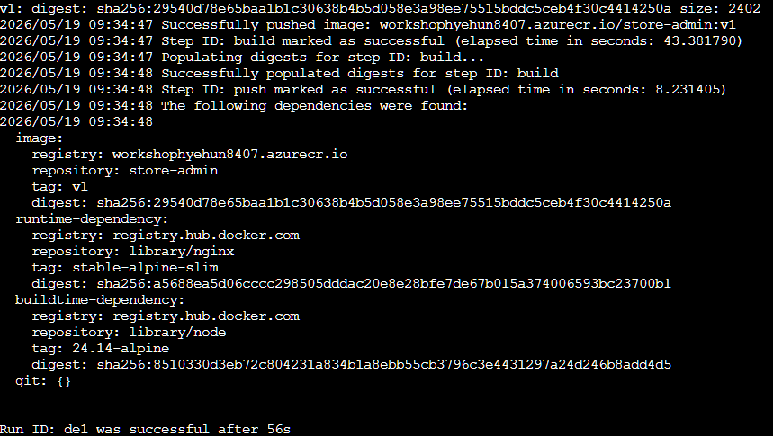

# 03. 애플리케이션 빌드 & ACR 푸시

<details>
<summary><strong>⚠️ Cloud Shell 세션이 만료된 경우 — 환경 변수 재설정</strong></summary>

```bash
export RESOURCE_GROUP="WorkshopDemo-RG"
export CLUSTER_NAME="workshop-demo"
export LOCATION="koreacentral"
export MY_ACR_NAME=$(az acr list --resource-group $RESOURCE_GROUP --query "[?starts_with(name,'workshop')].name" -o tsv)
```

</details>

AKS에 애플리케이션을 배포하려면 먼저 컨테이너 이미지를 준비해야 합니다.  
이 섹션에서는 워크샵 소스를 클론하고, `store-admin` 서비스의 UI를 커스터마이징한 후 **ACR Task**를 사용하여 클라우드에서 직접 컨테이너 이미지를 빌드합니다.

### 이 섹션에서 배우는 것

- **ACR Task** — 로컬 Docker 데몬 없이 Azure에서 원격 빌드하는 방법
- **매니페스트 치환** — `sed`로 이미지 레지스트리를 동적으로 교체하는 패턴
- **공용/개인 ACR 전략** — 대부분의 이미지는 공용 ACR에서 풀하고, 커스터마이징한 이미지만 개인 ACR에서 관리

> [!NOTE]
> `store-admin`을 제외한 나머지 서비스 이미지는 사전 빌드하여 공용 ACR에 준비해 두었습니다. 참가자는 `store-admin`만 직접 빌드합니다.

## 3-1. 소스 클론

Cloud Shell에서 워크샵 리포지터리를 클론합니다.

```bash
git clone https://github.com/bbiggum/azure-aks-workshop.git
cd azure-aks-workshop
```

## 3-2. 소스 구조 확인

`aks-store-demo-ko/src/` 디렉터리에 소스가 있습니다.

```
aks-store-demo-ko/src/
├── store-front/          # Vue.js 3 — 고객 웹 UI
├── store-admin/          # Vue.js 3 — 관리자 대시보드  ← 직접 빌드
├── ai-agent/             # Python / FastAPI — AI 상품 추천 에이전트
├── ai-service/           # Python / FastAPI — AI 서비스 백엔드
├── product-service/      # Rust — 상품 카탈로그
├── order-service/        # Node.js / Fastify — 주문 처리
├── order-service-dotnet/ # .NET 8 — 주문 처리 (Windows 버전)
├── makeline-service/     # Go — 큐 소비 & DB 저장
├── virtual-customer/     # Rust — 부하 생성기
└── virtual-worker/       # Rust — 자동 주문 처리기
```

## 3-3. store-admin 소스 수정

`aks-store-demo-ko/src/store-admin/` 디렉터리에서 원하는 부분을 자유롭게 수정하세요.

예시 — 페이지 타이틀 변경:

```bash
# 현재 타이틀 확인
grep "<title>" aks-store-demo-ko/src/store-admin/index.html
# 출력: <title>Contoso 펫 스토어 관리자 포털</title>
```

`sed` 명령어로 바로 변경할 수 있습니다. `내 펫 스토어` 부분을 원하는 이름으로 바꾸세요:

```bash
# 타이틀 변경 (예: "내 펫 스토어 관리자 포털")
sed -i 's/Contoso 펫 스토어/내 펫 스토어/' aks-store-demo-ko/src/store-admin/index.html

# 변경 확인
grep "<title>" aks-store-demo-ko/src/store-admin/index.html
```

> [!TIP]
> 04절에서 배포 후 브라우저에서 자신이 변경한 타이틀이 보이는지 확인하세요!

원하는 텍스트로 수정한 뒤 다음 단계에서 개인 ACR에 빌드합니다.

## 3-4. 이미지 빌드 & ACR 푸시

ACR Task를 사용하여 **클라우드에서 원격 빌드** 후 개인 ACR에 푸시합니다.

```bash
# 리포 루트로 이동
cd ~/azure-aks-workshop

# 개인 ACR에 store-admin 빌드 (ACR Task — 원격 빌드)
az acr build \
  --registry $MY_ACR_NAME \
  --image store-admin:v1 \
  --file aks-store-demo-ko/src/store-admin/Dockerfile \
  aks-store-demo-ko/src/store-admin/
```

> [!TIP]
> **ACR Task**: `az acr build`는 Docker 데몬 없이 Azure에서 직접 이미지를 빌드합니다.  
> Cloud Shell 환경에서도 별도의 Docker 설치 없이 사용할 수 있습니다.

> 📸 **스크린샷**: ACR Task 빌드 완료 화면
>
> 

빌드 확인:

```bash
az acr repository list --name $MY_ACR_NAME -o table
```

```
Result
-----------
store-admin
```

## 3-5. 매니페스트 내 ACR 이름 수정

`workshop-manifests/aks-store-all-in-one-ko.yaml` 파일에서 store-admin 이미지만 개인 ACR로 변경합니다.

```bash
cd ~/azure-aks-workshop

# store-admin 이미지만 개인 ACR로 변경
sed -i "s|aksworkshopkoea6e.azurecr.io/store-admin:ko|$MY_ACR_NAME.azurecr.io/store-admin:v1|g" \
  workshop-manifests/aks-store-all-in-one-ko.yaml
```

확인:

```bash
grep "azurecr.io" workshop-manifests/aks-store-all-in-one-ko.yaml
```

```diff
# 예상 출력 — store-admin만 개인 ACR, 나머지는 공용 ACR
          image: aksworkshopkoea6e.azurecr.io/order-service:ko
          image: aksworkshopkoea6e.azurecr.io/makeline-service:ko
          image: aksworkshopkoea6e.azurecr.io/product-service:ko
          image: aksworkshopkoea6e.azurecr.io/store-front:ko
+         image: <내 ACR 이름>.azurecr.io/store-admin:v1          ← ✅ 개인 ACR
          image: aksworkshopkoea6e.azurecr.io/virtual-customer:ko
          image: aksworkshopkoea6e.azurecr.io/virtual-worker:ko
```

## 점검 체크리스트

- [ ] `az acr repository list --name $MY_ACR_NAME -o table` — 개인 ACR에 store-admin 이미지 존재
- [ ] `grep "azurecr.io" workshop-manifests/aks-store-all-in-one-ko.yaml` — store-admin만 개인 ACR을 가리킴

> [!TIP]
> 04절에서 앱을 배포한 뒤 브라우저에서 `store-admin`에 접속해 보세요. 3-3에서 변경한 타이틀이 화면에 표시되면 성공입니다!

---

| | |
|:---|---:|
| [⬅️ 02. 클러스터 생성](02-create-cluster.md) | [04. 앱 배포 ➡️](04-deploy-app.md) |
