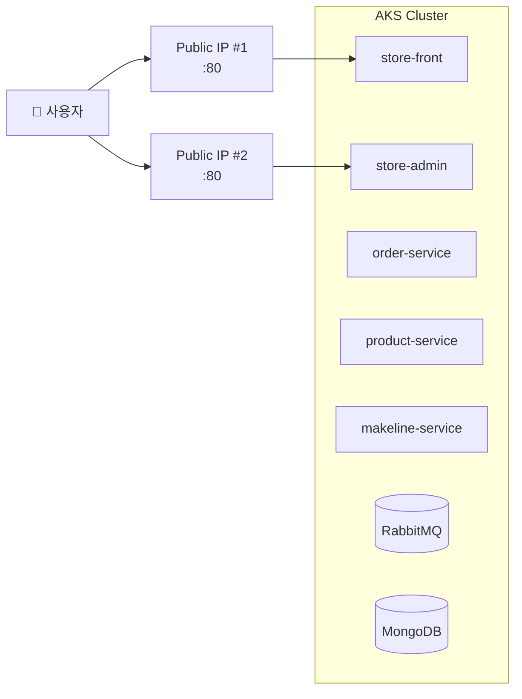
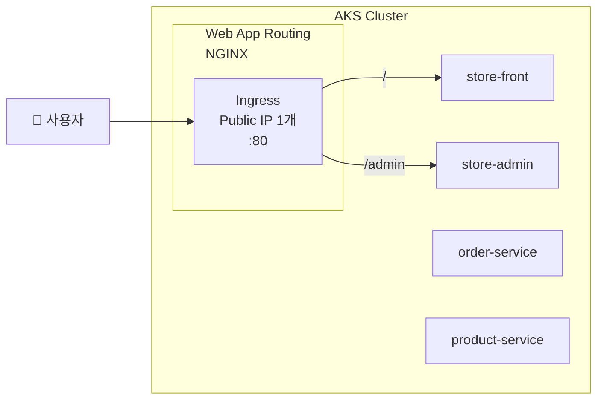
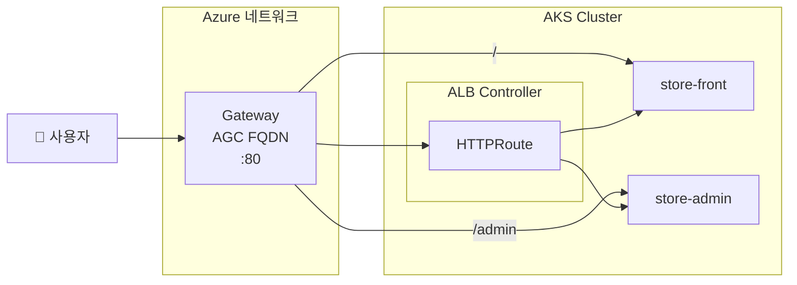
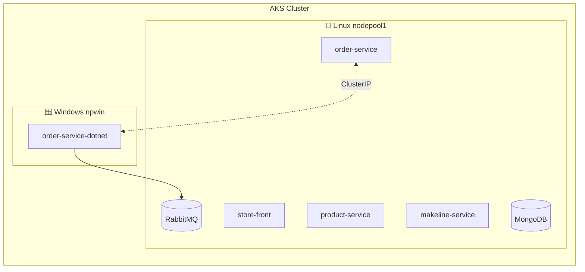

# 04. 펫 스토어 배포

<details>
<summary><strong>⚠️ Cloud Shell 세션이 만료된 경우 — 환경 변수 재설정</strong></summary>

```bash
export RESOURCE_GROUP="WorkshopDemo-RG"
export CLUSTER_NAME="workshop-demo"
export LOCATION="koreacentral"
export MY_ACR_NAME=$(az acr list --resource-group $RESOURCE_GROUP --query "[?starts_with(name,'workshop')].name" -o tsv)
az aks get-credentials --name $CLUSTER_NAME --resource-group $RESOURCE_GROUP --overwrite-existing
```

</details>

## 목차

- [4-1. 전체 스택 배포](#4-1-전체-스택-배포)
- [4-2. 배포 상태 확인](#4-2-배포-상태-확인)
- [4-3. 외부 접속 확인](#4-3-외부-접속-확인)
- [4-4. Ingress로 단일 IP 노출 (핸즈온)](#4-4-ingress로-단일-ip-노출-핸즈온)
- [4-5. (옵션 B) AGC](#4-5-옵션-b-agc--application-gateway-for-containers-preview) — 고급
- [4-6. (선택) Windows 노드풀 + .NET](#4-6-선택-사항-windows-노드풀--net-order-service) — 선택
- [트러블슈팅](#트러블슈팅)

이제 마이크로서비스 기반 펫 스토어 애플리케이션을 AKS 클러스터에 배포합니다.  
하나의 YAML 매니페스트로 10개 서비스(MongoDB, RabbitMQ, 백엔드 API, 프론트엔드, 부하 생성기)를 한 번에 배포하고,
**Ingress**로 단일 IP 로드 밸런싱을 구성하는 과정을 체험합니다.

### 이 섹션에서 배우는 것

- **Kubernetes 워크로드 배포** — Deployment, StatefulSet, Service, Namespace
- **외부 접속** — LoadBalancer Service로 브라우저 접속
- **Ingress 라우팅** — Web App Routing으로 경로 기반 단일 IP 통합
- **(선택) AGC** — Azure 네이티브 L7 로드 밸런싱 (Gateway API)
- **(선택) Windows 노드풀** — Linux/Windows 혼합 클러스터 운영

---

## 4-1. 전체 스택 배포

모든 서비스를 한 번에 배포합니다.

```bash
kubectl apply -f workshop-manifests/aks-store-all-in-one-ko.yaml
```

### 생성되는 리소스

| 리소스 | 이름 | 네임스페이스 | 비고 |
|--------|------|-------------|------|
| Namespace | `pets` | — | 모든 리소스의 네임스페이스 |
| StatefulSet | `mongodb` | pets | 주문 DB (MongoDB 4.2) |
| StatefulSet | `rabbitmq` | pets | 메시지 큐 (RabbitMQ 3.13) |
| Deployment | `order-service` | pets | 주문 접수 API |
| Deployment | `makeline-service` | pets | 주문 처리 워커 |
| Deployment | `product-service` | pets | 상품 카탈로그 API |
| Deployment | `store-front` | pets | 고객 웹 UI (replicas: 2) |
| Deployment | `store-admin` | pets | 관리자 UI |
| Deployment | `virtual-customer` | pets | 부하 생성기 |
| Deployment | `virtual-worker` | pets | 자동 주문 처리 |
| Service | `store-front` | pets | **LoadBalancer** (포트 80) |
| Service | `store-admin` | pets | **LoadBalancer** (포트 80) |
| Service | 나머지 | pets | ClusterIP (내부 전용) |

### Service 타입 비교

| 타입 | 접근 범위 | 동작 방식 | 이 워크샵에서의 용도 |
|------|----------|----------|-------------------|
| **ClusterIP** | 클러스터 내부만 | Pod 간 내부 통신용 가상 IP 할당 | `order-service`, `product-service` 등 백엔드 |
| **NodePort** | 노드 IP + 지정 포트 | 각 노드의 `30000~32767` 포트를 외부에 오픈 | (이 워크샵에서는 미사용) |
| **LoadBalancer** | 인터넷 공개 | Azure Load Balancer를 생성하여 **공인 IP** 할당 | `store-front`, `store-admin` 웹 UI |

> [!NOTE]
> 이 워크샵에서는 `store-front`와 `store-admin`만 LoadBalancer로 외부에 노출하고, 나머지 서비스는 ClusterIP로 내부 통신만 허용합니다.
> 4-4절에서 Ingress를 적용하면 LoadBalancer 2개를 **하나의 IP로 통합**합니다.

> [!WARNING]
> **보안 참고**: 이 매니페스트에는 RabbitMQ 기본 자격증명(`username`/`password`)이 포함되어 있습니다.
> 워크샵 데모 전용이며, **프로덕션 환경에서는 반드시 강력한 비밀번호로 변경**하고 Azure Key Vault 등과 연동하세요.

## 4-2. 배포 상태 확인

```bash
# Pod 상태 확인 (모두 Running / 1/1 Ready 확인)
kubectl get pods -n pets -w
```

> [!NOTE]
> ⏱ 모든 Pod가 Ready가 되기까지 약 2~3분 소요됩니다.  
> MongoDB가 먼저 Ready가 되어야 makeline-service가 정상 기동합니다.

### 실행 결과

```
NAME                                READY   STATUS    RESTARTS      AGE
makeline-service-c8568b9c7-5jmqz    1/1     Running   0             13m
mongodb-0                           1/1     Running   0             14m
order-service-c9cd69cff-dt7hf       1/1     Running   0             13m
product-service-5497bfff7f-jmr2q    1/1     Running   0             13m
rabbitmq-0                          1/1     Running   0             13m
store-admin-666f7897d4-cmsjc        1/1     Running   0             2m11s
store-front-7dfd9dd7cf-m2jwm        1/1     Running   0             25s
store-front-7dfd9dd7cf-ssvh4        1/1     Running   0             15s
virtual-customer-67674c6946-zp4gx   1/1     Running   0             13m
virtual-worker-5486bbb9b6-wkzpf     1/1     Running   3 (12m ago)   13m
```


## 4-3. 외부 접속 확인

현재 배포 상태에서는 `store-front`와 `store-admin`이 각각 **별도의 LoadBalancer IP**를 가집니다.



```bash
kubectl get svc -n pets
```

```
NAME               TYPE           CLUSTER-IP     EXTERNAL-IP     PORT(S)              AGE
makeline-service   ClusterIP      10.0.89.12     <none>          3001/TCP             3m10s
mongodb            ClusterIP      10.0.254.91    <none>          27017/TCP            3m13s
order-service      ClusterIP      10.0.31.61     <none>          3000/TCP             3m11s
product-service    ClusterIP      10.0.141.175   <none>          3002/TCP             3m10s
rabbitmq           ClusterIP      10.0.202.128   <none>          5672/TCP,15672/TCP   3m12s
store-admin        LoadBalancer   10.0.176.39    20.249.27.125   80:30691/TCP         3m9s
store-front        LoadBalancer   10.0.59.53     20.200.224.21   80:30942/TCP         3m9s
```

### 브라우저 접속

1. **고객 스토어**: `http://<store-front EXTERNAL-IP>`
   - 제목: "Contoso 펫 스토어"
   - 상품 목록이 표시됨 (예: "짭짤한 선원의 삑삑 오징어")

   > 📸 **스크린샷**: store-front 고객 스토어 화면
   >
   > 

2. **관리자 대시보드**: `http://<store-admin EXTERNAL-IP>`
   - 주문 목록 확인 (virtual-customer가 자동 주문 생성 중)
   - **03절에서 수정한 타이틀이 반영되었는지 확인하세요!** 자신이 빌드한 이미지가 실행되고 있습니다.

   > 📸 **스크린샷**: store-admin 관리자 대시보드
   >
   > 

### CLI로 상품 확인

```bash
STORE_IP=$(kubectl get svc store-front -n pets -o jsonpath='{.status.loadBalancer.ingress[0].ip}')
curl -s http://$STORE_IP/api/products | python3 -c "
import sys, json
for p in json.load(sys.stdin):
    print(f\"{p['id']}. {p['name']} — ₩{p['price']}\")
"
```

### 예상 출력

```
1. 콘토소 캣닢 친구 — ₩9.99
2. 짭짤한 선원의 삑삑 오징어 — ₩6.99
3. 인어공주 쥐돌이 3형제 — ₩12.99
4. 바다 탐험가 퍼즐볼 — ₩11.99
5. 해적 앵무새 낚싯대 — ₩8.99
6. 뱃사람의 터그 로프 — ₩14.99
7. 조개 포근 침대 — ₩19.99
8. 해양 매듭 공 — ₩7.99
9. 콘토소 집게발 꽃게 장난감 — ₩3.99
10. 어이 강아지 구명조끼 — ₩5.99
...
```

## 4-4. Ingress로 단일 IP 노출 (핸즈온)

현재 store-front과 store-admin이 각각 별도의 LoadBalancer IP를 가지고 있습니다.  
**Ingress**를 사용하면 하나의 IP로 경로 기반 라우팅이 가능합니다.



### LoadBalancer vs Ingress 비교

| 항목 | LoadBalancer (현재) | Ingress (이번 실습) |
|------|-------------------|-------------------|
| 외부 IP 수 | 서비스당 1개 (2개) | **1개로 통합** |
| 비용 | Public IP × 2 + LB 규칙 × 2 | Public IP × 1 + LB 규칙 × 1 |
| 경로 기반 라우팅 | ❌ | ✅ (path-based routing) |
| TLS 종료 | 각 서비스에서 처리 | Ingress에서 중앙 처리 |

### Step 1: Web App Routing 애드온 활성화

AKS의 관리형 NGINX Ingress 컨트롤러를 활성화합니다.

```bash
az aks approuting enable \
  --name $CLUSTER_NAME \
  --resource-group $RESOURCE_GROUP
```

> [!NOTE]
> ⏱ 약 1~2분 소요됩니다.

활성화 확인:

```bash
# Ingress 컨트롤러 Pod 확인
kubectl get pods -n app-routing-system

# IngressClass 확인
kubectl get ingressclass
```

### 예상 출력

```
NAME                                   READY   STATUS    RESTARTS   AGE
nginx-0                                1/1     Running   0          1m
```

```
NAME                                 CONTROLLER                                 PARAMETERS   AGE
webapprouting.kubernetes.azure.com   webapprouting.kubernetes.azure.com/nginx   <none>       3m
```

### Step 2: Service 타입을 ClusterIP로 변경

Ingress가 트래픽을 라우팅하므로 store-front, store-admin의 Service를 ClusterIP로 변경합니다.

```bash
kubectl patch svc store-front -n pets -p '{"spec": {"type": "ClusterIP"}}'
kubectl patch svc store-admin -n pets -p '{"spec": {"type": "ClusterIP"}}'
```

변경 확인:

```bash
kubectl get svc -n pets store-front store-admin
```

```
NAME          TYPE        CLUSTER-IP    EXTERNAL-IP   PORT(S)   AGE
store-front   ClusterIP   10.0.59.53    <none>        80/TCP    11m
store-admin   ClusterIP   10.0.176.39   <none>        80/TCP    11m
```

> 기존 LoadBalancer External IP는 더 이상 접근되지 않습니다.

### Step 3: Ingress 리소스 배포

```bash
kubectl apply -f workshop-manifests/60-ingress.yaml
```

매니페스트 내용 (`workshop-manifests/60-ingress.yaml`):

```yaml
apiVersion: networking.k8s.io/v1
kind: Ingress
metadata:
  name: pets-ingress
  namespace: pets
  annotations:
    nginx.ingress.kubernetes.io/ssl-redirect: "false"
    nginx.ingress.kubernetes.io/use-regex: "true"
    nginx.ingress.kubernetes.io/rewrite-target: /$2
spec:
  ingressClassName: webapprouting.kubernetes.azure.com
  rules:
    - http:
        paths:
          - path: /admin(/|$)(.*)
            pathType: ImplementationSpecific
            backend:
              service:
                name: store-admin
                port:
                  number: 80
          - path: /()(.*)
            pathType: ImplementationSpecific
            backend:
              service:
                name: store-front
                port:
                  number: 80
```

> [!TIP]
> **`rewrite-target: /$2` 동작 원리**  
> 두 경로 모두 캡처 그룹 2개를 사용하며, `$2`가 실제 요청 경로가 됩니다.
> - `/admin/js/app.js` → `/admin(/|$)(.*)` 매칭 → `$2` = `js/app.js` → store-admin에 `/js/app.js` 전달
> - `/api/products` → `/()(.*)` 매칭 → `$2` = `api/products` → store-front에 `/api/products` 전달

### Step 4: Ingress IP 확인 & 접속

```bash
# IP 할당 대기 (최대 2분)
kubectl get ingress -n pets -w
```

```
NAME           CLASS                                HOSTS   ADDRESS          PORTS   AGE
pets-ingress   webapprouting.kubernetes.azure.com   *       20.249.129.218   80      20s
```

```bash
INGRESS_IP=$(kubectl get ingress pets-ingress -n pets -o jsonpath='{.status.loadBalancer.ingress[0].ip}')
echo "Ingress IP: $INGRESS_IP"
```

### 브라우저 접속

| URL | 서비스 | 설명 |
|-----|--------|------|
| `http://<INGRESS-IP>/` | store-front | 고객 펫 스토어 |
| `http://<INGRESS-IP>/admin` | store-admin | 관리자 대시보드 |

> 📸 **스크린샷**: Ingress로 단일 IP 접속 화면
>
> 📸 *스크린샷 준비 중 — `images/ingress-single-ip.png`*

### CLI 검증

```bash
# 고객 스토어 — 상품 확인
curl -s http://$INGRESS_IP/api/products | python3 -c "
import sys, json
for p in json.load(sys.stdin):
    print(f\"{p['id']}. {p['name']} — ₩{p['price']}\")
"

# 관리자 대시보드 — 페이지 확인
curl -s -o /dev/null -w '%{http_code}' http://$INGRESS_IP/admin
# → 200
```

<details>
<summary><strong>(선택) 되돌리기 — LoadBalancer로 복원</strong></summary>

Ingress 실습 후 원래 상태로 되돌리려면:

```bash
kubectl delete -f workshop-manifests/60-ingress.yaml
kubectl patch svc store-front -n pets -p '{"spec": {"type": "LoadBalancer"}}'
kubectl patch svc store-admin -n pets -p '{"spec": {"type": "LoadBalancer"}}'
```

</details>

### Ingress 점검 체크리스트

- [ ] `kubectl get ingressclass` — `webapprouting.kubernetes.azure.com` 존재
- [ ] `kubectl get ingress -n pets` — ADDRESS에 IP 할당됨
- [ ] `http://<INGRESS-IP>/` — 고객 스토어 표시
- [ ] `http://<INGRESS-IP>/admin` — 관리자 대시보드 표시
- [ ] 기존 LoadBalancer IP 2개 → Ingress IP 1개로 통합 확인

---

## 4-5. (옵션 B) AGC — Application Gateway for Containers (Preview)

> [!CAUTION]
> **이 섹션은 고급 실습입니다.** Preview Feature 등록, OIDC/Workload Identity 활성화, 전용 서브넷 구성 등 사전 작업이 많아 **30분 이상** 소요될 수 있습니다. 워크샵 시간이 충분하지 않다면 4-4(Web App Routing)를 권장합니다.

> 이 섹션은 4-4의 Web App Routing 대신 **AGC**를 사용하는 **대안 방식**입니다.  
> 4-4를 이미 완료했다면, 먼저 되돌린 후 진행하세요.



### Web App Routing vs AGC 비교

| 항목 | Web App Routing (4-4) | AGC (이번 섹션) |
|------|----------------------|-----------------|
| **Ingress 컨트롤러** | NGINX (클러스터 내부) | Azure ALB Controller (Azure 네트워크) |
| **API** | Ingress API | **Gateway API** (K8s 표준) |
| **L7 기능** | NGINX 기반 | Azure 네이티브 (자동 스케일링, 트래픽 분할) |
| **스케일링** | 노드 리소스에 의존 | Azure 인프라 레벨 자동 스케일링 |
| **비용** | 추가 비용 없음 | AGC 리소스 별도 과금 |
| **적합한 경우** | 간단한 라우팅, 비용 절약 | 프로덕션 L7, 트래픽 분할, 고가용성 |

### Step 1: ALB Controller 애드온 활성화

AGC의 ALB Controller는 Azure 리소스(Application Gateway for Containers)를 생성/관리하기 위해 Azure API에 접근해야 합니다.  
이때 **Workload Identity**를 사용하여 Pod이 Azure AD 토큰을 안전하게 발급받고, **OIDC Issuer**가 Kubernetes 서비스 어카운트와 Azure AD 간 신뢰를 설정합니다.

```bash
# AGC 관련 CLI 옵션을 사용하려면 aks-preview 확장이 필요합니다
az extension add --name aks-preview --upgrade

# Preview 기능 등록 (구독당 한 번만 실행)
az feature register --namespace "Microsoft.ContainerService" --name "ManagedGatewayAPIPreview"
az feature register --namespace "Microsoft.ContainerService" --name "ApplicationLoadBalancerPreview"

# 등록 상태 확인 — "Registered"가 될 때까지 대기 (수 분 소요)
az feature show --namespace "Microsoft.ContainerService" --name "ManagedGatewayAPIPreview" --query "properties.state" -o tsv
az feature show --namespace "Microsoft.ContainerService" --name "ApplicationLoadBalancerPreview" --query "properties.state" -o tsv

# 등록 완료 후 provider 갱신
az provider register --namespace Microsoft.ContainerService
```
> [!NOTE]> ⏱ Feature 등록에 약 3~5분 소요될 수 있습니다. `Registered`로 바뀐 후 다음 단계를 진행하세요.

```bash
# OIDC Issuer 및 Workload Identity 활성화
# - OIDC Issuer: AKS 클러스터가 외부 ID 공급자로 동작하여 서비스 어카운트 토큰을 발급
# - Workload Identity: Pod이 Azure AD 토큰을 발급받아 Azure 리소스에 접근 가능
az aks update \
  --name $CLUSTER_NAME \
  --resource-group $RESOURCE_GROUP \
  --enable-oidc-issuer \
  --enable-workload-identity

# Gateway API + ALB Controller 애드온 활성화
az aks update \
  --name $CLUSTER_NAME \
  --resource-group $RESOURCE_GROUP \
  --enable-gateway-api \
  --enable-application-load-balancer
```

> [!NOTE]
> ⏱ 약 2~3분 소요됩니다.

활성화 확인:

```bash
# ALB Controller Pod 확인 (AKS 애드온 방식은 kube-system에서 실행)
kubectl get pods -n kube-system | grep alb-controller

# GatewayClass 확인
kubectl get gatewayclass
```

### 예상 출력

```
alb-controller-xxxx-xxxxx   1/1     Running   0   2m
alb-controller-xxxx-xxxxx   1/1     Running   0   2m
```

```
NAME                 CONTROLLER                                   ACCEPTED   AGE
azure-alb-external   alb.networking.azure.io/alb-controller       True       2m
```

### Step 2: ALB 인프라 네임스페이스 & 리소스 생성

AGC는 Azure에서 관리되는 ALB 리소스가 필요합니다.

```bash
# ALB 인프라 네임스페이스 생성
kubectl create namespace alb-infra

# AKS 클러스터의 관리 ID에 필요한 권한 부여
MC_RG=$(az aks show -n $CLUSTER_NAME -g $RESOURCE_GROUP --query "nodeResourceGroup" -o tsv)
MC_RG_ID=$(az group show -n $MC_RG --query "id" -o tsv)

ALB_IDENTITY=$(az aks show -n $CLUSTER_NAME -g $RESOURCE_GROUP \
  --query "ingressProfile.webAppRouting.identity.objectId" -o tsv 2>/dev/null || \
  az aks show -n $CLUSTER_NAME -g $RESOURCE_GROUP \
  --query "identity.principalId" -o tsv)

# ApplicationLoadBalancer 리소스 생성
kubectl apply -f - <<EOF
apiVersion: alb.networking.azure.io/v1
kind: ApplicationLoadBalancer
metadata:
  name: pets-alb
  namespace: alb-infra
spec:
  associations:
    - $MC_RG_ID/providers/Microsoft.Network/virtualNetworks/$(az network vnet list -g $MC_RG --query "[0].name" -o tsv)/subnets/$(az network vnet subnet list -g $MC_RG --vnet-name $(az network vnet list -g $MC_RG --query "[0].name" -o tsv) --query "[?contains(name,'alb')].name | [0]" -o tsv 2>/dev/null || echo "aks-subnet")
EOF
```

> [!WARNING]
> AGC는 **전용 서브넷**이 필요합니다. 최소 **/24** CIDR 대역(256개 IP)이 권장되며,  
> `Microsoft.ServiceNetworking/TrafficController` 서브넷 위임이 설정되어야 합니다.  
> 기본 AKS 서브넷으로 동작하지 않으면 [공식 문서](https://learn.microsoft.com/ko-kr/azure/application-gateway/for-containers/quickstart-deploy-application-gateway-for-containers-alb-controller)를 참고하여 서브넷을 구성하세요.

### Step 3: Service 타입을 ClusterIP로 변경

> 4-4에서 이미 변경했다면 이 단계를 건너뛰세요.

```bash
kubectl patch svc store-front -n pets -p '{"spec": {"type": "ClusterIP"}}'
kubectl patch svc store-admin -n pets -p '{"spec": {"type": "ClusterIP"}}'
```

### Step 4: Gateway & HTTPRoute 배포

먼저 AGC 전용 서브넷 ID를 매니페스트에 주입한 후 배포합니다.

```bash
# AGC 서브넷 ID 조회
MC_RG=$(az aks show --name $CLUSTER_NAME --resource-group $RESOURCE_GROUP --query "nodeResourceGroup" -o tsv)
VNET_NAME=$(az network vnet list -g $MC_RG --query "[0].name" -o tsv)
AGC_SUBNET_ID=$(az network vnet subnet show -g $MC_RG --vnet-name $VNET_NAME -n aks-appgateway --query id -o tsv)
echo "AGC Subnet ID: $AGC_SUBNET_ID"

# 매니페스트에 서브넷 ID 주입
sed -i "s|__AGC_SUBNET_ID__|$AGC_SUBNET_ID|g" workshop-manifests/61-agc-gateway.yaml

# 배포
kubectl apply -f workshop-manifests/61-agc-gateway.yaml
```

> [!NOTE]
> ⏱ `ApplicationLoadBalancer` 프로비저닝에 약 3~5분 소요됩니다.
> `DEPLOYMENT`가 `True`로 바뀌는지 확인하세요.
> ```bash
> kubectl get applicationloadbalancer -n alb-infra -w
> ```

매니페스트 내용 (`workshop-manifests/61-agc-gateway.yaml`):

```yaml
apiVersion: v1
kind: Namespace
metadata:
  name: alb-infra
---
apiVersion: alb.networking.azure.io/v1
kind: ApplicationLoadBalancer
metadata:
  name: pets-alb
  namespace: alb-infra
spec:
  associations:
    - __AGC_SUBNET_ID__    # ← sed로 실제 서브넷 ID가 주입됩니다
---
apiVersion: gateway.networking.k8s.io/v1
kind: Gateway
metadata:
  name: pets-gateway
  namespace: pets
  annotations:
    alb.networking.azure.io/alb-namespace: alb-infra
    alb.networking.azure.io/alb-name: pets-alb
spec:
  gatewayClassName: azure-alb-external
  listeners:
    - name: http
      protocol: HTTP
      port: 80
      allowedRoutes:
        namespaces:
          from: Same
---
apiVersion: gateway.networking.k8s.io/v1
kind: HTTPRoute
metadata:
  name: pets-store-front-route
  namespace: pets
spec:
  parentRefs:
    - name: pets-gateway
      namespace: pets
  rules:
    - matches:
        - path:
            type: PathPrefix
            value: /admin
      filters:
        - type: URLRewrite
          urlRewrite:
            path:
              type: ReplacePrefixMatch
              replacePrefixMatch: /
      backendRefs:
        - name: store-admin
          port: 80
    - matches:
        - path:
            type: PathPrefix
            value: /
      backendRefs:
        - name: store-front
          port: 80
```

> **매니페스트 구성 요약**:
> - `ApplicationLoadBalancer` = AGC 리소스를 Azure에 프로비저닝 (ALB Controller가 관리)
> - `Gateway` = 인프라 (리스너, 포트, 프로토콜)
> - `HTTPRoute` = 라우팅 규칙 (경로 → 서비스 매핑, `/admin` → `/`로 URL 재작성)

### Step 5: NSG 규칙 추가

AGC가 외부 트래픽을 받으려면 AGC 서브넷의 NSG에 인바운드 규칙을 추가해야 합니다.

```bash
# AGC 서브넷 NSG 이름 확인
NSG_NAME=$(az network vnet subnet show -g $MC_RG --vnet-name $VNET_NAME -n aks-appgateway \
  --query "networkSecurityGroup.id" -o tsv | xargs -I{} basename {})
echo "NSG: $NSG_NAME"

# HTTP/HTTPS 인바운드 허용
az network nsg rule create \
  -g $MC_RG \
  --nsg-name $NSG_NAME \
  -n AllowHTTPInbound \
  --priority 100 \
  --source-address-prefixes Internet \
  --destination-port-ranges 80 443 \
  --access Allow \
  --protocol Tcp \
  --direction Inbound
```

### Step 6: Gateway IP 확인 & 접속

```bash
# Gateway 상태 확인 (Programmed=True 대기)
kubectl get gateway pets-gateway -n pets -w
```

> [!NOTE]
> ⏱ AGC 리소스가 Azure에서 프로비저닝되므로 **3~5분** 소요될 수 있습니다.

```
NAME           CLASS                ADDRESS                               PROGRAMMED   AGE
pets-gateway   azure-alb-external   bjduafcpgef6b9h0.fz37.alb.azure.com   True         4m59s
```

```bash
AGC_FQDN=$(kubectl get gateway pets-gateway -n pets \
  -o jsonpath='{.status.addresses[0].value}')
echo "AGC 주소: http://$AGC_FQDN"
```

### 브라우저 접속

| URL | 서비스 | 설명 |
|-----|--------|------|
| `http://<AGC-FQDN>/` | store-front | 고객 펫 스토어 |
| `http://<AGC-FQDN>/admin` | store-admin | 관리자 대시보드 |

> [!NOTE]
> AGC는 IP 대신 FQDN(도메인)으로 접근합니다.

### CLI 검증

```bash
# 상품 확인
curl -s http://$AGC_FQDN/api/products | python3 -c "
import sys, json
for p in json.load(sys.stdin):
    print(f\"{p['id']}. {p['name']} — ₩{p['price']}\")
"

# 관리자 페이지 확인
curl -s -o /dev/null -w '%{http_code}' http://$AGC_FQDN/admin
# → 200
```

### (선택) 되돌리기 — AGC 정리

```bash
kubectl delete -f workshop-manifests/61-agc-gateway.yaml
kubectl delete ApplicationLoadBalancer pets-alb -n alb-infra
kubectl delete namespace alb-infra
kubectl patch svc store-front -n pets -p '{"spec": {"type": "LoadBalancer"}}'
kubectl patch svc store-admin -n pets -p '{"spec": {"type": "LoadBalancer"}}'
```

### AGC 점검 체크리스트

- [ ] `kubectl get gatewayclass` — `azure-alb-external` 존재
- [ ] `kubectl get gateway -n pets` — Programmed=True, ADDRESSES 할당
- [ ] `kubectl get httproute -n pets` — Accepted=True
- [ ] `http://<AGC-FQDN>/` — 고객 스토어 표시
- [ ] `http://<AGC-FQDN>/admin` — 관리자 대시보드 표시

---

<details>
<summary><strong>4-6. (선택 사항) Windows 노드풀 + .NET order-service</strong></summary>

> 이 섹션에서는 order-service를 **.NET 8 (C#)** 로 재작성하여 **Windows 노드풀**에 배포합니다.  
> Linux/Windows 혼합 AKS 클러스터 운영과 마이크로서비스 런타임 교체를 직접 체험합니다.  
> [!WARNING]
> **이 섹션은 선택 사항**입니다. Windows 노드풀이 필요하지 않은 경우 건너뛸 수 있습니다.

### 개요

| 항목 | Node.js 버전 (현재) | .NET 8 버전 (이번 실습) |
|------|---------------------|----------------------|
| 프레임워크 | Fastify | ASP.NET Minimal API |
| 런타임 | Node.js 24 (Linux) | .NET 8 (**Windows**) |
| 코드량 | ~267줄 (JS) | ~55줄 (C#) |
| 컨테이너 OS | Linux | Windows Server 2022 |
| 엔드포인트 | POST /, GET /health | 동일 |

### 혼합 클러스터 개념



- `nodeSelector`와 `tolerations`로 Pod를 특정 OS 노드에 스케줄링합니다
- Linux 서비스와 Windows 서비스는 ClusterIP로 자유롭게 통신합니다

### Step 1: Windows 노드풀 추가

```bash
az aks nodepool add \
  --resource-group $RESOURCE_GROUP \
  --cluster-name $CLUSTER_NAME \
  --name npwin \
  --os-type Windows \
  --os-sku Windows2022 \
  --node-count 1 \
  --node-vm-size Standard_D2s_v3 \
  -o table
```

> [!NOTE]
> ⏱ Windows 노드풀 추가에 약 5~8분 소요됩니다.

확인:

```bash
kubectl get nodes -o wide
```

```
NAME                                STATUS   ROLES   AGE   VERSION   OS-IMAGE
aks-nodepool1-xxxxx-vmss000000      Ready    <none>  30m   v1.34.x   Ubuntu 22.04.5 LTS
aks-nodepool1-xxxxx-vmss000001      Ready    <none>  30m   v1.34.x   Ubuntu 22.04.5 LTS
aksnpwin000000                      Ready    <none>  2m    v1.34.x   Windows Server 2022 Datacenter
```

### Step 2: Windows .NET 이미지 빌드 (ACR Task)

```bash
cd aks-store-demo-ko/src/order-service-dotnet

# Windows 컨테이너 이미지 빌드 (ACR에서 원격 빌드 — 로컬 Docker 불필요)
az acr build \
  --registry $MY_ACR_NAME \
  --image order-service-dotnet:win \
  --platform windows \
  --file Dockerfile.windows \
  .
```

> [!NOTE]
> Windows 컨테이너 이미지는 로컬 Linux Docker에서 빌드할 수 없습니다.  
> `az acr build --platform windows`를 사용하면 ACR에서 원격 빌드됩니다.

### Step 3: 매니페스트 ACR 이름 수정 & 배포

```bash
cd /home/hyehunlim/projects/AKS-Workshop

# 매니페스트 내 ACR 이름 치환
sed -i "s/__ACR_NAME__/$MY_ACR_NAME/g" workshop-manifests/65-order-service-dotnet-windows.yaml

# 배포
kubectl apply -f workshop-manifests/65-order-service-dotnet-windows.yaml
```

매니페스트의 핵심 부분:

```yaml
spec:
  nodeSelector:
    "kubernetes.io/os": windows       # Windows 노드에만 스케줄링
  tolerations:
    - key: "os"
      operator: "Equal"
      value: "windows"
      effect: "NoSchedule"
  containers:
    - name: order-service-dotnet
      image: <ACR>.azurecr.io/order-service-dotnet:win
      ports:
        - containerPort: 3000
```

### Step 4: 배포 확인

```bash
# Windows 노드에서 실행 중인지 확인
kubectl get pods -n pets -o wide | grep dotnet
```

```
order-service-dotnet-xxx    1/1   Running   0   1m   10.244.2.x   aksnpwin000000
```

```bash
# Health 엔드포인트로 .NET 런타임 확인
kubectl exec -n pets deploy/order-service-dotnet -- curl -s http://localhost:3000/health
```

```json
{"status":"ok","version":"1.0.0-dotnet","runtime":".NET 8"}
```

### Step 5: 트래픽 전환 (Node.js → .NET)

기존 Node.js order-service 대신 Windows .NET 버전으로 전환합니다.

```bash
# 기존 order-service 스케일 다운
kubectl scale deployment/order-service -n pets --replicas=0

# Service selector를 .NET 버전으로 전환
kubectl patch svc order-service -n pets \
  -p '{"spec": {"selector": {"app": "order-service-dotnet"}}}'
```

브라우저에서 store-front에 접속하여 주문을 생성하면, Windows .NET 서비스가 RabbitMQ에 메시지를 발행합니다.

```bash
# .NET 서비스 로그 확인
kubectl logs -n pets deploy/order-service-dotnet --tail=10
```

```
[.NET] Order published to queue 'orders'
[.NET] Order published to queue 'orders'
```

### (선택) 되돌리기

```bash
# Node.js order-service 복원
kubectl patch svc order-service -n pets \
  -p '{"spec": {"selector": {"app": "order-service"}}}'
kubectl scale deployment/order-service -n pets --replicas=1

# .NET 버전 정리
kubectl delete -f workshop-manifests/65-order-service-dotnet-windows.yaml

# Windows 노드풀 삭제
az aks nodepool delete \
  --resource-group $RESOURCE_GROUP \
  --cluster-name $CLUSTER_NAME \
  --name npwin --yes
```

### Windows 노드풀 점검 체크리스트

- [ ] `kubectl get nodes` — Windows 노드(aksnpwin) Ready
- [ ] `kubectl get pods -n pets -o wide` — dotnet Pod가 Windows 노드에서 실행
- [ ] `/health` 응답에 `"runtime":".NET 8"` 포함
- [ ] store-front에서 주문 시 `.NET` 로그 출력 확인

</details>

---

## 트러블슈팅

### Windows Pod가 Pending 상태

Windows 노드풀이 없거나 `nodeSelector`가 올바르지 않은 경우입니다.

```bash
kubectl describe pod -n pets -l app=order-service-dotnet
kubectl get nodes -l "kubernetes.io/os=windows"
```

> [!NOTE]
> Cilium 데이터플레인(`--network-dataplane cilium`)을 사용하는 클러스터에서는 Windows 노드를 추가할 수 없습니다. Cilium 없이 클러스터를 생성하세요.

```bash
kubectl describe pod -n pets -l app=order-service-dotnet
kubectl get nodes -l "kubernetes.io/os=windows"
```

### Ingress ADDRESS가 비어있음

Web App Routing 애드온이 정상 활성화되지 않은 경우입니다.

```bash
# 애드온 상태 확인
az aks show -n $CLUSTER_NAME -g $RESOURCE_GROUP \
  --query "ingressProfile.webAppRouting.enabled"

# app-routing-system 네임스페이스에 nginx Pod 확인
kubectl get pods -n app-routing-system
kubectl logs -n app-routing-system -l app=nginx --tail=20
```

### Ingress 404 에러

경로가 매칭되지 않는 경우입니다. Ingress 리소스가 올바른 네임스페이스(`pets`)에 생성되었는지 확인하세요.

```bash
kubectl describe ingress pets-ingress -n pets
```

### AGC Gateway가 Programmed=False

ALB Controller가 정상 동작하지 않거나 서브넷 연결이 잘못된 경우입니다.

```bash
# ALB Controller 로그 확인
kubectl logs -n azure-alb-system -l app=alb-controller --tail=30

# Gateway 이벤트 확인
kubectl describe gateway pets-gateway -n pets

# ApplicationLoadBalancer 상태 확인
kubectl get ApplicationLoadBalancer -n alb-infra -o yaml
```

> AGC 전용 서브넷(최소 /24 CIDR)이 없으면 프로비저닝이 실패합니다.  
> [공식 가이드](https://learn.microsoft.com/ko-kr/azure/application-gateway/for-containers/quickstart-deploy-application-gateway-for-containers-alb-controller)를 참고하여 서브넷을 생성하세요.

### MongoDB가 CrashLoop 또는 Readiness 실패

MongoDB는 저사양에서 초기 기동이 느릴 수 있습니다. 매니페스트에서 리소스를 충분히 설정했는지 확인하세요.

```yaml
resources:
  requests:
    cpu: 50m
    memory: 128Mi
  limits:
    cpu: 500m
    memory: 1024Mi
```

### makeline-service CrashLoopBackOff

MongoDB가 아직 Ready가 아니면 발생합니다. MongoDB가 Ready가 된 뒤 자동 복구되거나, 수동으로 재시작합니다.

```bash
kubectl rollout restart deployment/makeline-service -n pets
```

### ImagePullBackOff

ACR 연결이 안 된 경우입니다.

```bash
az aks update --name $CLUSTER_NAME -g $RESOURCE_GROUP --attach-acr $MY_ACR_NAME
```

## 점검 체크리스트

- [ ] `kubectl get pods -n pets` — 모든 Pod 1/1 Running
- [ ] 브라우저에서 store-front UI 확인
- [ ] 상품 목록이 정상 표시됨

---

| | |
|:---|---:|
| [⬅️ 03. 빌드 & 푸시](03-build-and-push.md) | [05. AI Agent 배포 ➡️](05-ai-agent.md) |
