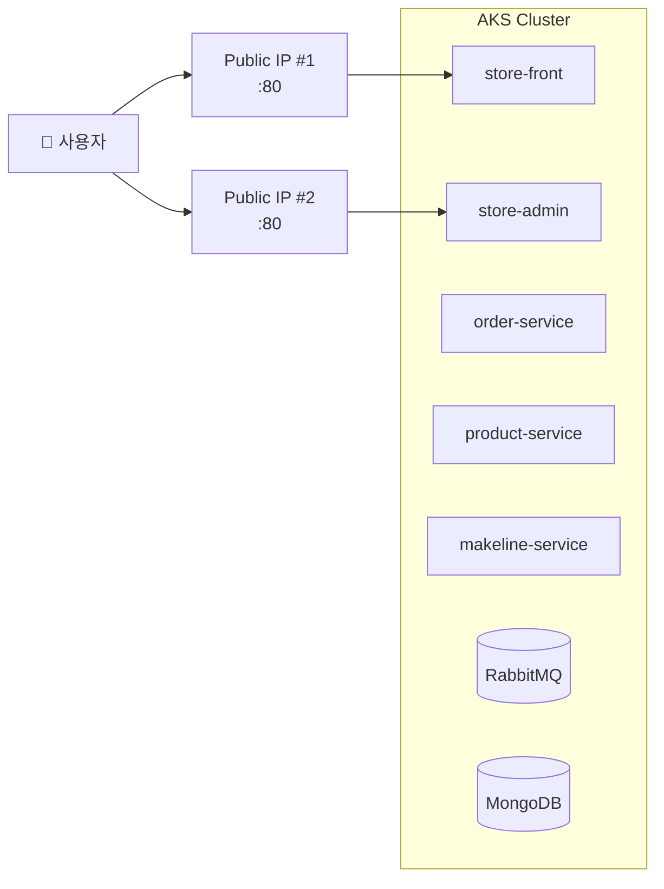
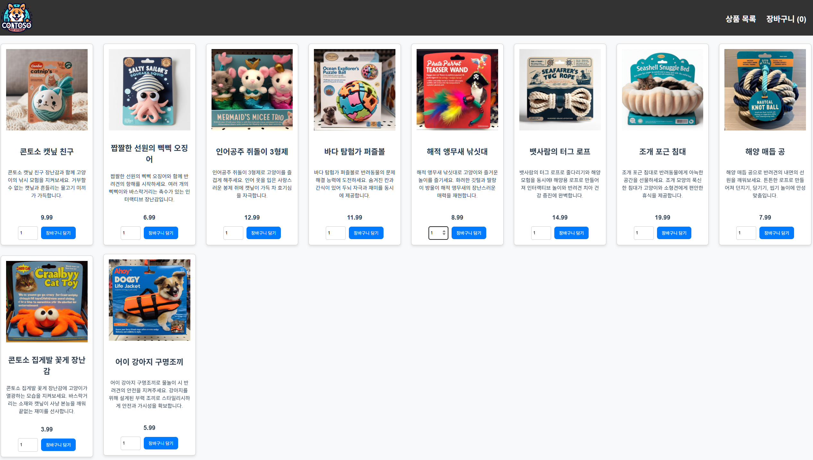
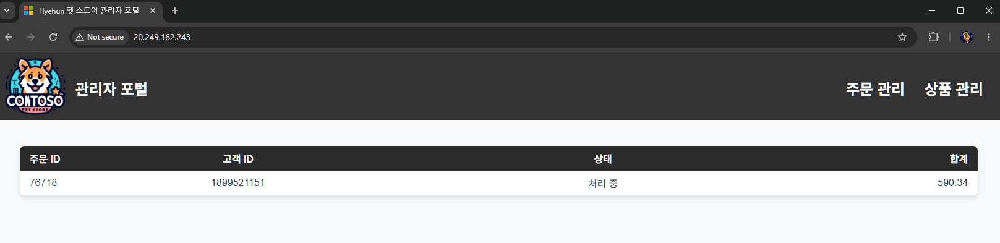
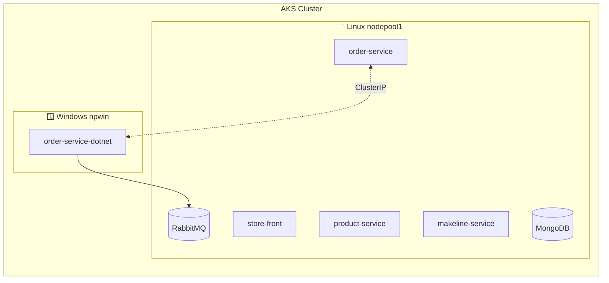

# 04. 펫 스토어 배포

<details>
<summary><strong>⚠️ Cloud Shell 세션이 만료된 경우 — 환경 변수 재설정</strong></summary>

```bash
export RESOURCE_GROUP="WorkshopDemo-RG"
export CLUSTER_NAME="workshop-demo"
export LOCATION="koreacentral"
export MY_ACR_NAME=$(az acr list --resource-group $RESOURCE_GROUP --query "[?starts_with(name,'workshop')].name" -o tsv)
az aks get-credentials --name $CLUSTER_NAME --resource-group $RESOURCE_GROUP --overwrite-existing
```

</details>

## 목차

- [4-1. 전체 스택 배포](#4-1-전체-스택-배포)
- [4-2. 배포 상태 확인](#4-2-배포-상태-확인)
- [4-3. 외부 접속 확인 (LoadBalancer)](#4-3-외부-접속-확인-loadbalancer)
- [4-4. (선택) Windows 노드풀 + .NET](#4-4-선택-사항-windows-노드풀--net-order-service)
- [트러블슈팅](#트러블슈팅)

이제 마이크로서비스 기반 펫 스토어 애플리케이션을 AKS 클러스터에 배포합니다.  
하나의 YAML 매니페스트로 10개 서비스(MongoDB, RabbitMQ, 백엔드 API, 프론트엔드, 부하 생성기)를 한 번에 배포하고, 가장 단순한 방식인 **LoadBalancer Service** 로 외부에 노출합니다. **Ingress 옵션 비교와 통합 실습**은 [05. Ingress](05-ingress.md)에서 이어집니다 (WAR / AGC / approuting-istio).

### 이 섹션에서 배우는 것

- **Kubernetes 워크로드 배포** — Deployment, StatefulSet, Service, Namespace
- **LoadBalancer Service** — 가장 단순한 외부 노출 방식 (서비스당 Public IP 1개)
- **(선택) Windows 노드풀** — Linux/Windows 혼합 클러스터 운영

---

## 4-1. 전체 스택 배포

모든 서비스를 한 번에 배포합니다.

```bash
kubectl apply -f workshop-manifests/aks-store-all-in-one-ko.yaml
```

### 생성되는 리소스

| 리소스 | 이름 | 네임스페이스 | 비고 |
|--------|------|-------------|------|
| Namespace | `pets` | — | 모든 리소스의 네임스페이스 |
| StatefulSet | `mongodb` | pets | 주문 DB (MongoDB 4.2) |
| StatefulSet | `rabbitmq` | pets | 메시지 큐 (RabbitMQ 3.13) |
| Deployment | `order-service` | pets | 주문 접수 API |
| Deployment | `makeline-service` | pets | 주문 처리 워커 |
| Deployment | `product-service` | pets | 상품 카탈로그 API |
| Deployment | `store-front` | pets | 고객 웹 UI (replicas: 2) |
| Deployment | `store-admin` | pets | 관리자 UI |
| Deployment | `virtual-customer` | pets | 부하 생성기 |
| Deployment | `virtual-worker` | pets | 자동 주문 처리 |
| Service | `store-front` | pets | **LoadBalancer** (포트 80) |
| Service | `store-admin` | pets | **LoadBalancer** (포트 80) |
| Service | 나머지 | pets | ClusterIP (내부 전용) |

### Service 타입 비교

| 타입 | 접근 범위 | 동작 방식 | 이 워크샵에서의 용도 |
|------|----------|----------|-------------------|
| **ClusterIP** | 클러스터 내부만 | Pod 간 내부 통신용 가상 IP 할당 | `order-service`, `product-service` 등 백엔드 |
| **NodePort** | 노드 IP + 지정 포트 | 각 노드의 `30000~32767` 포트를 외부에 오픈 | (이 워크샵에서는 미사용) |
| **LoadBalancer** | 인터넷 공개 | Azure Load Balancer를 생성하여 **공인 IP** 할당 | `store-front`, `store-admin` 웹 UI |

> [!NOTE]
> 이 워크샵에서는 `store-front`와 `store-admin`만 LoadBalancer로 외부에 노출하고, 나머지 서비스는 ClusterIP로 내부 통신만 허용합니다.
> 다음 문서([05. Ingress](05-ingress.md))에서 두 LoadBalancer를 **하나의 IP로 통합**하는 3가지 옵션(Web App Routing / AGC / Istio)을 비교하고 실습합니다.

> [!WARNING]
> **보안 참고**: 이 매니페스트에는 RabbitMQ 기본 자격증명(`username`/`password`)이 포함되어 있습니다.
> 워크샵 데모 전용이며, **프로덕션 환경에서는 반드시 강력한 비밀번호로 변경**하고 Azure Key Vault 등과 연동하세요.

## 4-2. 배포 상태 확인

```bash
# Pod 상태 확인 (모두 Running / 1/1 Ready 확인)
kubectl get pods -n pets -w
```

> [!NOTE]
> ⏱ 모든 Pod가 Ready가 되기까지 약 2~3분 소요됩니다.  
> MongoDB가 먼저 Ready가 되어야 makeline-service가 정상 기동합니다.

### 실행 결과

```
NAME                                READY   STATUS    RESTARTS      AGE
makeline-service-c8568b9c7-5jmqz    1/1     Running   0             13m
mongodb-0                           1/1     Running   0             14m
order-service-c9cd69cff-dt7hf       1/1     Running   0             13m
product-service-5497bfff7f-jmr2q    1/1     Running   0             13m
rabbitmq-0                          1/1     Running   0             13m
store-admin-666f7897d4-cmsjc        1/1     Running   0             2m11s
store-front-7dfd9dd7cf-m2jwm        1/1     Running   0             25s
store-front-7dfd9dd7cf-ssvh4        1/1     Running   0             15s
virtual-customer-67674c6946-zp4gx   1/1     Running   0             13m
virtual-worker-5486bbb9b6-wkzpf     1/1     Running   3 (12m ago)   13m
```


## 4-3. 외부 접속 확인 (LoadBalancer)

현재 배포 상태에서는 `store-front`와 `store-admin`이 각각 **별도의 LoadBalancer IP**를 가집니다. 이 상태가 가장 단순한 외부 노출 방식이며, **단일 IP + 경로 기반 라우팅으로 통합**하는 방법은 [05. Ingress](05-ingress.md)에서 다룹니다.



```bash
kubectl get svc -n pets
```

```
NAME               TYPE           CLUSTER-IP     EXTERNAL-IP     PORT(S)              AGE
makeline-service   ClusterIP      10.0.89.12     <none>          3001/TCP             3m10s
mongodb            ClusterIP      10.0.254.91    <none>          27017/TCP            3m13s
order-service      ClusterIP      10.0.31.61     <none>          3000/TCP             3m11s
product-service    ClusterIP      10.0.141.175   <none>          3002/TCP             3m10s
rabbitmq           ClusterIP      10.0.202.128   <none>          5672/TCP,15672/TCP   3m12s
store-admin        LoadBalancer   10.0.176.39    20.249.27.125   80:30691/TCP         3m9s
store-front        LoadBalancer   10.0.59.53     20.200.224.21   80:30942/TCP         3m9s
```

### 브라우저 접속

1. **고객 스토어**: `http://<store-front EXTERNAL-IP>`
   - 제목: "Contoso 펫 스토어"
   - 상품 목록이 표시됨 (예: "짭짤한 선원의 삑삑 오징어")

   > 📸 **스크린샷**: store-front 고객 스토어 화면
   >
   > 

2. **관리자 대시보드**: `http://<store-admin EXTERNAL-IP>`
   - 주문 목록 확인 (virtual-customer가 자동 주문 생성 중)
   - **03절에서 수정한 타이틀이 반영되었는지 확인하세요!** 자신이 빌드한 이미지가 실행되고 있습니다.

   > 📸 **스크린샷**: store-admin 관리자 대시보드
   >
   > 

### CLI로 상품 확인

```bash
STORE_IP=$(kubectl get svc store-front -n pets -o jsonpath='{.status.loadBalancer.ingress[0].ip}')
curl -s http://$STORE_IP/api/products | python3 -c "
import sys, json
for p in json.load(sys.stdin):
    print(f\"{p['id']}. {p['name']} — ₩{p['price']}\")
"
```

### 예상 출력

```
1. 콘토소 캣닢 친구 — ₩9.99
2. 짭짤한 선원의 삑삑 오징어 — ₩6.99
3. 인어공주 쥐돌이 3형제 — ₩12.99
4. 바다 탐험가 퍼즐볼 — ₩11.99
5. 해적 앵무새 낚싯대 — ₩8.99
6. 뱃사람의 터그 로프 — ₩14.99
7. 조개 포근 침대 — ₩19.99
8. 해양 매듭 공 — ₩7.99
9. 콘토소 집게발 꽃게 장난감 — ₩3.99
10. 어이 강아지 구명조끼 — ₩5.99
...
```

> [!TIP]
> 여기까지 정상 동작했다면, 단일 IP + 경로 라우팅으로 통합하는 [05. Ingress](05-ingress.md) 실습으로 넘어가세요.

---

<details>
<summary><strong>4-4. (선택 사항) Windows 노드풀 + .NET order-service</strong></summary>

> 이 섹션에서는 order-service를 **.NET 8 (C#)** 로 재작성하여 **Windows 노드풀**에 배포합니다.  
> Linux/Windows 혼합 AKS 클러스터 운영과 마이크로서비스 런타임 교체를 직접 체험합니다.  
> [!WARNING]
> **이 섹션은 선택 사항**입니다. Windows 노드풀이 필요하지 않은 경우 건너뛸 수 있습니다.

### 개요

| 항목 | Node.js 버전 (현재) | .NET 8 버전 (이번 실습) |
|------|---------------------|----------------------|
| 프레임워크 | Fastify | ASP.NET Minimal API |
| 런타임 | Node.js 24 (Linux) | .NET 8 (**Windows**) |
| 코드량 | ~267줄 (JS) | ~55줄 (C#) |
| 컨테이너 OS | Linux | Windows Server 2022 |
| 엔드포인트 | POST /, GET /health | 동일 |

### 혼합 클러스터 개념



- `nodeSelector`와 `tolerations`로 Pod를 특정 OS 노드에 스케줄링합니다
- Linux 서비스와 Windows 서비스는 ClusterIP로 자유롭게 통신합니다

### Step 1: Windows 노드풀 추가

```bash
az aks nodepool add \
  --resource-group $RESOURCE_GROUP \
  --cluster-name $CLUSTER_NAME \
  --name npwin \
  --os-type Windows \
  --os-sku Windows2022 \
  --node-count 1 \
  --node-vm-size Standard_D2s_v3 \
  -o table
```

> [!NOTE]
> ⏱ Windows 노드풀 추가에 약 5~8분 소요됩니다.

확인:

```bash
kubectl get nodes -o wide
```

```
NAME                                STATUS   ROLES   AGE   VERSION   OS-IMAGE
aks-nodepool1-xxxxx-vmss000000      Ready    <none>  30m   v1.34.x   Ubuntu 22.04.5 LTS
aks-nodepool1-xxxxx-vmss000001      Ready    <none>  30m   v1.34.x   Ubuntu 22.04.5 LTS
aksnpwin000000                      Ready    <none>  2m    v1.34.x   Windows Server 2022 Datacenter
```

### Step 2: Windows .NET 이미지 빌드 (ACR Task)

```bash
cd aks-store-demo-ko/src/order-service-dotnet

# Windows 컨테이너 이미지 빌드 (ACR에서 원격 빌드 — 로컬 Docker 불필요)
az acr build \
  --registry $MY_ACR_NAME \
  --image order-service-dotnet:win \
  --platform windows \
  --file Dockerfile.windows \
  .
```

> [!NOTE]
> Windows 컨테이너 이미지는 로컬 Linux Docker에서 빌드할 수 없습니다.  
> `az acr build --platform windows`를 사용하면 ACR에서 원격 빌드됩니다.

### Step 3: 매니페스트 ACR 이름 수정 & 배포

```bash
cd /home/hyehunlim/projects/AKS-Workshop

# 매니페스트 내 ACR 이름 치환
sed -i "s/__ACR_NAME__/$MY_ACR_NAME/g" workshop-manifests/65-order-service-dotnet-windows.yaml

# 배포
kubectl apply -f workshop-manifests/65-order-service-dotnet-windows.yaml
```

매니페스트의 핵심 부분:

```yaml
spec:
  nodeSelector:
    "kubernetes.io/os": windows       # Windows 노드에만 스케줄링
  tolerations:
    - key: "os"
      operator: "Equal"
      value: "windows"
      effect: "NoSchedule"
  containers:
    - name: order-service-dotnet
      image: <ACR>.azurecr.io/order-service-dotnet:win
      ports:
        - containerPort: 3000
```

### Step 4: 배포 확인

```bash
# Windows 노드에서 실행 중인지 확인
kubectl get pods -n pets -o wide | grep dotnet
```

```
order-service-dotnet-xxx    1/1   Running   0   1m   10.244.2.x   aksnpwin000000
```

```bash
# Health 엔드포인트로 .NET 런타임 확인
kubectl exec -n pets deploy/order-service-dotnet -- curl -s http://localhost:3000/health
```

```json
{"status":"ok","version":"1.0.0-dotnet","runtime":".NET 8"}
```

### Step 5: 트래픽 전환 (Node.js → .NET)

기존 Node.js order-service 대신 Windows .NET 버전으로 전환합니다.

```bash
# 기존 order-service 스케일 다운
kubectl scale deployment/order-service -n pets --replicas=0

# Service selector를 .NET 버전으로 전환
kubectl patch svc order-service -n pets \
  -p '{"spec": {"selector": {"app": "order-service-dotnet"}}}'
```

브라우저에서 store-front에 접속하여 주문을 생성하면, Windows .NET 서비스가 RabbitMQ에 메시지를 발행합니다.

```bash
# .NET 서비스 로그 확인
kubectl logs -n pets deploy/order-service-dotnet --tail=10
```

```
[.NET] Order published to queue 'orders'
[.NET] Order published to queue 'orders'
```

### (선택) 되돌리기

```bash
# Node.js order-service 복원
kubectl patch svc order-service -n pets \
  -p '{"spec": {"selector": {"app": "order-service"}}}'
kubectl scale deployment/order-service -n pets --replicas=1

# .NET 버전 정리
kubectl delete -f workshop-manifests/65-order-service-dotnet-windows.yaml

# Windows 노드풀 삭제
az aks nodepool delete \
  --resource-group $RESOURCE_GROUP \
  --cluster-name $CLUSTER_NAME \
  --name npwin --yes
```

### Windows 노드풀 점검 체크리스트

- [ ] `kubectl get nodes` — Windows 노드(aksnpwin) Ready
- [ ] `kubectl get pods -n pets -o wide` — dotnet Pod가 Windows 노드에서 실행
- [ ] `/health` 응답에 `"runtime":".NET 8"` 포함
- [ ] store-front에서 주문 시 `.NET` 로그 출력 확인

</details>

---

## 트러블슈팅

### MongoDB가 CrashLoop 또는 Readiness 실패

MongoDB는 저사양에서 초기 기동이 느릴 수 있습니다. 매니페스트에서 리소스를 충분히 설정했는지 확인하세요.

```yaml
resources:
  requests:
    cpu: 50m
    memory: 128Mi
  limits:
    cpu: 500m
    memory: 1024Mi
```

### makeline-service CrashLoopBackOff

MongoDB가 아직 Ready가 아니면 발생합니다. MongoDB가 Ready가 된 뒤 자동 복구되거나, 수동으로 재시작합니다.

```bash
kubectl rollout restart deployment/makeline-service -n pets
```

### ImagePullBackOff

ACR 연결이 안 된 경우입니다.

```bash
az aks update --name $CLUSTER_NAME -g $RESOURCE_GROUP --attach-acr $MY_ACR_NAME
```

### Windows Pod가 Pending 상태 (4-4 진행 시)

Windows 노드풀이 없거나 `nodeSelector`가 올바르지 않은 경우입니다.

```bash
kubectl describe pod -n pets -l app=order-service-dotnet
kubectl get nodes -l "kubernetes.io/os=windows"
```

> [!NOTE]
> Cilium 데이터플레인(`--network-dataplane cilium`)을 사용하는 클러스터에서는 Windows 노드를 추가할 수 없습니다. Cilium 없이 클러스터를 생성하세요.

> Ingress 관련 트러블슈팅(`Ingress ADDRESS가 비어있음`, `Ingress 404`, `AGC Gateway Programmed=False`, `Istio Ingress`)은 [05. Ingress](05-ingress.md#트러블슈팅)의 트러블슈팅 섹션을 참고하세요.

## 점검 체크리스트

- [ ] `kubectl get pods -n pets` — 모든 Pod 1/1 Running
- [ ] 브라우저에서 store-front UI 확인
- [ ] 상품 목록이 정상 표시됨

---

| | |
|:---|---:|
| [⬅️ 03. 빌드 & 푸시](03-build-and-push.md) | [05. Ingress ➡️](05-ingress.md) |
