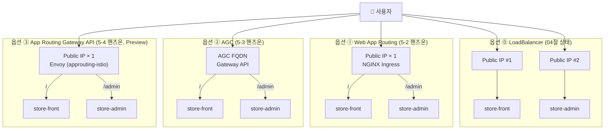
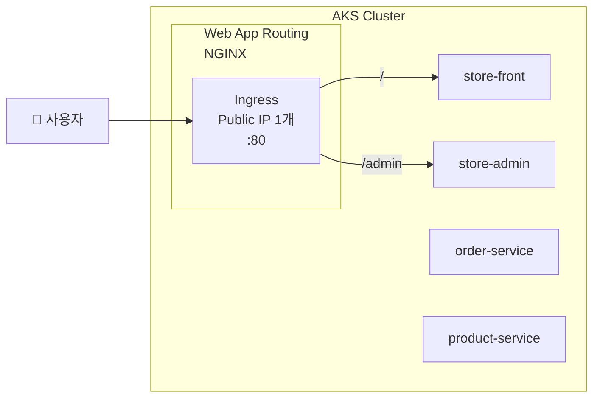
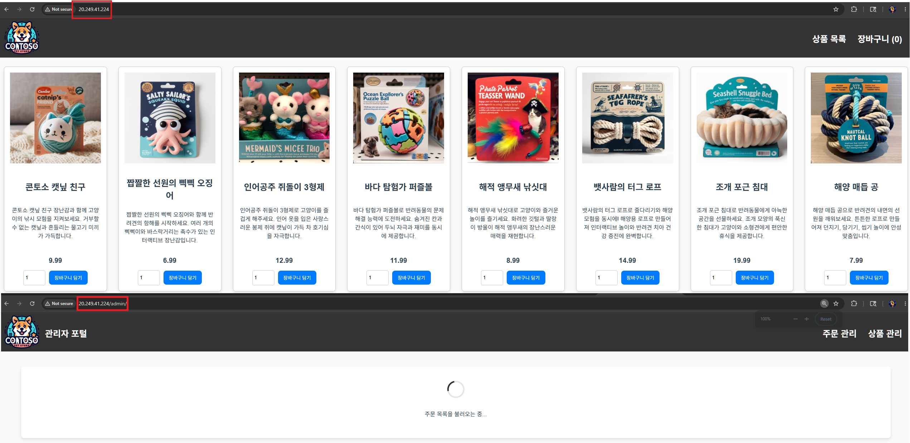
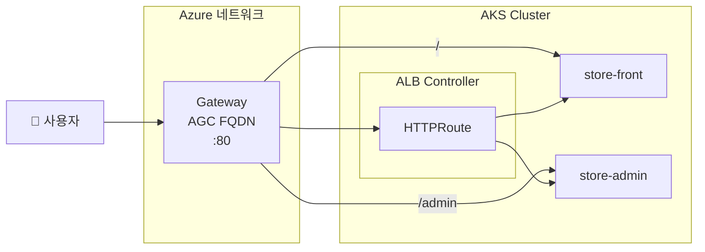
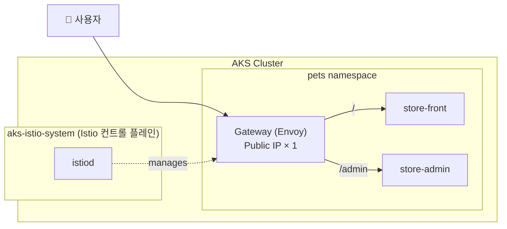

# 05. AKS Ingress 옵션 비교 & 핸즈온

<details>
<summary><strong>⚠️ Cloud Shell 세션이 만료된 경우 — 환경 변수 재설정</strong></summary>

```bash
export RESOURCE_GROUP="WorkshopDemo-RG"
export CLUSTER_NAME="workshop-demo"
export LOCATION="koreacentral"
export MY_ACR_NAME=$(az acr list --resource-group $RESOURCE_GROUP --query "[?starts_with(name,'workshop')].name" -o tsv)
az aks get-credentials --name $CLUSTER_NAME --resource-group $RESOURCE_GROUP --overwrite-existing
```

</details>

## 목차

- [5-1. AKS Ingress 옵션 개념 비교](#5-1-aks-ingress-옵션-개념-비교)
- [5-2. 핸즈온 ① — Web App Routing (NGINX Ingress)](#5-2-핸즈온--web-app-routing-nginx-ingress)
- [5-3. 핸즈온 ② — AGC (Application Gateway for Containers)](#5-3-핸즈온--agc-application-gateway-for-containers) — 고급
- [5-4. 핸즈온 ③ — App Routing Gateway API (`approuting-istio`)](#5-4-핸즈온--app-routing-gateway-api-approuting-istio) — Preview
- [트러블슈팅](#트러블슈팅)

04절에서는 `store-front`/`store-admin`을 각각 LoadBalancer Service로 외부에 노출했습니다.  
이 문서에서는 **AKS Ingress 옵션 4가지(LoadBalancer / Web App Routing / AGC / approuting-istio)** 의 개념을 비교한 뒤,
3개의 매니지드 옵션을 차례로 직접 실습하여 **단일 IP + 경로 기반 라우팅**으로 통합합니다.

### 이 섹션에서 배우는 것

- **외부 접속 옵션 비교** — LoadBalancer / Web App Routing / AGC / approuting-istio의 차이와 선택 기준
- **핸즈온 ① Web App Routing** — AKS 관리형 NGINX Ingress로 경로 기반 단일 IP 통합
- **핸즈온 ② AGC** — Azure 네이티브 L7 (Gateway API) 로드 밸런싱
- **핸즈온 ③ App Routing Gateway API (`approuting-istio`)** — NGINX EOL 후속 경로, Istio 컨트롤 플레인 기반 Gateway API 구현 (**Preview**)

---

## 5-1. AKS Ingress 옵션 개념 비교

AKS에서 워크로드를 외부에 노출하는 대표적인 4가지 방식과 그 장단점을 먼저 정리합니다. 다음 절(5-2, 5-3, 5-4)에서 각 매니지드 옵션을 순서대로 직접 실습합니다.



### 옵션별 비교

| 항목 | ⓪ LoadBalancer | ① Web App Routing (WAR) | ② AGC | ③ approuting-istio |
|------|----------------|------------------------|-------|--------|
| **타입** | Service `type: LoadBalancer` | AKS 관리형 NGINX Ingress 애드온 | Azure 매니지드 L7 (AGC) | AKS App Routing **Gateway API 구현** (Istio 컨트롤 플레인 기반) |
| **데이터 플레인** | Azure L4 LB → 노드 | NGINX Pod (클러스터 내부) | Azure 네트워크 (매니지드, 외부) | Envoy (클러스터 내부, App Routing이 자동 프로비저닝) |
| **API** | Service | **Ingress** API | **Gateway** API | **Gateway** API |
| **외부 IP/주소** | 서비스마다 1개 | Ingress 1개 (Public IP) | AGC FQDN 1개 | Public IP 1개 (`<gw>-approuting-istio` Service) |
| **경로 기반 라우팅** | ❌ | ✅ | ✅ | ✅ |
| **TLS 종료** | 각 서비스 | Ingress에서 중앙 처리 | Gateway/AGC | Gateway에서 (Key Vault 연동은 미지원) |
| **고급 L7 / 부가 기능** | 없음 | NGINX rewrite, rate-limit 등 | 트래픽 분할, mTLS, WAF, gRPC | Gateway API 표준 (HTTPRoute filters, 트래픽 분할). **사이드카/Istio CRD는 미지원** |
| **스케일링** | 노드 리소스 | 노드 리소스 | Azure 인프라 자동 | 자동 HPA (기본 min 2 / max 5) |
| **GA 상태** | GA | **GA** | AGC 서비스 GA, AKS 애드온 **Preview** | **Preview** (`AppRoutingIstioGatewayAPIPreview`) |
| **추가 비용** | Public IP 개수 | Public IP 1개 | AGC 리소스 별도 과금 | Public IP 1개 |
| **적합한 경우** | 가장 단순한 데모/PoC | 일반적인 프로덕션, 비용 효율 | 고급 L7, 트래픽 분할, Azure 네이티브 | **NGINX EOL 대비 Gateway API 마이그레이션**, 메시 없이 Gateway API만 필요할 때 |

> [!NOTE]
> **AGIC(Application Gateway Ingress Controller)** 는 기존 Application Gateway 기반의 **레거시** 옵션입니다. 신규 도입 시에는 본 문서에서 다루는 **AGC**(Application Gateway *for Containers*)가 권장됩니다.

> [!IMPORTANT]
> **NGINX Ingress EOL 안내** — 업스트림 Ingress NGINX 프로젝트가 [2026년 3월 유지보수를 종료](https://www.kubernetes.dev/blog/2025/11/12/ingress-nginx-retirement/)합니다. Microsoft는 해당 애드온(WAR)을 **2026년 11월까지** 보안 패치 지원하며, 이후 **Gateway API 기반** 옵션(② AGC 또는 ③ approuting-istio)으로 이전을 권장합니다.

### 의사 결정 가이드

- **워크샵/데모만 빠르게 보고 싶다** → 04절 LoadBalancer로 충분 (별도 핸즈온 없음)
- **단일 IP + 경로 라우팅이 필요하다 (일반적 선택, 단 NGINX EOL 주의)** → 5-2 Web App Routing
- **Gateway API, 트래픽 분할, Azure 네이티브 L7이 필요하다** → 5-3 AGC
- **Gateway API로 통일하고 싶거나 NGINX EOL 후속 경로를 미리 체험하고 싶다** → 5-4 approuting-istio (Preview)

> [!TIP]
> 워크샵 시간이 제한적이라면 **5-2만 진행**하는 것을 권장합니다. 5-3은 Preview 기능 등록과 전용 서브넷 구성이 필요해 30분 이상, 5-4는 Preview 기능 등록 + istiod 배포에 약 5~10분 소요됩니다.

---

## 5-2. 핸즈온 ① — Web App Routing (NGINX Ingress)

AKS 관리형 NGINX Ingress(Web App Routing)로 두 개의 LoadBalancer를 **단일 IP + 경로 기반 라우팅**으로 통합합니다.



### Step 1: Web App Routing 애드온 활성화

AKS의 관리형 NGINX Ingress 컨트롤러를 활성화합니다.

```bash
az aks approuting enable \
  --name $CLUSTER_NAME \
  --resource-group $RESOURCE_GROUP
```

> [!NOTE]
> ⏱ 약 1~2분 소요됩니다.

활성화 확인:

```bash
# Ingress 컨트롤러 Pod 확인
kubectl get pods -n app-routing-system

# IngressClass 확인
kubectl get ingressclass
```

### 예상 출력

```
NAME                     READY   STATUS    RESTARTS   AGE
nginx-7596c898cd-bqph4   1/1     Running   0          2m23s
nginx-7596c898cd-zk9tz   1/1     Running   0          2m37s
```

```
NAME                                 CONTROLLER                                 PARAMETERS   AGE
webapprouting.kubernetes.azure.com   webapprouting.kubernetes.azure.com/nginx   <none>       3m17s
```

### Step 2: Service 타입을 ClusterIP로 변경

Ingress가 트래픽을 라우팅하므로 store-front, store-admin의 Service를 ClusterIP로 변경합니다.

```bash
kubectl patch svc store-front -n pets -p '{"spec": {"type": "ClusterIP"}}'
kubectl patch svc store-admin -n pets -p '{"spec": {"type": "ClusterIP"}}'
```

변경 확인:

```bash
kubectl get svc -n pets store-front store-admin
```

```
NAME          TYPE        CLUSTER-IP    EXTERNAL-IP   PORT(S)   AGE
store-front   ClusterIP   10.0.36.166   <none>        80/TCP    44h
store-admin   ClusterIP   10.0.7.98     <none>        80/TCP    44h
```

> 기존 LoadBalancer External IP는 더 이상 접근되지 않습니다.

### Step 3: Ingress 리소스 배포

```bash
kubectl apply -f workshop-manifests/60-ingress.yaml
```

매니페스트 내용 (`workshop-manifests/60-ingress.yaml`):

```yaml
apiVersion: networking.k8s.io/v1
kind: Ingress
metadata:
  name: pets-ingress
  namespace: pets
  annotations:
    nginx.ingress.kubernetes.io/ssl-redirect: "false"
    nginx.ingress.kubernetes.io/use-regex: "true"
    nginx.ingress.kubernetes.io/rewrite-target: /$2
spec:
  ingressClassName: webapprouting.kubernetes.azure.com
  rules:
    - http:
        paths:
          - path: /admin(/|$)(.*)
            pathType: ImplementationSpecific
            backend:
              service:
                name: store-admin
                port:
                  number: 80
          - path: /()(.*)
            pathType: ImplementationSpecific
            backend:
              service:
                name: store-front
                port:
                  number: 80
```

> [!TIP]
> **`rewrite-target: /$2` 동작 원리**  
> 두 경로 모두 캡처 그룹 2개를 사용하며, `$2`가 실제 요청 경로가 됩니다.
> - `/admin/js/app.js` → `/admin(/|$)(.*)` 매칭 → `$2` = `js/app.js` → store-admin에 `/js/app.js` 전달
> - `/api/products` → `/()(.*)` 매칭 → `$2` = `api/products` → store-front에 `/api/products` 전달

### Step 4: Ingress IP 확인 & 접속

```bash
# IP 할당 대기 (최대 2분)
kubectl get ingress -n pets -w
```

```
NAME           CLASS                                HOSTS   ADDRESS         PORTS   AGE
pets-ingress   webapprouting.kubernetes.azure.com   *       20.249.41.224   80      47s
```

```bash
INGRESS_IP=$(kubectl get ingress pets-ingress -n pets -o jsonpath='{.status.loadBalancer.ingress[0].ip}')
echo "Ingress IP: $INGRESS_IP"
```

### 브라우저 접속

| URL | 서비스 | 설명 |
|-----|--------|------|
| `http://<INGRESS-IP>/` | store-front | 고객 펫 스토어 |
| `http://<INGRESS-IP>/admin` | store-admin | 관리자 대시보드 |

> 📸 **스크린샷**: Ingress로 단일 IP 접속 화면
>
> 

### CLI 검증

```bash
# 고객 스토어 — 상품 확인
curl -s http://$INGRESS_IP/api/products | python3 -c "
import sys, json
for p in json.load(sys.stdin):
    print(f\"{p['id']}. {p['name']} — ₩{p['price']}\")
"

# 관리자 대시보드 — 페이지 확인
curl -s -o /dev/null -w '%{http_code}' http://$INGRESS_IP/admin
# → 200
```

<details>
<summary><strong>(선택) 되돌리기 — LoadBalancer로 복원</strong></summary>

Ingress 실습 후 원래 상태로 되돌리려면:

```bash
kubectl delete -f workshop-manifests/60-ingress.yaml
kubectl patch svc store-front -n pets -p '{"spec": {"type": "LoadBalancer"}}'
kubectl patch svc store-admin -n pets -p '{"spec": {"type": "LoadBalancer"}}'
```

</details>

### Ingress 점검 체크리스트

- [ ] `kubectl get ingressclass` — `webapprouting.kubernetes.azure.com` 존재
- [ ] `kubectl get ingress -n pets` — ADDRESS에 IP 할당됨
- [ ] `http://<INGRESS-IP>/` — 고객 스토어 표시
- [ ] `http://<INGRESS-IP>/admin` — 관리자 대시보드 표시
- [ ] 기존 LoadBalancer IP 2개 → Ingress IP 1개로 통합 확인

---

## 5-3. 핸즈온 ② — AGC (Application Gateway for Containers)

> [!NOTE]
> **GA 상태 안내** — AGC 서비스 자체는 **GA(2024.5)** 이며 SLA가 적용됩니다. 다만 본 절에서 사용하는 **AKS 매니지드 애드온(`--enable-application-load-balancer`)은 현재 Preview**이며, `aks-preview` CLI 확장과 두 개의 feature 등록이 필요합니다. GA 경로로 운영하려면 ALB Controller를 **Helm으로 설치**하고 AGC 리소스를 **BYO**로 프로비저닝하세요.

> [!CAUTION]
> **이 섹션은 고급 실습입니다.** Preview Feature 등록, OIDC/Workload Identity 활성화, 전용 서브넷 구성 등 사전 작업이 많아 **30분 이상** 소요될 수 있습니다. 워크샵 시간이 충분하지 않다면 5-2(Web App Routing)만으로 충분합니다.

> 이 섹션은 5-2의 Web App Routing 대신 **AGC**를 사용하는 **대안 방식**입니다.  
> 5-2를 이미 완료했다면, 먼저 되돌린 후 진행하세요.



> Web App Routing(5-2) vs AGC(이 절) 의 상세 비교는 5-1의 비교표를 참고하세요.

### Step 0: AGC 전용 서브넷 준비 (CIDR 설계)

AGC는 **클러스터 외부의 Azure 네트워크**에서 동작하는 매니지드 데이터 플레인을 가지며, 이를 위해 **전용 서브넷**이 필요합니다. AKS 노드 서브넷이나 다른 워크로드가 들어있는 서브넷에는 배포할 수 없습니다.

#### 서브넷 요구사항

| 항목 | 요구사항 / 권장값 |
|------|-----------------|
| **CIDR 크기** | 아웃바운딩 경계(`network boundary`)에 따라 **최소 `/24` 권장** (256개 IP) — AGC 데이터 플레인이 다수의 내부 ENI/프론트엔드 IP를 소모 |
| **서브넷 위임** | `Microsoft.ServiceNetworking/trafficControllers` 로 위임 필수 |
| **다른 리소스 공존** | ❌ 구조적으로 불가 (AKS 노드, VM, 다른 PaaS와 공유 불가) |
| **VNet 위치** | AKS 클러스터의 VNet과 **동일한 VNet** 내부에 존재해야 함 |
| **NSG** | 인바운드 HTTP/HTTPS 허용 필요 (Step 5에서 설정) |
| **주소 겹침** | 기존 AKS 노드 서브넷 및 기타 서브넷과 겹치면 안 됨 |

> [!WARNING]
> `/27`, `/28` 같은 작은 CIDR로는 AGC 프로비저닝이 실패하거나 스케일 아웃이 제한됩니다. **프로덕션에서는 일관되게 `/24` 이상**을 사용하세요.

#### 전용 서브넷 생성

```bash
# AKS 노드 리소스 그룹과 VNet 정보 조회
MC_RG=$(az aks show -n $CLUSTER_NAME -g $RESOURCE_GROUP --query "nodeResourceGroup" -o tsv)
VNET_NAME=$(az network vnet list -g $MC_RG --query "[0].name" -o tsv)

# 기존 VNet의 주소 공간 확인 (충돌하지 않는 CIDR 선택에 필요)
az network vnet show -g $MC_RG -n $VNET_NAME --query "addressSpace.addressPrefixes" -o tsv

# 기존 서브넷들 확인 (주소 겹침 방지)
az network vnet subnet list -g $MC_RG --vnet-name $VNET_NAME \
  --query "[].{name:name, cidr:addressPrefix}" -o table

# AGC 전용 서브넷 생성 (예시: 10.225.0.0/24 — 기존 VNet 범위 내에서 비어있는 영역)
az network vnet subnet create \
  -g $MC_RG \
  --vnet-name $VNET_NAME \
  --name aks-appgateway \
  --address-prefixes 10.225.0.0/24 \
  --delegations Microsoft.ServiceNetworking/trafficControllers
```

> [!TIP]
> AKS 기본 VNet(`10.224.0.0/12`) 내에서 노드 서브넷과 겹치지 않는 영역이 예시의 `10.225.0.0/24`입니다.
> 위 `addressSpace.addressPrefixes` 출력을 보고 본인 환경에 맞는 빈 CIDR로 조정하세요.
> VNet 주소 공간(`addressSpace`)에 여유가 없다면 먼저 `az network vnet update --address-prefixes`로 확장해야 합니다.

생성 확인:

```bash
az network vnet subnet show -g $MC_RG --vnet-name $VNET_NAME -n aks-appgateway \
  --query "{name:name, cidr:addressPrefix, delegation:delegations[0].serviceName}" -o table
```

예상 출력:

```
Name            Cidr             Delegation
--------------- ---------------- ----------------------------------------------
aks-appgateway  10.225.0.0/24    Microsoft.ServiceNetworking/trafficControllers
```

> [!NOTE]
> 이 서브넷 이름(`aks-appgateway`)은 이후 Step 4에서 `AGC_SUBNET_ID` 조회 시 그대로 재사용됩니다. 다른 이름을 사용했다면 Step 4의 `-n aks-appgateway` 부분을 그에 맞게 바꿔야 합니다.

### Step 1: ALB Controller 애드온 활성화

AGC의 ALB Controller는 Azure 리소스(Application Gateway for Containers)를 생성/관리하기 위해 Azure API에 접근해야 합니다.  
이때 **Workload Identity**를 사용하여 Pod이 Azure AD 토큰을 안전하게 발급받고, **OIDC Issuer**가 Kubernetes 서비스 어카운트와 Azure AD 간 신뢰를 설정합니다.

```bash
# AGC 관련 CLI 옵션을 사용하려면 aks-preview 확장이 필요합니다
az extension add --name aks-preview --upgrade

# Preview 기능 등록 (구독당 한 번만 실행)
az feature register --namespace "Microsoft.ContainerService" --name "ManagedGatewayAPIPreview"
az feature register --namespace "Microsoft.ContainerService" --name "ApplicationLoadBalancerPreview"

# 등록 상태 확인 — "Registered"가 될 때까지 대기 (수 분 소요)
az feature show --namespace "Microsoft.ContainerService" --name "ManagedGatewayAPIPreview" --query "properties.state" -o tsv
az feature show --namespace "Microsoft.ContainerService" --name "ApplicationLoadBalancerPreview" --query "properties.state" -o tsv

# 등록 완료 후 provider 갱신
az provider register --namespace Microsoft.ContainerService
```

> [!NOTE]
> ⏱ Feature 등록에 약 3~5분 소요될 수 있습니다. `Registered`로 바뀐 후 다음 단계를 진행하세요.

```bash
# OIDC Issuer 및 Workload Identity 활성화
# - OIDC Issuer: AKS 클러스터가 외부 ID 공급자로 동작하여 서비스 어카운트 토큰을 발급
# - Workload Identity: Pod이 Azure AD 토큰을 발급받아 Azure 리소스에 접근 가능
az aks update \
  --name $CLUSTER_NAME \
  --resource-group $RESOURCE_GROUP \
  --enable-oidc-issuer \
  --enable-workload-identity

# Gateway API + ALB Controller 애드온 활성화
az aks update \
  --name $CLUSTER_NAME \
  --resource-group $RESOURCE_GROUP \
  --enable-gateway-api \
  --enable-application-load-balancer
```

> [!NOTE]
> ⏱ 약 2~3분 소요됩니다.

활성화 확인:

```bash
# ALB Controller Pod 확인 (AKS 애드온 방식은 kube-system에서 실행)
kubectl get pods -n kube-system | grep alb-controller

# GatewayClass 확인
kubectl get gatewayclass
```

### 예상 출력

```
alb-controller-xxxx-xxxxx   1/1     Running   0   2m
alb-controller-xxxx-xxxxx   1/1     Running   0   2m
```

```
NAME                 CONTROLLER                                   ACCEPTED   AGE
azure-alb-external   alb.networking.azure.io/alb-controller       True       2m
```

### Step 2: ALB 인프라 네임스페이스 & 리소스 생성

AGC는 Azure에서 관리되는 ALB 리소스가 필요합니다.

```bash
# ALB 인프라 네임스페이스 생성
kubectl create namespace alb-infra

# AKS 클러스터의 관리 ID에 필요한 권한 부여
MC_RG=$(az aks show -n $CLUSTER_NAME -g $RESOURCE_GROUP --query "nodeResourceGroup" -o tsv)
MC_RG_ID=$(az group show -n $MC_RG --query "id" -o tsv)

ALB_IDENTITY=$(az aks show -n $CLUSTER_NAME -g $RESOURCE_GROUP \
  --query "ingressProfile.webAppRouting.identity.objectId" -o tsv 2>/dev/null || \
  az aks show -n $CLUSTER_NAME -g $RESOURCE_GROUP \
  --query "identity.principalId" -o tsv)

# ApplicationLoadBalancer 리소스 생성
kubectl apply -f - <<EOF
apiVersion: alb.networking.azure.io/v1
kind: ApplicationLoadBalancer
metadata:
  name: pets-alb
  namespace: alb-infra
spec:
  associations:
    - $MC_RG_ID/providers/Microsoft.Network/virtualNetworks/$(az network vnet list -g $MC_RG --query "[0].name" -o tsv)/subnets/$(az network vnet subnet list -g $MC_RG --vnet-name $(az network vnet list -g $MC_RG --query "[0].name" -o tsv) --query "[?contains(name,'alb')].name | [0]" -o tsv 2>/dev/null || echo "aks-subnet")
EOF
```

> [!NOTE]
> Step 0에서 만든 전용 서브넷(`aks-appgateway`)이 있어야 합니다. 서브넷 요구사항(최소 `/24`, `Microsoft.ServiceNetworking/trafficControllers` 위임) 상세는 Step 0을 참고하세요.

### Step 3: Service 타입을 ClusterIP로 변경

> 5-2에서 이미 변경했다면 이 단계를 건너뛰세요.

```bash
kubectl patch svc store-front -n pets -p '{"spec": {"type": "ClusterIP"}}'
kubectl patch svc store-admin -n pets -p '{"spec": {"type": "ClusterIP"}}'
```

### Step 4: Gateway & HTTPRoute 배포

먼저 AGC 전용 서브넷 ID를 매니페스트에 주입한 후 배포합니다.

```bash
# AGC 서브넷 ID 조회
MC_RG=$(az aks show --name $CLUSTER_NAME --resource-group $RESOURCE_GROUP --query "nodeResourceGroup" -o tsv)
VNET_NAME=$(az network vnet list -g $MC_RG --query "[0].name" -o tsv)
AGC_SUBNET_ID=$(az network vnet subnet show -g $MC_RG --vnet-name $VNET_NAME -n aks-appgateway --query id -o tsv)
echo "AGC Subnet ID: $AGC_SUBNET_ID"

# 매니페스트에 서브넷 ID 주입
sed -i "s|__AGC_SUBNET_ID__|$AGC_SUBNET_ID|g" workshop-manifests/61-agc-gateway.yaml

# 배포
kubectl apply -f workshop-manifests/61-agc-gateway.yaml
```

> [!NOTE]
> ⏱ `ApplicationLoadBalancer` 프로비저닝에 약 3~5분 소요됩니다.
> `DEPLOYMENT`가 `True`로 바뀌는지 확인하세요.
> ```bash
> kubectl get applicationloadbalancer -n alb-infra -w
> ```

매니페스트 내용 (`workshop-manifests/61-agc-gateway.yaml`):

```yaml
apiVersion: v1
kind: Namespace
metadata:
  name: alb-infra
---
apiVersion: alb.networking.azure.io/v1
kind: ApplicationLoadBalancer
metadata:
  name: pets-alb
  namespace: alb-infra
spec:
  associations:
    - __AGC_SUBNET_ID__    # ← sed로 실제 서브넷 ID가 주입됩니다
---
apiVersion: gateway.networking.k8s.io/v1
kind: Gateway
metadata:
  name: pets-gateway
  namespace: pets
  annotations:
    alb.networking.azure.io/alb-namespace: alb-infra
    alb.networking.azure.io/alb-name: pets-alb
spec:
  gatewayClassName: azure-alb-external
  listeners:
    - name: http
      protocol: HTTP
      port: 80
      allowedRoutes:
        namespaces:
          from: Same
---
apiVersion: gateway.networking.k8s.io/v1
kind: HTTPRoute
metadata:
  name: pets-store-front-route
  namespace: pets
spec:
  parentRefs:
    - name: pets-gateway
      namespace: pets
  rules:
    - matches:
        - path:
            type: PathPrefix
            value: /admin
      filters:
        - type: URLRewrite
          urlRewrite:
            path:
              type: ReplacePrefixMatch
              replacePrefixMatch: /
      backendRefs:
        - name: store-admin
          port: 80
    - matches:
        - path:
            type: PathPrefix
            value: /
      backendRefs:
        - name: store-front
          port: 80
```

> **매니페스트 구성 요약**:
> - `ApplicationLoadBalancer` = AGC 리소스를 Azure에 프로비저닝 (ALB Controller가 관리)
> - `Gateway` = 인프라 (리스너, 포트, 프로토콜)
> - `HTTPRoute` = 라우팅 규칙 (경로 → 서비스 매핑, `/admin` → `/`로 URL 재작성)

### Step 5: NSG 규칙 추가

AGC가 외부 트래픽을 받으려면 AGC 서브넷의 NSG에 인바운드 규칙을 추가해야 합니다.

```bash
# AGC 서브넷 NSG 이름 확인
NSG_NAME=$(az network vnet subnet show -g $MC_RG --vnet-name $VNET_NAME -n aks-appgateway \
  --query "networkSecurityGroup.id" -o tsv | xargs -I{} basename {})
echo "NSG: $NSG_NAME"

# HTTP/HTTPS 인바운드 허용
az network nsg rule create \
  -g $MC_RG \
  --nsg-name $NSG_NAME \
  -n AllowHTTPInbound \
  --priority 100 \
  --source-address-prefixes Internet \
  --destination-port-ranges 80 443 \
  --access Allow \
  --protocol Tcp \
  --direction Inbound
```

### Step 6: Gateway IP 확인 & 접속

```bash
# Gateway 상태 확인 (Programmed=True 대기)
kubectl get gateway pets-gateway -n pets -w
```

> [!NOTE]
> ⏱ AGC 리소스가 Azure에서 프로비저닝되므로 **3~5분** 소요될 수 있습니다.

```
NAME           CLASS                ADDRESS                               PROGRAMMED   AGE
pets-gateway   azure-alb-external   bjduafcpgef6b9h0.fz37.alb.azure.com   True         4m59s
```

```bash
AGC_FQDN=$(kubectl get gateway pets-gateway -n pets \
  -o jsonpath='{.status.addresses[0].value}')
echo "AGC 주소: http://$AGC_FQDN"
```

### 브라우저 접속

| URL | 서비스 | 설명 |
|-----|--------|------|
| `http://<AGC-FQDN>/` | store-front | 고객 펫 스토어 |
| `http://<AGC-FQDN>/admin` | store-admin | 관리자 대시보드 |

> [!NOTE]
> AGC는 IP 대신 FQDN(도메인)으로 접근합니다.

### CLI 검증

```bash
# 상품 확인
curl -s http://$AGC_FQDN/api/products | python3 -c "
import sys, json
for p in json.load(sys.stdin):
    print(f\"{p['id']}. {p['name']} — ₩{p['price']}\")
"

# 관리자 페이지 확인
curl -s -o /dev/null -w '%{http_code}' http://$AGC_FQDN/admin
# → 200
```

### (선택) 되돌리기 — AGC 정리

```bash
kubectl delete -f workshop-manifests/61-agc-gateway.yaml
kubectl delete ApplicationLoadBalancer pets-alb -n alb-infra
kubectl delete namespace alb-infra
kubectl patch svc store-front -n pets -p '{"spec": {"type": "LoadBalancer"}}'
kubectl patch svc store-admin -n pets -p '{"spec": {"type": "LoadBalancer"}}'
```

### AGC 점검 체크리스트

- [ ] `kubectl get gatewayclass` — `azure-alb-external` 존재
- [ ] `kubectl get gateway -n pets` — Programmed=True, ADDRESSES 할당
- [ ] `kubectl get httproute -n pets` — Accepted=True
- [ ] `http://<AGC-FQDN>/` — 고객 스토어 표시
- [ ] `http://<AGC-FQDN>/admin` — 관리자 대시보드 표시

---

## 5-4. 핸즈온 ③ — App Routing Gateway API (`approuting-istio`)

> [!IMPORTANT]
> **Preview 안내** — 이 절에서 사용하는 **App Routing의 Gateway API 구현(`approuting-istio`)** 은 현재 **Preview** 입니다. `aks-preview` CLI 확장과 두 개의 feature(`AppRoutingIstioGatewayAPIPreview`, `ManagedGatewayAPIPreview`)를 등록해야 합니다.

NGINX 기반 Web App Routing은 [Ingress NGINX 프로젝트 종료 공지](https://www.kubernetes.dev/blog/2025/11/12/ingress-nginx-retirement/)에 따라 **2026년 11월 이후 Microsoft 지원이 종료**될 예정이며, 그 마이그레이션 경로 중 하나가 바로 이 **App Routing Gateway API 구현**입니다. 내부적으로는 **Istio 컨트롤 플레인**을 사용해 Kubernetes Gateway API 리소스(`Gateway`, `HTTPRoute`)의 인프라(Envoy 데이터 플레인)를 자동 프로비저닝합니다. 단, Istio 서비스 메시 애드온과 달리 **사이드카 주입/Istio CRD(VirtualService 등)는 지원하지 않으며**, 오직 Gateway API 리소스의 인프라만 관리합니다.

> [!NOTE]
> `approuting-istio`와 [Istio 서비스 메시 애드온](https://learn.microsoft.com/en-us/azure/aks/istio-about)(`az aks mesh enable`)은 **동시에 활성화할 수 없습니다.** 둘 중 하나만 사용해야 하며, 전환 시 기존 Istio CRD 정리가 필요합니다.

> 이 절은 5-2(WAR), 5-3(AGC)과 동일한 라우팅을 `approuting-istio`로 구현하는 **대안 방식**입니다.  
> 이전 핸즈온(5-2 또는 5-3)을 진행했다면 먼저 되돌린 후 시작하세요.



### Step 1: 사전 준비 — Preview 기능 등록

```bash
# aks-preview 확장 (19.0.0b24 이상)
az extension add --name aks-preview --upgrade

# Preview feature 등록 (구독당 한 번)
az feature register --namespace "Microsoft.ContainerService" --name "AppRoutingIstioGatewayAPIPreview"
az feature register --namespace "Microsoft.ContainerService" --name "ManagedGatewayAPIPreview"

# 등록 완료까지 대기 (수 분 소요) — "Registered"가 되면 다음 단계로
az feature show --namespace "Microsoft.ContainerService" --name "AppRoutingIstioGatewayAPIPreview" --query "properties.state" -o tsv
az feature show --namespace "Microsoft.ContainerService" --name "ManagedGatewayAPIPreview" --query "properties.state" -o tsv

# provider 재등록
az provider register --namespace Microsoft.ContainerService
```

> [!NOTE]
> 5-3 AGC 절을 먼저 진행하며 `ManagedGatewayAPIPreview`와 `aks-preview` 확장을 이미 등록했다면 그 부분은 건너뛰세요.

### Step 2: Managed Gateway API + App Routing Istio 활성화

```bash
# Managed Gateway API 설치 (Gateway API CRD를 AKS가 관리)
az aks update \
  --resource-group $RESOURCE_GROUP \
  --name $CLUSTER_NAME \
  --enable-gateway-api

# App Routing Gateway API 구현(approuting-istio) 활성화
az aks update \
  --resource-group $RESOURCE_GROUP \
  --name $CLUSTER_NAME \
  --enable-app-routing-istio
```

> [!NOTE]
> ⏱ Istio 컨트롤 플레인(`istiod`) 배포에 약 3~5분 소요됩니다. 5-3 AGC에서 이미 `--enable-gateway-api`를 수행했다면 해당 명령은 건너뛰세요.

활성화 확인:

```bash
# istiod 컨트롤 플레인 확인
kubectl get pods -n aks-istio-system

# GatewayClass 확인 — approuting-istio 가 보여야 함
kubectl get gatewayclass
```

예상 출력:

```
NAME                              READY   STATUS    RESTARTS   AGE
istiod-54b4ff45cf-htph8           1/1     Running   0          3m
istiod-54b4ff45cf-wlvgd           1/1     Running   0          3m
```

```
NAME                CONTROLLER                                  ACCEPTED   AGE
approuting-istio    istio.io/gateway-controller                 True       2m
```

### Step 3: Service 타입을 ClusterIP로 변경

> 5-2 또는 5-3에서 이미 변경했다면 이 단계를 건너뛰세요.

```bash
kubectl patch svc store-front -n pets -p '{"spec": {"type": "ClusterIP"}}'
kubectl patch svc store-admin -n pets -p '{"spec": {"type": "ClusterIP"}}'
```

### Step 4: Gateway & HTTPRoute 배포

```bash
kubectl apply -f workshop-manifests/62-approuting-istio-gateway.yaml
```

매니페스트 내용 (`workshop-manifests/62-approuting-istio-gateway.yaml`):

```yaml
apiVersion: gateway.networking.k8s.io/v1
kind: Gateway
metadata:
  name: pets-gateway
  namespace: pets
spec:
  gatewayClassName: approuting-istio
  listeners:
    - name: http
      port: 80
      protocol: HTTP
      allowedRoutes:
        namespaces:
          from: Same
---
apiVersion: gateway.networking.k8s.io/v1
kind: HTTPRoute
metadata:
  name: pets-store-front-route
  namespace: pets
spec:
  parentRefs:
    - name: pets-gateway
  rules:
    - matches:
        - path:
            type: PathPrefix
            value: /admin
      filters:
        - type: URLRewrite
          urlRewrite:
            path:
              type: ReplacePrefixMatch
              replacePrefixMatch: /
      backendRefs:
        - name: store-admin
          port: 80
    - matches:
        - path:
            type: PathPrefix
            value: /
      backendRefs:
        - name: store-front
          port: 80
```

> **매니페스트 구성 요약**:
> - `Gateway` (Kubernetes Gateway API) — 핵심은 `gatewayClassName: approuting-istio`
> - `HTTPRoute` — 경로 기반 라우팅 (`/admin` → store-admin, 그 외 → store-front, `/admin` 은 `/`로 URL 재작성)
> - App Routing이 `<gateway-name>-approuting-istio` 이름으로 Envoy Deployment + LoadBalancer Service + HPA + PDB를 자동 생성

### Step 5: 외부 IP 확인 & 접속

```bash
# Gateway가 Programmed 될 때까지 대기 (1~2분)
kubectl wait --for=condition=programmed gateways.gateway.networking.k8s.io pets-gateway -n pets

INGRESS_IP=$(kubectl get gateways.gateway.networking.k8s.io pets-gateway -n pets \
  -o jsonpath='{.status.addresses[0].value}')
echo "App Routing (approuting-istio) IP: $INGRESS_IP"
```

자동 생성된 리소스 확인:

```bash
kubectl get deployment,svc,hpa,pdb -n pets pets-gateway-approuting-istio
```

```
NAME                                            READY   UP-TO-DATE   AVAILABLE   AGE
deployment.apps/pets-gateway-approuting-istio   2/2     2            2           3m

NAME                                    TYPE           CLUSTER-IP    EXTERNAL-IP    PORT(S)
service/pets-gateway-approuting-istio   LoadBalancer   10.0.x.x      20.249.x.x     15021/TCP,80/TCP
```

### 브라우저 접속

| URL | 서비스 | 설명 |
|-----|--------|------|
| `http://<INGRESS_IP>/` | store-front | 고객 펫 스토어 |
| `http://<INGRESS_IP>/admin` | store-admin | 관리자 대시보드 |

### CLI 검증

```bash
curl -s http://$INGRESS_IP/api/products | python3 -c "
import sys, json
for p in json.load(sys.stdin):
    print(f\"{p['id']}. {p['name']} — ₩{p['price']}\")
"

curl -s -o /dev/null -w '%{http_code}' http://$INGRESS_IP/admin
# → 200
```

### (선택) 되돌리기 — App Routing Istio 정리

```bash
# Gateway/HTTPRoute 삭제
kubectl delete -f workshop-manifests/62-approuting-istio-gateway.yaml

# App Routing Istio 비활성화
az aks update \
  --resource-group $RESOURCE_GROUP \
  --name $CLUSTER_NAME \
  --disable-app-routing-istio

# Service 타입 복원
kubectl patch svc store-front -n pets -p '{"spec": {"type": "LoadBalancer"}}'
kubectl patch svc store-admin -n pets -p '{"spec": {"type": "LoadBalancer"}}'
```

### approuting-istio 점검 체크리스트

- [ ] `kubectl get pods -n aks-istio-system` — `istiod` Pod Running
- [ ] `kubectl get gatewayclass` — `approuting-istio` 존재 + Accepted=True
- [ ] `kubectl get gateways.gateway.networking.k8s.io -n pets` — `pets-gateway` Programmed=True
- [ ] `kubectl get svc pets-gateway-approuting-istio -n pets` — EXTERNAL-IP 할당
- [ ] `http://<INGRESS_IP>/` — 고객 스토어 표시
- [ ] `http://<INGRESS_IP>/admin` — 관리자 대시보드 표시

> [!TIP]
> 본격적인 **서비스 메시 기능(mTLS, 사이드카 기반 트래픽 분할/관측성)** 이 필요하다면 `approuting-istio` 대신 [Istio 서비스 메시 애드온](https://learn.microsoft.com/en-us/azure/aks/istio-about)(`az aks mesh enable`)을 사용하세요. 둘은 동시에 활성화할 수 없으니 전환 시 [공식 문서의 limitation 안내](https://learn.microsoft.com/en-us/azure/aks/app-routing-gateway-api#limitations)를 따르세요.

---

## 트러블슈팅

### Ingress ADDRESS가 비어있음 (Web App Routing)

Web App Routing 애드온이 정상 활성화되지 않은 경우입니다.

```bash
# 애드온 상태 확인
az aks show -n $CLUSTER_NAME -g $RESOURCE_GROUP \
  --query "ingressProfile.webAppRouting.enabled"

# app-routing-system 네임스페이스에 nginx Pod 확인
kubectl get pods -n app-routing-system
kubectl logs -n app-routing-system -l app=nginx --tail=20
```

### Ingress 404 에러 (Web App Routing)

경로가 매칭되지 않는 경우입니다. Ingress 리소스가 올바른 네임스페이스(`pets`)에 생성되었는지 확인하세요.

```bash
kubectl describe ingress pets-ingress -n pets
```

### `/admin` 은 200 인데 관리자 페이지가 흰 화면 (SPA 자산 경로 문제)

`curl http://$INGRESS_IP/admin` 이 `200`을 반환하지만 브라우저에서는 빈 화면이 나오는 경우입니다. **store-admin이 Vue SPA**이기 때문에 `index.html` 자체는 정상 서빙되지만 그 안의 자산(JS/CSS) 절대 경로가 잘못되어 발생합니다.

원인 확인:

```bash
curl -s http://$INGRESS_IP/admin | grep -oE '(src|href)="[^"]*"' | head -5
```

- `src="/assets/...` (앞 슬래시 있고 `/admin/` 없음) → **문제 있음**. 브라우저가 `/assets/...`를 요청하면 Ingress 규칙상 store-front로 라우팅되어 깨집니다.
- `src="/admin/assets/...` → 정상.

해결 — store-admin을 `base: '/admin/'` 으로 재빌드해야 합니다.

```bash
# 1) vite 설정 확인 (이 워크샵에서는 이미 /admin/ 으로 설정됨)
grep "base:" aks-store-demo-ko/src/store-admin/vite.config.ts

# 2) ACR에서 재빌드
cd aks-store-demo-ko/src/store-admin
az acr build \
  --registry $MY_ACR_NAME \
  --image store-admin:ko \
  .

# 3) Pod 재시작 + 강력 새로고침 (Ctrl+Shift+R)
kubectl rollout restart deploy/store-admin -n pets
kubectl rollout status deploy/store-admin -n pets
```

> [!NOTE]
> 이 워크샵의 `store-admin` 컨테이너는 nginx에 `/admin/` alias location이 추가되어 있어, **04절 LoadBalancer 직접 접속(루트 `/`)과 05절 Ingress(`/admin`) 양쪽 모두 정상 동작**합니다. 자세한 원리는 `aks-store-demo-ko/src/store-admin/nginx.conf` 상단 주석 참고.

### AGC Gateway가 Programmed=False

ALB Controller가 정상 동작하지 않거나 서브넷 연결이 잘못된 경우입니다.

```bash
# ALB Controller 로그 확인
kubectl logs -n azure-alb-system -l app=alb-controller --tail=30

# Gateway 이벤트 확인
kubectl describe gateway pets-gateway -n pets

# ApplicationLoadBalancer 상태 확인
kubectl get ApplicationLoadBalancer -n alb-infra -o yaml
```

> AGC 전용 서브넷(최소 /24 CIDR)이 없으면 프로비저닝이 실패합니다.  
> 5-3 Step 0(전용 서브넷 준비)을 다시 확인하거나 [공식 가이드](https://learn.microsoft.com/ko-kr/azure/application-gateway/for-containers/quickstart-deploy-application-gateway-for-containers-alb-controller)를 참고하세요.

### approuting-istio Gateway가 Programmed=False 또는 EXTERNAL-IP가 `<pending>`

App Routing Istio 활성화 직후 istiod 배포와 LoadBalancer IP 할당까지 1~3분 소요될 수 있습니다.

```bash
kubectl get gateways.gateway.networking.k8s.io -n pets -w
kubectl describe gateway pets-gateway -n pets
kubectl get svc pets-gateway-approuting-istio -n pets
kubectl get pods -n aks-istio-system
```

### `kubectl get gatewayclass` 에 `approuting-istio`가 안 보임

Managed Gateway API 또는 App Routing Istio 애드온이 활성화되지 않은 경우입니다. Preview feature 등록 상태를 먼저 확인하세요.

```bash
# feature 등록 상태
az feature show --namespace "Microsoft.ContainerService" --name "AppRoutingIstioGatewayAPIPreview" --query "properties.state" -o tsv
az feature show --namespace "Microsoft.ContainerService" --name "ManagedGatewayAPIPreview" --query "properties.state" -o tsv

# 애드온 상태
az aks show -n $CLUSTER_NAME -g $RESOURCE_GROUP --query "serviceMeshProfile"
```

### Istio 서비스 메시 애드온과 충돌

`approuting-istio`와 Istio 서비스 메시 애드온은 **동시에 사용할 수 없습니다.** 전환 시 기존 Istio CRD와 `istio` GatewayClass를 먼저 정리해야 합니다.

```bash
# Istio 애드온 비활성화 후
kubectl delete crd $(kubectl get crd -o name | grep -E 'istio\.io')
kubectl delete gatewayclass istio
```

자세한 내용은 [App Routing Gateway API 공식 문서](https://learn.microsoft.com/en-us/azure/aks/app-routing-gateway-api#limitations) 참고.

---

| | |
|:---|---:|
| [⬅️ 04. 앱 배포](04-deploy-app.md) | [06. AI Agent 배포 ➡️](06-ai-agent.md) |
