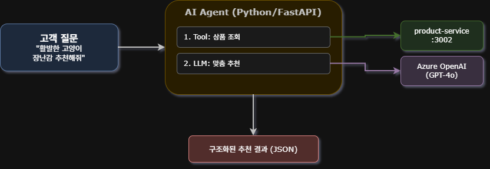
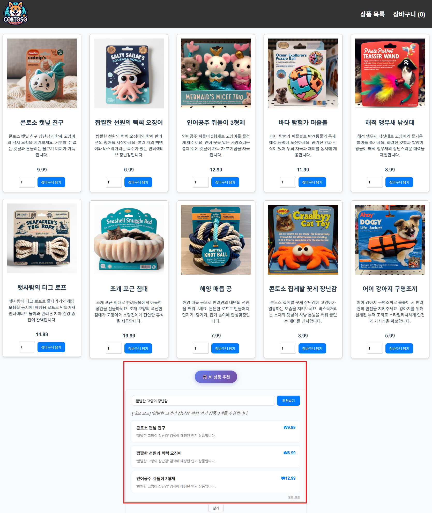
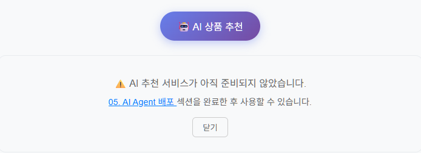
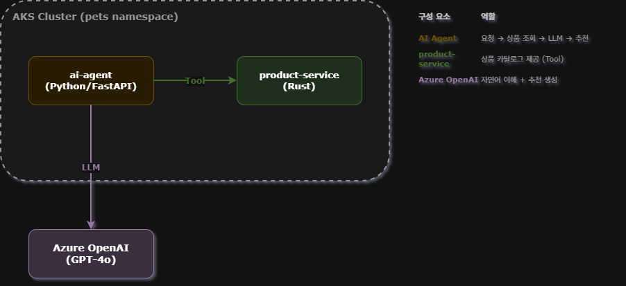
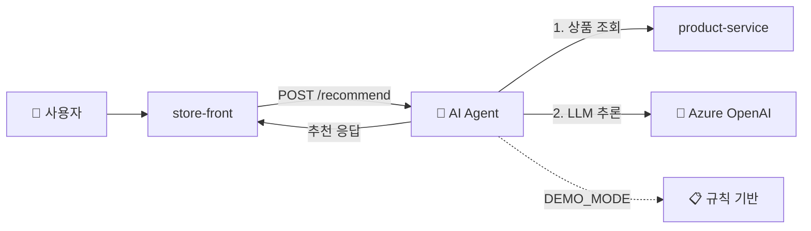

# 06. AI Agent 배포 (Azure OpenAI)

<details>
<summary><strong>⚠️ Cloud Shell 세션이 만료된 경우 — 환경 변수 재설정</strong></summary>

```bash
export RESOURCE_GROUP="WorkshopDemo-RG"
export CLUSTER_NAME="workshop-demo"
export LOCATION="koreacentral"
az aks get-credentials --name $CLUSTER_NAME --resource-group $RESOURCE_GROUP --overwrite-existing
```

</details>

## 목차

- [AI Agent 패턴](#ai-agent-패턴)
- [6-1. Azure OpenAI 리소스 생성](#6-1-azure-openai-리소스-생성)
- [6-2. AI Agent 이미지 확인](#6-2-ai-agent-이미지-확인)
- [6-3. Secret & ConfigMap 생성](#6-3-kubernetes-secret--configmap-생성)
- [6-4. AI Agent 배포](#6-4-ai-agent-배포)
- [6-5. AI 추천 테스트](#6-5-ai-추천-테스트)
- [AI Agent 아키텍처 요약](#ai-agent-아키텍처-요약)

---

이 섹션에서는 **Azure OpenAI**를 활용한 **AI 상품 추천 에이전트**를 AKS에 배포합니다.
기존 펫 스토어의 상품 카탈로그를 조회(Tool)하고, LLM으로 맞춤 추천(Reasoning)을 생성하는 **AI Agent 패턴**을 체험합니다.

### 이 섹션에서 배우는 것

- **AI Agent 패턴** — Tool(API 호출) + Reasoning(LLM 추론)을 결합한 에이전트 아키텍처
- **Azure OpenAI 연동** — GPT-4o 모델 배포 및 API Key / Workload Identity 인증
- **Kubernetes Secret/ConfigMap** — 민감 정보와 설정을 안전하게 관리하는 방법
- **데모 모드** — Azure OpenAI 없이도 규칙 기반 추천으로 실습 가능

## AI Agent 패턴



### 개요

| 항목 | 내용 |
|------|------|
| 서비스 | `ai-agent` (Python FastAPI) |
| 포트 | 5100 |
| 엔드포인트 | `POST /recommend`, `GET /health` |
| 외부 의존 | Azure OpenAI (GPT-4o), product-service |
| 폴백 | `DEMO_MODE=true` — Azure OpenAI 없이 데모 추천 |

---

## 6-1. Azure OpenAI 리소스 생성

> [!TIP]
> 이미 Azure OpenAI 리소스가 있다면 이 단계를 건너뛰고 6-2로 이동하세요.  
> **Azure OpenAI가 없거나 빠르게 테스트만 하려면** [6-1-B. 데모 모드](#6-1-b-데모-모드-azure-openai-없이-실습)로 이동하세요.

```bash
# Azure OpenAI 리소스 생성
az cognitiveservices account create \
  --name workshop-openai \
  --resource-group $RESOURCE_GROUP \
  --kind OpenAI \
  --sku S0 \
  --location eastus \
  -o table
```

> [!WARNING]
> Azure OpenAI는 일부 리전에서만 사용 가능합니다. `koreacentral`에서 불가능하면 `eastus`를 사용하세요.

### GPT-4o 모델 배포

```bash
az cognitiveservices account deployment create \
  --name workshop-openai \
  --resource-group $RESOURCE_GROUP \
  --deployment-name gpt-4o \
  --model-name gpt-4o \
  --model-version "2024-11-20" \
  --model-format OpenAI \
  --sku-capacity 10 \
  --sku-name Standard \
  -o table
```

### 엔드포인트 확인

```bash
# 엔드포인트
AOAI_ENDPOINT=$(az cognitiveservices account show \
  --name workshop-openai -g $RESOURCE_GROUP \
  --query "properties.endpoint" -o tsv)
echo "엔드포인트: $AOAI_ENDPOINT"
```

아래 **Option 1(API Key)** 또는 **Option 2(Entra ID)** 중 하나를 선택하세요.

---

### Option 1 — API Key 인증

가장 간단한 방식입니다. Azure OpenAI 키를 Kubernetes Secret으로 저장합니다.

```bash
# API 키 가져오기
AOAI_KEY=$(az cognitiveservices account keys list \
  --name workshop-openai -g $RESOURCE_GROUP \
  --query "key1" -o tsv)
echo "API 키: ${AOAI_KEY:0:8}..."
```

---

### Option 2 — Microsoft Entra ID 인증 (Workload Identity)

API Key 없이 **Managed Identity + Workload Identity Federation**으로 Azure OpenAI에 접근합니다.  
프로덕션 환경에서 권장되는 방식입니다.

#### 1) AKS에서 OIDC & Workload Identity 활성화

```bash
az aks update \
  --name $CLUSTER_NAME \
  --resource-group $RESOURCE_GROUP \
  --enable-oidc-issuer \
  --enable-workload-identity \
  -o none

# OIDC Issuer URL 확인
OIDC_ISSUER=$(az aks show \
  --name $CLUSTER_NAME -g $RESOURCE_GROUP \
  --query "oidcIssuerProfile.issuerUrl" -o tsv)
echo "OIDC Issuer: $OIDC_ISSUER"
```

#### 2) User-Assigned Managed Identity 생성

```bash
az identity create \
  --name ai-agent-identity \
  --resource-group $RESOURCE_GROUP \
  -o table

IDENTITY_CLIENT_ID=$(az identity show \
  --name ai-agent-identity -g $RESOURCE_GROUP \
  --query "clientId" -o tsv)
IDENTITY_RESOURCE_ID=$(az identity show \
  --name ai-agent-identity -g $RESOURCE_GROUP \
  --query "id" -o tsv)
echo "Client ID: $IDENTITY_CLIENT_ID"
```

#### 3) Azure OpenAI에 역할 할당

```bash
AOAI_RESOURCE_ID=$(az cognitiveservices account show \
  --name workshop-openai -g $RESOURCE_GROUP \
  --query "id" -o tsv)

az role assignment create \
  --assignee $IDENTITY_CLIENT_ID \
  --role "Cognitive Services OpenAI User" \
  --scope $AOAI_RESOURCE_ID \
  -o table
```

#### 4) Federated Credential 생성

```bash
az identity federated-credential create \
  --name ai-agent-federated \
  --identity-name ai-agent-identity \
  --resource-group $RESOURCE_GROUP \
  --issuer $OIDC_ISSUER \
  --subject system:serviceaccount:pets:ai-agent-sa \
  --audiences api://AzureADTokenExchange \
  -o table
```

#### 5) Kubernetes ServiceAccount 생성

```bash
cat <<EOF | kubectl apply -f -
apiVersion: v1
kind: ServiceAccount
metadata:
  name: ai-agent-sa
  namespace: pets
  annotations:
    azure.workload.identity/client-id: "$IDENTITY_CLIENT_ID"
  labels:
    azure.workload.identity/use: "true"
EOF
```

### 6-1-B. 데모 모드 (Azure OpenAI 없이 실습)

Azure OpenAI 리소스 없이도 AI Agent의 동작 흐름을 체험할 수 있습니다.  
데모 모드에서는 LLM 대신 규칙 기반으로 인기 상품을 추천합니다.

```bash
# 데모 모드용 더미 값 설정
AOAI_ENDPOINT="https://demo.openai.azure.com"
AOAI_KEY="demo-key"
```

> 6-3에서 ConfigMap의 `DEMO_MODE`를 `"true"`로 변경하면 됩니다.

---

## 6-2. AI Agent 이미지 확인

> [!NOTE]
> ai-agent 이미지는 공용 ACR에 사전 빌드되어 있습니다. 별도 빌드가 필요 없습니다.

```bash
az acr repository show-tags --name aksworkshopkoea6e --repository ai-agent -o table
```

```
Result
--------
v1
```

---

## 6-3. Kubernetes Secret & ConfigMap 생성

### Option 1 — API Key 방식

AI Agent가 Azure OpenAI에 접근하기 위한 자격증명을 Secret으로 생성합니다.

```bash
cd ~/azure-aks-workshop

# Secret 생성 (API 키, 엔드포인트, 배포 이름)
kubectl create secret generic ai-agent-secrets \
  --namespace pets \
  --from-literal=AZURE_OPENAI_API_KEY="$AOAI_KEY" \
  --from-literal=AZURE_OPENAI_ENDPOINT="$AOAI_ENDPOINT" \
  --from-literal=AZURE_OPENAI_DEPLOYMENT_NAME="gpt-4o"
```

### Option 2 — Entra ID 방식

API Key를 사용하지 않으므로, 엔드포인트와 배포 이름만 Secret으로 저장합니다.

```bash
cd ~/azure-aks-workshop

# Secret 생성 (엔드포인트, 배포 이름만 — API 키 불필요)
kubectl create secret generic ai-agent-secrets \
  --namespace pets \
  --from-literal=AZURE_OPENAI_API_KEY="" \
  --from-literal=AZURE_OPENAI_ENDPOINT="$AOAI_ENDPOINT" \
  --from-literal=AZURE_OPENAI_DEPLOYMENT_NAME="gpt-4o"

# ConfigMap에서 USE_AZURE_AD를 true로 변경
sed -i 's/USE_AZURE_AD: "false"/USE_AZURE_AD: "true"/' workshop-manifests/90-ai-agent.yaml
```

> **데모 모드로 실습하는 경우**, ConfigMap에서 `DEMO_MODE`를 `"true"`로 변경하세요:
> ```bash
> # 매니페스트 내 DEMO_MODE를 true로 변경
> sed -i 's/DEMO_MODE: "false"/DEMO_MODE: "true"/' workshop-manifests/90-ai-agent.yaml
> ```

---

## 6-4. AI Agent 배포

> **Option 2 (Entra ID)를 선택한 경우**, 배포 전에 매니페스트에 ServiceAccount와 Workload Identity 레이블을 추가해야 합니다:
> ```bash
> # 90-ai-agent.yaml Deployment spec에 serviceAccountName과 label 추가
> sed -i '/nodeSelector:/i\      serviceAccountName: ai-agent-sa' workshop-manifests/90-ai-agent.yaml
> sed -i '/labels:/a\        azure.workload.identity/use: "true"' workshop-manifests/90-ai-agent.yaml
> ```

```bash
kubectl apply -f workshop-manifests/90-ai-agent.yaml
```

배포 상태 확인:

```bash
kubectl get pods -n pets -l app=ai-agent -w
```

```
NAME                        READY   STATUS    RESTARTS   AGE
ai-agent-xxx                1/1     Running   0          30s
```

Health 확인:

```bash
kubectl exec -n pets deploy/ai-agent -- wget -qO- http://localhost:5100/health
```

```json
{"status":"ok","service":"ai-agent","mode":"azure-openai","auth":"api-key","ready":true}
```

> - **Option 2 (Entra ID)** 사용 시: `"auth":"entra-id"`로 표시됩니다.
> - 데모 모드에서는 `"mode":"demo"`로 표시됩니다.

---

## 6-5. AI 추천 테스트

AI Agent 배포가 완료되면 store-front 하단의 **🤖 AI 상품 추천** 버튼으로 직접 추천을 받을 수 있습니다.



> [!NOTE]
> AI Agent가 배포되지 않은 상태에서 버튼을 클릭하면 "AI 추천 서비스가 아직 준비되지 않았습니다" 안내가 표시됩니다.
>
> 

### Port-Forward로 접속

```bash
kubectl port-forward -n pets svc/ai-agent 5100:5100 &
```

### 추천 요청

```bash
# 테스트 1: 고양이 장난감 추천
curl -s http://localhost:5100/recommend \
  -H "Content-Type: application/json" \
  -d '{"query": "활발한 고양이를 위한 장난감 추천해줘"}' | python3 -m json.tool
```

### 예상 출력 (Azure OpenAI 모드)

```json
{
    "recommendations": [
        {
            "productId": 2,
            "name": "짭짤한 선원의 삑삑 오징어",
            "price": 6.99,
            "reason": "삑삑 소리가 나서 활발한 고양이의 사냥 본능을 자극합니다."
        },
        {
            "productId": 5,
            "name": "해적 앵무새 낚싯대",
            "price": 8.99,
            "reason": "낚싯대 형태로 고양이와 인터랙티브 놀이가 가능합니다."
        }
    ],
    "message": "활발한 고양이에게는 사냥 본능을 자극하는 인터랙티브 장난감이 좋습니다!",
    "mode": "azure-openai"
}
```

### 다양한 질문 테스트

```bash
# 테스트 2: 선물 추천
curl -s http://localhost:5100/recommend \
  -H "Content-Type: application/json" \
  -d '{"query": "강아지 생일 선물로 뭐가 좋을까?"}' | python3 -m json.tool

# 테스트 3: 예산 기반 추천
curl -s http://localhost:5100/recommend \
  -H "Content-Type: application/json" \
  -d '{"query": "1만원 이하로 살 수 있는 상품 추천해줘"}' | python3 -m json.tool
```

### Port-Forward 종료

```bash
# 백그라운드 port-forward 종료
kill %1 2>/dev/null
```

---

## 6-6. (선택) 정리

```bash
# AI Agent 리소스 삭제
kubectl delete -f workshop-manifests/90-ai-agent.yaml
kubectl delete secret ai-agent-secrets -n pets

# (Option 2 사용 시) ServiceAccount 및 Managed Identity 삭제
kubectl delete sa ai-agent-sa -n pets
az identity delete --name ai-agent-identity --resource-group $RESOURCE_GROUP

# Azure OpenAI 리소스 삭제 (생성한 경우)
az cognitiveservices account delete \
  --name workshop-openai \
  --resource-group $RESOURCE_GROUP
```

---

## AI Agent 아키텍처 요약





| 구성 요소 | 역할 |
|-----------|------|
| **AI Agent** | 요청 수신 → 상품 조회 → LLM 호출 → 추천 응답 |
| **product-service** | 상품 카탈로그 제공 (Tool) |
| **Azure OpenAI** | 자연어 이해 + 추천 생성 (Reasoning) |
| **인증 (Option 1)** | API Key — Secret에 키 저장 |
| **인증 (Option 2)** | Entra ID — Workload Identity + Managed Identity |
| **DEMO_MODE** | Azure OpenAI 없이 규칙 기반 폴백 |

## 점검 체크리스트

- [ ] `kubectl get pods -n pets -l app=ai-agent` — Pod 1/1 Running
- [ ] `/health` 응답에 `"ready": true` 포함
- [ ] `POST /recommend` — 추천 결과 반환
- [ ] (데모 모드) `"mode": "demo"` 확인

---

| | |
|:---|---:|
| [⬅️ 05. Ingress](05-ingress.md) | [07. HPA 오토스케일링 ➡️](07-hpa-autoscaling.md) |
