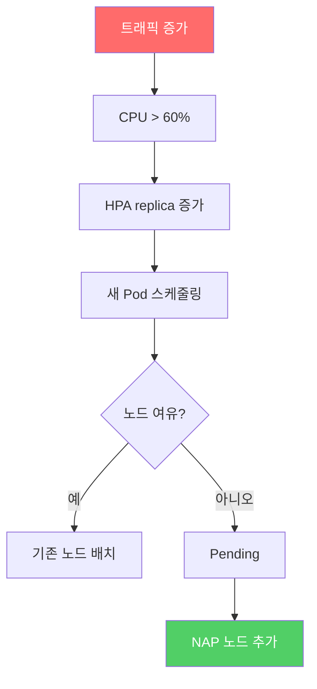

# 06. HPA 오토스케일링

<details>
<summary><strong>⚠️ Cloud Shell 세션이 만료된 경우 — 환경 변수 재설정</strong></summary>

```bash
export RESOURCE_GROUP="WorkshopDemo-RG"
export CLUSTER_NAME="workshop-demo"
az aks get-credentials --name $CLUSTER_NAME --resource-group $RESOURCE_GROUP --overwrite-existing
```

</details>

## 개요

트래픽이 증가하면 Pod의 CPU 사용률이 올라갑니다. 이때 **Horizontal Pod Autoscaler(HPA)** 가 자동으로 Pod 수를 늘려 부하를 분산시킵니다.  
이 섹션에서는 `store-front`와 `order-service`에 HPA를 적용하고, virtual-customer가 생성하는 부하에 따라 스케일링되는 과정을 관찰합니다.

### 이 섹션에서 배우는 것

- **HPA 개념** — CPU/메모리 기반으로 Pod을 수평 확장/축소하는 Kubernetes 네이티브 기능
- **스케일 아웃/인 관찰** — 부하 변화에 따른 replica 수 증감을 실시간으로 확인
- **부하 조절** — `ORDERS_PER_HOUR` 환경 변수로 트래픽을 제어하여 오토스케일링 동작 실험
- **쿨다운 동작** — 부하 감소 후 5분 대기 후 자동 스케일 다운

> [!TIP]
> 스케일링 과정을 Grafana 대시보드로 시각적으로 확인하고 싶다면, [08. 모니터링](08-monitoring-troubleshooting.md)의 8-1절(Prometheus & Grafana 구성)을 먼저 진행하는 것을 권장합니다.

## 6-1. HPA 배포

```bash
kubectl apply -f workshop-manifests/55-hpa-store.yaml
```

### HPA 설정 요약

| 대상 | 최소 | 최대 | CPU 임계치 |
|------|------|------|-----------|
| store-front | 2 | 10 | 60% |
| order-service | 1 | 8 | 60% |

## 6-2. HPA 상태 관찰

```bash
# HPA 현황 (TARGETS 컬럼에 현재 CPU% / 목표% 표시)
kubectl get hpa -n pets -w
```

### 예상 출력

```
NAME                REFERENCE                  TARGETS        MINPODS   MAXPODS   REPLICAS
store-front-hpa     Deployment/store-front     cpu: 85%/60%   2         10        5
order-service-hpa   Deployment/order-service   cpu: 120%/60%  1         8         4
```

> 📸 **스크린샷**: HPA 스케일 아웃 상태
>
> 📸 *스크린샷 준비 중 — `images/hpa-scale-out.png`*

> virtual-customer가 시간당 100건의 주문을 생성하므로, 배포 후 수 분 이내에 HPA가 스케일 아웃을 시작합니다.

## 6-3. 실시간 모니터링

### Pod 리소스 사용량

```bash
kubectl top pods -n pets
```

### Pod 수 변화 관찰

```bash
# 별도 터미널에서 실행
kubectl get pods -n pets -w
```

### Deployment 레플리카 변화

```bash
kubectl get deploy -n pets -w
```

## 6-4. 부하 조절 실험

아래 단계를 순서대로 실행하며 **각 부하 수준에서 HPA의 반응을 기록**해 보세요.

### 실험 기록표

| 단계 | 명령어 | ORDERS_PER_HOUR | store-front Pod 수 | order-service Pod 수 | 반응 시간 |
|------|--------|:---------------:|:------------------:|:--------------------:|:---------:|
| 1️⃣ 기본 | (현재 상태) | 100 | ___개 | ___개 | — |
| 2️⃣ 부하 증가 | 아래 실행 | 500 | ___개 | ___개 | ___분 |
| 3️⃣ 극단 부하 | 아래 실행 | 1000 | ___개 | ___개 | ___분 |
| 4️⃣ 부하 감소 | 아래 실행 | 10 | ___개 | ___개 | ___분 |

### Step 1: 기본 상태 확인

```bash
kubectl get hpa -n pets
```

### Step 2: 부하 증가 (500 → 스케일 아웃 관찰)

```bash
kubectl set env deployment/virtual-customer -n pets ORDERS_PER_HOUR=500
```

잠시 후 HPA가 더 많은 Pod를 추가하는 것을 관찰하세요.

### Step 3: 극단 부하 (1000 → 최대 스케일 확인)

```bash
kubectl set env deployment/virtual-customer -n pets ORDERS_PER_HOUR=1000
```

> [!NOTE]
> HPA의 `maxReplicas`(store-front: 10, order-service: 8)에 도달하면 더 이상 Pod가 추가되지 않습니다.
> 노드 리소스가 부족하면 Pending Pod가 발생하고 NAP이 노드를 추가합니다 (07절에서 실습).

### Step 4: 부하 감소 (10 → 스케일 다운 관찰)

```bash
kubectl set env deployment/virtual-customer -n pets ORDERS_PER_HOUR=10
```

약 5분 뒤 HPA가 스케일 다운을 시작합니다 (기본 쿨다운: 5분).

### (선택) 부하 중지 — virtual-customer 일시 중지

```bash
kubectl scale deployment/virtual-customer -n pets --replicas=0
```

## 6-5. HPA 상세 확인

```bash
kubectl describe hpa store-front-hpa -n pets
kubectl describe hpa order-service-hpa -n pets
```

주요 확인 포인트:
- `AbleToScale` 조건
- `ScalingActive` 조건
- 최근 스케일링 이벤트

## 핵심 개념 정리



> 다음 섹션(07절)에서 NAP 노드 자동 확장을 직접 실습합니다.

## 점검 체크리스트

- [ ] `kubectl get hpa -n pets` — 두 HPA 모두 TARGETS 표시
- [ ] ORDERS_PER_HOUR=500 시 replica 수 증가 확인
- [ ] ORDERS_PER_HOUR=10 시 약 5분 뒤 스케일 다운 확인

---

| | |
|:---|---:|
| [⬅️ 05. AI Agent 배포](05-ai-agent.md) | [07. NAP 노드 확장 ➡️](07-nap-node-scaling.md) |
