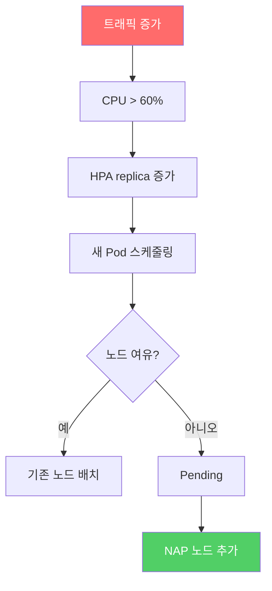

# 07. HPA 오토스케일링

<details>
<summary><strong>⚠️ Cloud Shell 세션이 만료된 경우 — 환경 변수 재설정</strong></summary>

```bash
export RESOURCE_GROUP="WorkshopDemo-RG"
export CLUSTER_NAME="workshop-demo"
az aks get-credentials --name $CLUSTER_NAME --resource-group $RESOURCE_GROUP --overwrite-existing
```

</details>

## 개요

트래픽이 증가하면 Pod의 CPU 사용률이 올라갑니다. 이때 **Horizontal Pod Autoscaler(HPA)** 가 자동으로 Pod 수를 늘려 부하를 분산시킵니다.  
이 섹션에서는 `store-front`와 `order-service`에 HPA를 적용하고, virtual-customer가 생성하는 부하에 따라 스케일링되는 과정을 관찰합니다.

### 이 섹션에서 배우는 것

- **HPA 개념** — CPU/메모리 기반으로 Pod을 수평 확장/축소하는 Kubernetes 네이티브 기능
- **스케일 아웃/인 관찰** — 부하 변화에 따른 replica 수 증감을 실시간으로 확인

- **쿨다운 동작** — 부하 감소 후 5분 대기 후 자동 스케일 다운

> [!TIP]
> 스케일링 과정을 Grafana 대시보드로 시각적으로 확인하고 싶다면, [09. 모니터링](09-monitoring-troubleshooting.md)의 9-1절(Prometheus & Grafana 구성)을 먼저 진행하는 것을 권장합니다.

## 7-1. HPA 배포

`pets` 네임스페이스에 `store-front`와 `order-service` 두 개의 **HorizontalPodAutoscaler** 리소스를 생성합니다.

> [!IMPORTANT]
> **부하 생성기는 이미 돌아가고 있습니다.**  
> `virtual-customer` Deployment는 04절에서 [`aks-store-all-in-one-ko.yaml`](../workshop-manifests/aks-store-all-in-one-ko.yaml)을 적용할 때 함께 배포되었고, 그때부터 환경 변수 `ORDERS_PER_HOUR=100`으로 **시간당 100건의 주문**을 `order-service`에 계속 보내고 있었습니다.  
> 즉, 부하는 04절부터 이미 있었지만 HPA가 없어서 Pod 개수가 고정돼 있었을 뿐입니다. 이 절에서 HPA를 만드는 순간, HPA 컨트롤러가 **이미 진행 중이던 CPU 부하**를 인식하고 곧바로 스케일 아웃을 시작합니다.

```bash
# (확인용) virtual-customer가 04절부터 이미 돌고 있는지 보기
kubectl get deployment virtual-customer -n pets
kubectl get deployment virtual-customer -n pets \
  -o jsonpath='{.spec.template.spec.containers[0].env}' | python3 -m json.tool
```

### HPA 생성

```bash
kubectl apply -f workshop-manifests/55-hpa-store.yaml
```

### 적용되는 매니페스트

```yaml
apiVersion: autoscaling/v2
kind: HorizontalPodAutoscaler
metadata:
  name: store-front-hpa
  namespace: pets
spec:
  scaleTargetRef:                        # ① 어떤 Deployment를 대상으로 할지
    apiVersion: apps/v1
    kind: Deployment
    name: store-front
  minReplicas: 2                         # ② 최소 Pod 개수 (트래픽이 없어도 유지)
  maxReplicas: 10                        # ③ 최대 Pod 개수 (스케일 아웃 상한)
  metrics:
    - type: Resource
      resource:
        name: cpu
        target:
          type: Utilization
          averageUtilization: 60         # ④ CPU 평균 사용률 60% 초과 시 확장
---
# order-service-hpa: 동일한 구조, min=1 / max=8 / CPU 60%
```

### 적용 직후 발생하는 변화

1. **`store-front` Pod 수가 1 → 2로 즉시 증가** (현재 replica < `minReplicas`이므로)
2. **`order-service` Pod 수는 변동 없음** (이미 1개로 `minReplicas`와 동일)
3. HPA 컨트롤러가 **15초 주기**로 metrics-server에서 CPU 사용률을 폴링 시작
4. **virtual-customer가 만들던 기존 부하**(시간당 100건의 주문)로 인해 이미 `order-service` CPU 사용률이 60% 임계치를 넘고 있다면, 수십 초~수 분 이내에 replica가 점진적으로 추가됨 (최대 10/8개)
5. 부하가 떨어지면 약 **5분 쿨다운** 후 천천히 축소 (`minReplicas`까지)

> [!NOTE]
> HPA는 CPU **요청량(`resources.requests.cpu`) 대비 사용률**로 판단합니다. 04절 매니페스트에서 `store-front`/`order-service` Deployment에 `resources.requests` 가 이미 설정되어 있어야 정상 동작합니다.

### 적용 직후 확인

```bash
kubectl get hpa -n pets
kubectl get deploy -n pets store-front order-service
```

`store-front` 의 `READY`가 `1/1` → `2/2`로 바뀌고, `kubectl get hpa`에 두 HPA가 표시되면 정상입니다.
초기 몇 초간 `TARGETS` 열에 `<unknown>/60%`가 보일 수 있는데, metrics-server가 첫 측정값을 수집하기 전 정상 동작입니다.

### HPA 설정 요약

| 대상 | 최소 | 최대 | CPU 임계치 |
|------|------|------|-----------|
| store-front | 2 | 10 | 60% |
| order-service | 1 | 8 | 60% |

## 7-2. HPA 상태 관찰

```bash
# HPA 현황 (TARGETS 컬럼에 현재 CPU% / 목표% 표시)
kubectl get hpa -n pets -w
```

### 예상 출력

```
NAME                            REFERENCE                                  TARGETS         MINPODS   MAXPODS   REPLICAS   AGE
order-service-hpa               Deployment/order-service                   cpu: 200%/60%   1         8         1          24s
pets-gateway-approuting-istio   Deployment/pets-gateway-approuting-istio   cpu: 2%/80%     2         5         2          4d15h
store-front-hpa                 Deployment/store-front                     cpu: 100%/60%   2         10        2          25s
store-front-hpa                 Deployment/store-front                     cpu: 100%/60%   2         10        4          31s
order-service-hpa               Deployment/order-service                   cpu: 200%/60%   1         8         4          30s
order-service-hpa               Deployment/order-service                   cpu: 100%/60%   1         8         4          90s
```

> virtual-customer가 시간당 100건의 주문을 생성하므로, 배포 후 수 분 이내에 HPA가 스케일 아웃을 시작합니다.

## 7-3. 실시간 모니터링

### Pod 리소스 사용량

```bash
kubectl top pods -n pets
```

### Pod 수 변화 관찰

```bash
# 별도 터미널에서 실행
kubectl get pods -n pets -w
```

### Deployment 레플리카 변화

```bash
kubectl get deploy -n pets -w
```

## 7-4. HPA 상세 확인

```bash
kubectl describe hpa store-front-hpa -n pets
kubectl describe hpa order-service-hpa -n pets
```

주요 확인 포인트:
- `AbleToScale` 조건
- `ScalingActive` 조건
- 최근 스케일링 이벤트

## 핵심 개념 정리



> 다음 섹션(08절)에서 NAP 노드 자동 확장을 직접 실습합니다.

## 점검 체크리스트

- [ ] `kubectl get hpa -n pets` — 두 HPA 모두 TARGETS 표시
- [ ] virtual-customer의 기본 부하로 `order-service` replica 가 증가하는지 확인

---

| | |
|:---|---:|
| [⬅️ 06. AI Agent 배포](06-ai-agent.md) | [08. NAP 노드 확장 ➡️](08-nap-node-scaling.md) |
