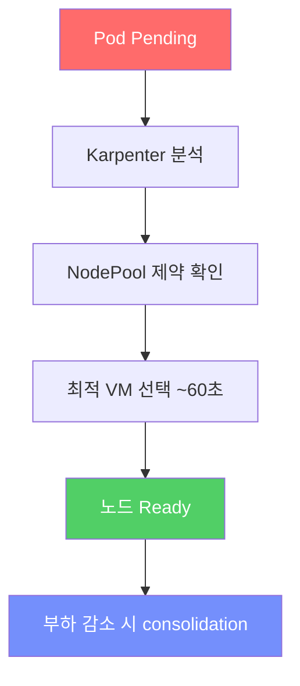

# 07. NAP (Node Auto Provisioning) 노드 자동 확장

<details>
<summary><strong>⚠️ Cloud Shell 세션이 만료된 경우 — 환경 변수 재설정</strong></summary>

```bash
export RESOURCE_GROUP="WorkshopDemo-RG"
export CLUSTER_NAME="workshop-demo"
az aks get-credentials --name $CLUSTER_NAME --resource-group $RESOURCE_GROUP --overwrite-existing
```

</details>

## 개요

이전 섹션에서 HPA가 Pod 수를 늘렸지만, 노드에 리소스가 부족하면 Pod이 **Pending** 상태로 남습니다.  
**NAP(Node Auto Provisioning)** 은 Karpenter 기반의 AKS 노드 오토스케일링 기능으로,
Pending Pod를 감지하면 **~60초 내에 최적의 VM을 자동으로 프로비저닝**합니다.

### 이 섹션에서 배우는 것

- **NAP vs Cluster Autoscaler** — 개별 VM 단위 프로비저닝의 장점
- **커스텀 NodePool CRD** — VM SKU 가족, OS, 아키텍처 제약 조건 설정
- **노드 자동 확장 관찰** — replica 증가 → Pending → 노드 생성 과정 실시간 확인
- **Consolidation** — 부하 감소 시 저활용 노드를 자동으로 제거하여 비용 절감

### NAP vs Cluster Autoscaler

| 항목 | Cluster Autoscaler | NAP (Karpenter) |
|------|-------------------|-----------------|
| 단위 | VMSS 노드풀 | 개별 VM |
| VM SKU 선택 | 노드풀별 고정 | 워크로드에 맞춰 자동 선택 |
| 스케일 속도 | 수 분 | ~60초 |
| 설정 | 노드풀 min/max | NodePool CRD로 유연 제어 |
| Karpenter 위치 | 해당 없음 | AKS 관리 컨트롤 플레인 내부 |

## 7-1. 기본 NAP NodePool 확인

클러스터 생성 시 `--node-provisioning-mode Auto`로 이미 NAP이 활성화되어 있습니다.

```bash
kubectl get nodepools.karpenter.sh
kubectl get aksnodeclasses.karpenter.azure.com
```

## 7-2. 커스텀 NodePool 배포

워크샵용 커스텀 NodePool을 생성하여 D 시리즈 VM만 사용하도록 제한합니다.

```bash
kubectl apply -f workshop-manifests/70-nap-nodepool.yaml
```

### NodePool 매니페스트 설명

```yaml
apiVersion: karpenter.sh/v1
kind: NodePool
metadata:
  name: workshop-linux
spec:
  disruption:
    consolidateAfter: 0s                              # 즉시 consolidation
    consolidationPolicy: WhenEmptyOrUnderutilized      # 미사용 노드 자동 축소
  limits:
    cpu: "100"                                         # 전체 CPU 상한
    memory: 200Gi                                      # 전체 메모리 상한
  template:
    spec:
      expireAfter: Never                               # 만료 없음
      nodeClassRef:
        group: karpenter.azure.com                     # AKS 전용 그룹
        kind: AKSNodeClass                             # AKS NodeClass 종류
        name: default
      requirements:
      - key: kubernetes.io/os
        operator: In
        values: ["linux"]
      - key: kubernetes.io/arch
        operator: In
        values: ["amd64"]
      - key: karpenter.azure.com/sku-family
        operator: In
        values: ["D"]                                 # D 시리즈만 허용
      - key: karpenter.sh/capacity-type
        operator: In
        values: ["on-demand"]                         # 온디맨드만 (Spot 제외)
```

```bash
kubectl get nodepools.karpenter.sh
```

## 7-3. 노드 스케일 아웃 유발

HPA가 많은 Pod를 생성하면 기존 노드에 스케줄링 공간이 부족해지고, NAP이 새 노드를 추가합니다.

### 부하 극대화

```bash
# virtual-customer 부하 증가
kubectl set env deployment/virtual-customer -n pets ORDERS_PER_HOUR=1000

# store-front replica를 수동으로 대량 증가
kubectl scale deployment/store-front -n pets --replicas=20
```

### 노드 변화 관찰

```bash
# 별도 터미널 — 노드 추가 관찰
kubectl get nodes -w

# Karpenter NodeClaim (노드 프로비저닝 요청) 확인
kubectl get nodeclaims.karpenter.sh
```

### 예상 동작

1. store-front Pod 20개 → 기존 2노드에 배치 불가 → Pending Pod 발생
2. NAP(Karpenter)이 Pending Pod 감지
3. D 시리즈 VM 자동 프로비저닝 (~60초)
4. 새 노드에 Pending Pod 스케줄링

> 📸 **스크린샷**: NAP 노드 자동 확장 (신규 노드 추가)
>
> 📸 *스크린샷 준비 중 — `images/nap-node-scale-out.png`*

```bash
# Pending Pod 확인
kubectl get pods -n pets --field-selector=status.phase=Pending
```

## 7-4. 노드 스케일 인 관찰

부하를 줄이면 NAP이 미사용 노드를 자동 정리합니다.

```bash
# 부하 원상 복구
kubectl set env deployment/virtual-customer -n pets ORDERS_PER_HOUR=100
kubectl scale deployment/store-front -n pets --replicas=2

# 잠시 후 노드 축소 관찰
kubectl get nodes -w
kubectl get nodeclaims.karpenter.sh -w
```

> `consolidationPolicy: WhenEmptyOrUnderutilized` 설정에 따라 비어있거나 저활용 노드는 자동으로 제거됩니다.

## 7-5. NAP 이벤트/로그 확인

```bash
# NodePool 상태
kubectl describe nodepool workshop-linux

# NodeClaim 이벤트
kubectl describe nodeclaims.karpenter.sh

# 노드에 Karpenter 라벨 확인
kubectl get nodes --show-labels | grep karpenter
```

## 핵심 개념 정리



## 점검 체크리스트

- [ ] `kubectl get nodepools.karpenter.sh` — workshop-linux 포함 3개 NodePool
- [ ] replica 20 설정 시 새 노드가 추가됨
- [ ] replica 2로 복구 후 과잉 노드가 제거됨
- [ ] `kubectl get nodeclaims.karpenter.sh` — 프로비저닝/삭제 이력 확인

---

| | |
|:---|---:|
| [⬅️ 06. HPA 오토스케일링](06-hpa-autoscaling.md) | [08. 모니터링 & 트러블슈팅 ➡️](08-monitoring-troubleshooting.md) |
