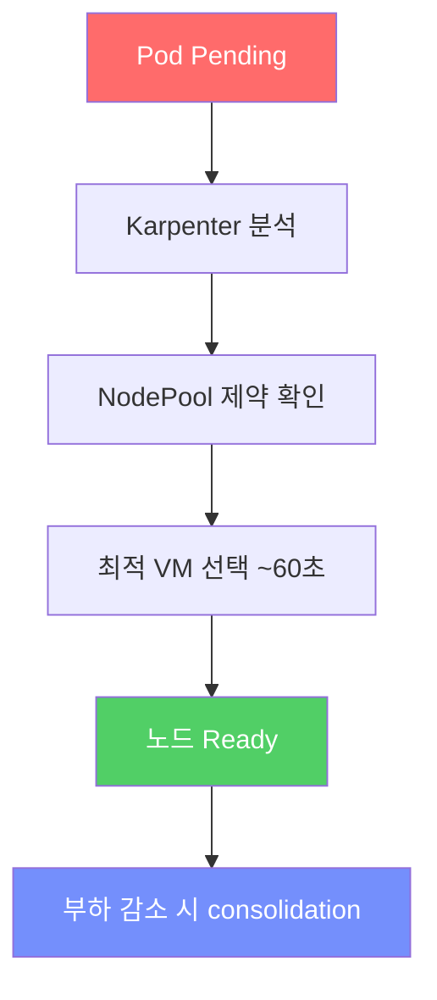

# 08. NAP (Node Auto Provisioning) 노드 자동 확장

<details>
<summary><strong>⚠️ Cloud Shell 세션이 만료된 경우 — 환경 변수 재설정</strong></summary>

```bash
export RESOURCE_GROUP="WorkshopDemo-RG"
export CLUSTER_NAME="workshop-demo"
az aks get-credentials --name $CLUSTER_NAME --resource-group $RESOURCE_GROUP --overwrite-existing
```

</details>

## 개요

이전 섹션에서 HPA가 Pod 수를 늘렸지만, 노드에 리소스가 부족하면 Pod이 **Pending** 상태로 남습니다.  
**NAP(Node Auto Provisioning)** 은 Karpenter 기반의 AKS 노드 오토스케일링 기능으로,
Pending Pod를 감지하면 **~60초 내에 최적의 VM을 자동으로 프로비저닝**합니다.

### 이 섹션에서 배우는 것

- **NAP vs Cluster Autoscaler** — 개별 VM 단위 프로비저닝의 장점
- **커스텀 NodePool CRD** — VM SKU 가족, OS, 아키텍처 제약 조건 설정
- **노드 자동 확장 관찰** — replica 증가 → Pending → 노드 생성 과정 실시간 확인
- **Consolidation** — 부하 감소 시 저활용 노드를 자동으로 제거하여 비용 절감

### NAP vs Cluster Autoscaler

| 항목 | Cluster Autoscaler | NAP (Karpenter) |
|------|-------------------|-----------------|
| 단위 | VMSS 노드풀 | 개별 VM |
| VM SKU 선택 | 노드풀별 고정 | 워크로드에 맞춰 자동 선택 |
| 스케일 속도 | 수 분 | ~60초 |
| 설정 | 노드풀 min/max | NodePool CRD로 유연 제어 |
| Karpenter 위치 | 해당 없음 | AKS 관리 컨트롤 플레인 내부 |

## 8-1. 기본 NAP NodePool 확인

클러스터 생성 시 `--node-provisioning-mode Auto`로 이미 NAP이 활성화되어 있습니다.

```bash
kubectl get nodepools.karpenter.sh
kubectl get aksnodeclasses.karpenter.azure.com
```

### 실행 결과

```
NAME           NODECLASS      NODES   READY   AGE
default        default        0       True    12m
system-surge   system-surge   0       True    12m

NAME           READY   AGE
default        True    12m
system-surge   True    12m
```

> AKS가 자동으로 프로비저닝한 두 개의 기본 NodePool(`default`, `system-surge`)이 보여야 정상입니다. `NODES=0`은 아직 이 NodePool이 관리하는 노드가 없다는 뜻으로, NAP이 필요해지면 이 NodePool을 기반으로 노드를 생성합니다.

## 8-2. 커스텀 NodePool 배포

워크샵용 커스텀 NodePool을 생성하여 D 시리즈 VM만 사용하도록 제한합니다.

```bash
kubectl apply -f workshop-manifests/70-nap-nodepool.yaml
```

### NodePool 매니페스트 설명

```yaml
apiVersion: karpenter.sh/v1
kind: NodePool
metadata:
  name: workshop-linux
spec:
  disruption:
    consolidateAfter: 0s                              # 즉시 consolidation
    consolidationPolicy: WhenEmptyOrUnderutilized      # 미사용 노드 자동 축소
  limits:
    cpu: "100"                                         # 전체 CPU 상한
    memory: 200Gi                                      # 전체 메모리 상한
  template:
    spec:
      taints:                                          # ★ NodePool 격리용 taint
        - key: workshop-linux                          #   이 NodePool이 만든 노드에
          value: "true"                                #   자동으로 부여됨 → toleration
          effect: NoSchedule                           #   없는 Pod은 스케줄링 안 됨
      expireAfter: Never                               # 만료 없음
      nodeClassRef:
        group: karpenter.azure.com                     # AKS 전용 그룹
        kind: AKSNodeClass                             # AKS NodeClass 종류
        name: default
      requirements:
      - key: kubernetes.io/os
        operator: In
        values: ["linux"]
      - key: kubernetes.io/arch
        operator: In
        values: ["amd64"]
      - key: karpenter.azure.com/sku-family
        operator: In
        values: ["D"]                                 # D 시리즈만 허용
      - key: karpenter.sh/capacity-type
        operator: In
        values: ["on-demand"]                         # 온디맨드만 (Spot 제외)
```

> [!IMPORTANT]
> **`taints: workshop-linux=true:NoSchedule` 가 핵심입니다.**  
> 이 NodePool에서 NAP가 만드는 노드에는 자동으로 이 taint가 붙어, **toleration이 명시된 Pod만** 스케줄링됩니다. 다음 절 8-3의 `nap-trigger` Deployment 가 바로 그 toleration을 가집니다.  
>
> 이렇게 격리하지 않으면 8-4 cleanup에서 NAP 노드가 사라질 때 그 위에 떠 있던 시스템 Pod(flux-system 컨트롤러, store-front 등)이 graceful shutdown에 실패하여 **수 시간 Terminating 좀비 상태**로 남을 수 있습니다.

```bash
kubectl get nodepools.karpenter.sh
```

### 실행 결과

```
NAME             NODECLASS      NODES   READY   AGE
default          default        0       True    6d20h
system-surge     system-surge   4       True    6d20h
workshop-linux   default        0       True    20s
```

> 기존 `default`, `system-surge`에 이어 방금 만든 `workshop-linux` NodePool이 추가되어 **총 3개**가 표시되면 정상입니다. 아직 해당 NodePool을 사용하는 Pod가 없으므로 `NODES=0`입니다.

## 8-3. 노드 스케일 아웃 유발

기존 노드에 스케줄링 공간이 부족해지면 Pending Pod가 발생하고, NAP(Karpenter)이 이를 감지해 새 노드를 자동으로 추가합니다. 이 절에서는 **큰 CPU/메모리를 요청하는 더미 Pod**를 배포해 의도적으로 Pending을 유발하고, NAP이 `workshop-linux` NodePool에서 D 시리즈 노드를 프로비저닝하는 과정을 관찰합니다.

> [!NOTE]
> **왜 store-front를 스케일하지 않고 더미 Deployment를 쓰나요?**  
> 07절에서 만든 HPA가 `store-front`(max=10) / `order-service`(max=8)를 관리하기 때문에 `kubectl scale store-front --replicas=20` 같은 명령은 HPA에 의해 즉시 원복됩니다. 또한 두 워크로드의 Pod당 리소스 요청량이 매우 작아 1개 노드에 수십 개가 들어가므로 Pending이 잘 생기지 않습니다. 그래서 **HPA와 분리된 더미 Deployment**를 사용해 의도적으로 노드 부족을 만듭니다.

### Step 1: 더미 Deployment 생성 (`nap-trigger`)

YAML로 한 번에 배포합니다. `tolerations` 가 있어야 8-2에서 NodePool에 부여한 `workshop-linux=true:NoSchedule` taint를 통과해 새로 만들어지는 NAP 노드에 스케줄링됩니다.

```bash
kubectl apply -n pets -f - <<'EOF'
apiVersion: apps/v1
kind: Deployment
metadata:
  name: nap-trigger
spec:
  replicas: 8
  selector:
    matchLabels:
      app: nap-trigger
  template:
    metadata:
      labels:
        app: nap-trigger
    spec:
      # ★ workshop-linux NodePool의 taint를 통과하는 toleration
      tolerations:
        - key: workshop-linux
          operator: Exists
          effect: NoSchedule
      containers:
        - name: nap-trigger
          image: registry.k8s.io/pause:3.9
          resources:
            requests:
              cpu: 1500m       # 큰 요청으로 기존 노드 여유 초과 → NAP 트리거
              memory: 2Gi
EOF
```

> `pause` 이미지는 Kubernetes가 Pod sandbox용으로 쓰는 가장 가벼운 컨테이너(수 MB)입니다. 실행 부하는 거의 없지만 `resources.requests`로 **스케줄러가 인식하는 점유량**을 만들 수 있어 NAP 트리거에 이상적입니다.
>
> `tolerations`이 없으면 새로 뜬 NAP 노드에도 스케줄되지 못해 Pending이 풀리지 않으니, **반드시 위 YAML 그대로 사용**하세요.

### Step 2: Pending 발생 확인

```bash
kubectl get pods -n pets -l app=nap-trigger -o wide
kubectl get pods -n pets --field-selector=status.phase=Pending
```

#### 실행 결과

```
NAME                           READY   STATUS    RESTARTS   AGE   IP             NODE                                NOMINATED NODE   READINESS GATES
nap-trigger-5cc5dd48d-4wwcf    0/1     Pending   0          15s   <none>         <none>                              <none>           <none>
nap-trigger-5cc5dd48d-9l7xg    0/1     Pending   0          15s   <none>         <none>                              <none>           <none>
nap-trigger-5cc5dd48d-mbdkd    0/1     Pending   0          15s   <none>         <none>                              <none>           <none>
nap-trigger-5cc5dd48d-pjpkq    0/1     Pending   0          15s   <none>         <none>                              <none>           <none>
nap-trigger-764986c966-68296   1/1     Running   0          15s   10.244.1.80    aks-nodepool1-15072150-vmss000000   <none>           <none>
nap-trigger-764986c966-d72p6   1/1     Running   0          15s   10.244.1.87    aks-nodepool1-15072150-vmss000000   <none>           <none>
nap-trigger-764986c966-f6k2p   1/1     Running   0          15s   10.244.1.229   aks-nodepool1-15072150-vmss000000   <none>           <none>
nap-trigger-764986c966-gjq96   1/1     Running   0          15s   10.244.1.185   aks-nodepool1-15072150-vmss000000   <none>           <none>
nap-trigger-764986c966-md644   1/1     Running   0          15s   10.244.1.114   aks-nodepool1-15072150-vmss000000   <none>           <none>
nap-trigger-764986c966-v8hj6   1/1     Running   0          15s   10.244.1.68    aks-nodepool1-15072150-vmss000000   <none>           <none>
NAME                          READY   STATUS    RESTARTS   AGE
nap-trigger-5cc5dd48d-4wwcf   0/1     Pending   0          15s
nap-trigger-5cc5dd48d-9l7xg   0/1     Pending   0          15s
nap-trigger-5cc5dd48d-mbdkd   0/1     Pending   0          15s
nap-trigger-5cc5dd48d-pjpkq   0/1     Pending   0          15s
```

배포 직후 일부 Pod이 `Pending` 상태인 것이 정상입니다. (기존 노드 용량 초과)

### Step 3: 노드 변화 관찰

```bash
# 별도 터미널 — 노드 추가 실시간 관찰 (약 60초 내 새 노드 등장)
kubectl get nodes -w

# Karpenter NodeClaim (노드 프로비저닝 요청) 확인
kubectl get nodeclaims.karpenter.sh

# workshop-linux NodePool이 만든 노드만 필터링
kubectl get nodes -l karpenter.sh/nodepool=workshop-linux
```

### 예상 동작

1. `nap-trigger` Pod 8개 → 기존 노드 용량 초과 → 일부 Pending
2. NAP(Karpenter)이 Pending Pod 감지 → `workshop-linux` NodePool 제약(D 시리즈, on-demand) 적용
3. **약 60초 내** D 시리즈 VM 자동 프로비저닝 → 노드 Ready
4. Pending Pod이 새 노드에 스케줄링되어 모두 `Running`

#### 실행 결과 
```
NAME                           READY   STATUS    RESTARTS   AGE    IP             NODE                                NOMINATED NODE   READINESS GATES
nap-trigger-5cc5dd48d-4wwcf    1/1     Running   0          2m9s   10.244.0.57    aks-workshop-linux-zfxms            <none>           <none>
nap-trigger-5cc5dd48d-5sxqs    0/1     Pending   0          43s    <none>         <none>                              <none>           <none>
nap-trigger-5cc5dd48d-9l7xg    1/1     Running   0          2m9s   10.244.0.176   aks-workshop-linux-zfxms            <none>           <none>
nap-trigger-5cc5dd48d-cmsgl    0/1     Pending   0          44s    <none>         <none>                              <none>           <none>
nap-trigger-5cc5dd48d-mbdkd    1/1     Running   0          2m9s   10.244.0.42    aks-workshop-linux-zfxms            <none>           <none>
nap-trigger-5cc5dd48d-pjpkq    1/1     Running   0          2m9s   10.244.0.175   aks-workshop-linux-zfxms            <none>           <none>
nap-trigger-5cc5dd48d-psjg4    0/1     Pending   0          43s    <none>         <none>                              <none>           <none>
nap-trigger-5cc5dd48d-q742b    0/1     Pending   0          43s    <none>         <none>                              <none>           <none>
nap-trigger-764986c966-d72p6   1/1     Running   0          2m9s   10.244.1.87    aks-nodepool1-15072150-vmss000000   <none>           <none>
nap-trigger-764986c966-f6k2p   1/1     Running   0          2m9s   10.244.1.229   aks-nodepool1-15072150-vmss000000   <none>           <none>
```

### Step 4: 결과 확인

```bash
# 새로 추가된 노드 — NAME에 'aks-workshop-linux-' 접두사가 보임
kubectl get nodes

# workshop-linux NodePool의 NODES 카운트가 0 → 1 이상으로 증가
kubectl get nodepools.karpenter.sh

# 모든 nap-trigger Pod이 Running
kubectl get pods -n pets -l app=nap-trigger
```

## 8-4. 노드 스케일 인 관찰

`nap-trigger` Deployment를 삭제하면 새로 만든 노드가 더 이상 필요 없어집니다. NAP의 `consolidationPolicy: WhenEmptyOrUnderutilized` 설정에 따라 비어있거나 저활용 상태가 된 노드는 자동으로 제거됩니다.

```bash
# 더미 Deployment 삭제 → 새 노드의 점유 Pod 사라짐
kubectl delete deployment nap-trigger -n pets

# 노드 축소 관찰 (consolidateAfter: 0s 설정이라 빠르게 정리됨)
kubectl get nodes -w
kubectl get nodeclaims.karpenter.sh -w
```

> [!TIP]
> 노드가 제거되기까지 보통 **1~3분** 정도 걸립니다. Pod이 다른 노드로 옮겨가는 drain 시간이 포함됩니다.

축소 완료 후 확인:

```bash
kubectl get nodepools.karpenter.sh
# workshop-linux 의 NODES 가 다시 0이 되면 정리 완료
```

## 8-5. NAP 이벤트/로그 확인

```bash
# NodePool 상태
kubectl describe nodepool workshop-linux

# NodeClaim 이벤트
kubectl describe nodeclaims.karpenter.sh

# 노드에 Karpenter 라벨 확인
kubectl get nodes --show-labels | grep karpenter
```

## 핵심 개념 정리



## 점검 체크리스트

- [ ] `kubectl get nodepools.karpenter.sh` — workshop-linux 포함 3개 NodePool
- [ ] `nap-trigger` 배포 직후 Pending Pod 발생 확인 (`kubectl get pods -n pets --field-selector=status.phase=Pending`)
- [ ] `kubectl get nodes -l karpenter.sh/nodepool=workshop-linux` — 새 D 시리즈 노드 추가됨
- [ ] `kubectl get nodepools.karpenter.sh` — `workshop-linux` 의 `NODES` 가 1 이상
- [ ] `nap-trigger` 삭제 후 추가된 노드가 자동 제거됨
- [ ] `kubectl get nodeclaims.karpenter.sh` — 프로비저닝/삭제 이력 확인

---

| | |
|:---|---:|
| [⬅️ 07. HPA 오토스케일링](07-hpa-autoscaling.md) | [09. 모니터링 & 트러블슈팅 ➡️](09-monitoring-troubleshooting.md) |
