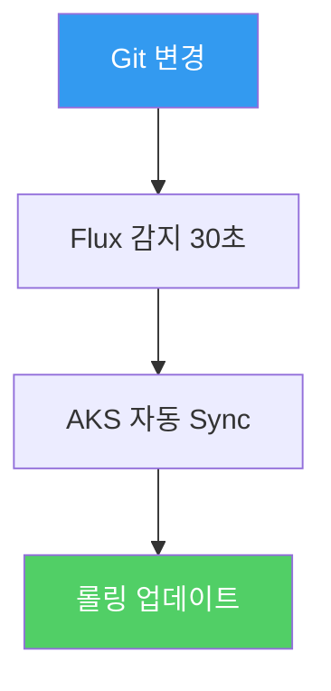
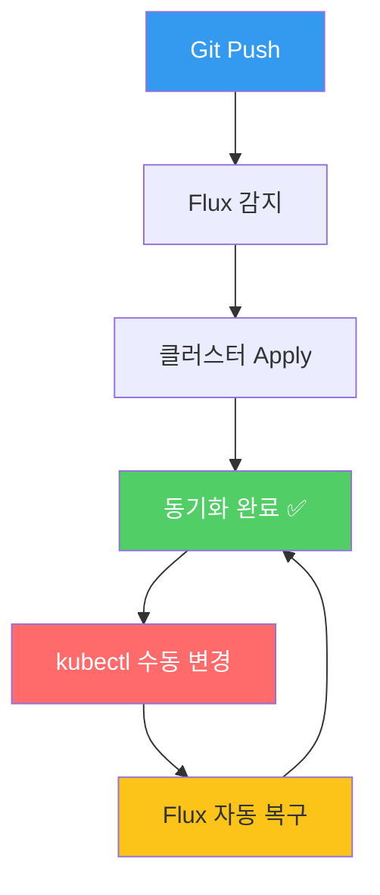

# 09. GitOps — Flux v2로 배포 자동화

<details>
<summary><strong>⚠️ Cloud Shell 세션이 만료된 경우 — 환경 변수 재설정</strong></summary>

```bash
export RESOURCE_GROUP="WorkshopDemo-RG"
export CLUSTER_NAME="workshop-demo"
az aks get-credentials --name $CLUSTER_NAME --resource-group $RESOURCE_GROUP --overwrite-existing
```

</details>

## 개요

> [!IMPORTANT]
> 이 섹션을 진행하기 전에 다음을 준비하세요:
> 1. [https://github.com/bbiggum/azure-aks-workshop](https://github.com/bbiggum/azure-aks-workshop)를 자신의 GitHub 계정으로 **Fork** 합니다.
> 2. 필요하면 [GitHub PAT(Personal Access Token)](https://github.com/settings/tokens)를 생성해 둡니다.

지금까지는 `kubectl apply`로 직접 배포했지만, 프로덕션 환경에서는 **선언적 배포 자동화**가 필수입니다.  
**GitOps**는 Git 저장소를 단일 진실 원천(Single Source of Truth)으로 사용하여 클러스터 상태를 선언적으로 관리하는 운영 방식입니다.
이 섹션에서는 AKS의 **매니지드 Flux v2** (Azure Arc 기반 GitOps 확장)를 활용하여
Git 저장소의 매니페스트 변경이 자동으로 클러스터에 반영되는 과정을 체험합니다.

### 이 섹션에서 배우는 것

- **GitOps 개념** — 명령형(imperative) vs 선언형(declarative) 배포의 차이
- **Flux v2 확장** — AKS에서 기본 지원하는 GitOps 컨트롤러 설정
- **자동 Sync** — Git 커밋 → 30초 내 클러스터 자동 반영
- **드리프트 복구** — 수동 변경을 감지하고 Git 상태로 자동 되돌리기

### GitOps vs 전통적 배포 비교

| 항목 | `kubectl apply` (전통적) | GitOps (Flux v2) |
|------|------------------------|------------------|
| 배포 주체 | 사람 (CLI 실행) | Flux가 자동 감지 & 배포 |
| 상태 관리 | 명령형 (imperative) | 선언형 (declarative) |
| 이력 추적 | CLI 히스토리에 의존 | Git 커밋 이력으로 추적 |
| 드리프트 감지 | 수동 확인 | 자동 감지 & 복구 |
| 롤백 | `kubectl rollout undo` | Git revert → 자동 반영 |

### 핸즈온 시나리오



---

## 9-1. AKS GitOps 확장 (Flux v2) 활성화

AKS에서는 **Flux v2** 기반의 GitOps 확장을 기본 지원합니다.  
먼저 CLI 확장을 설치하고 클러스터에 GitOps를 활성화합니다.

```bash
# k8s-configuration CLI 확장 설치
az extension add --name k8s-configuration --upgrade
```

## 9-2. GitOps 구성 생성

Git 저장소를 클러스터에 연결하는 Flux 구성을 생성합니다.

```bash
# GitOps 매니페스트 디렉터리 생성
mkdir -p gitops-manifests
```

### store-front 전용 GitOps 매니페스트 준비

간단한 시나리오로 `store-front`의 이미지 태그를 GitOps로 관리합니다.

```bash
cat > gitops-manifests/store-front-deployment.yaml << 'EOF'
apiVersion: apps/v1
kind: Deployment
metadata:
  name: store-front
  namespace: pets
spec:
  replicas: 2
  selector:
    matchLabels:
      app: store-front
  template:
    metadata:
      labels:
        app: store-front
    spec:
      nodeSelector:
        "kubernetes.io/os": linux
      containers:
        - name: store-front
          image: aksworkshopkoea6e.azurecr.io/store-front:ko
          ports:
            - containerPort: 8080
          env:
            - name: VUE_APP_ORDER_SERVICE_URL
              value: "http://order-service:3000/"
            - name: VUE_APP_PRODUCT_SERVICE_URL
              value: "http://product-service:3002/"
          resources:
            requests:
              cpu: 50m
              memory: 64Mi
            limits:
              cpu: 500m
              memory: 512Mi
          readinessProbe:
            httpGet:
              path: /health
              port: 8080
            initialDelaySeconds: 3
            periodSeconds: 5
          livenessProbe:
            httpGet:
              path: /health
              port: 8080
            initialDelaySeconds: 5
            periodSeconds: 10
EOF
```

### Git 저장소에 매니페스트 푸시

> [!IMPORTANT]
> **사전 준비**: GitOps 실습을 위해 **자신의 GitHub 저장소**가 필요합니다.
> 1. [https://github.com/bbiggum/azure-aks-workshop](https://github.com/bbiggum/azure-aks-workshop)에서 **Fork** 버튼을 클릭하여 자신의 계정으로 복제합니다.
> 2. fork한 저장소를 클론하거나, 기존 클론의 remote를 자신의 fork로 변경합니다:
>    ```bash
>    git remote set-url origin https://github.com/<YOUR_GITHUB_USERNAME>/azure-aks-workshop.git
>    ```
> 3. 프라이빗 저장소이거나 push 인증이 필요하면 [GitHub PAT(Personal Access Token)](https://github.com/settings/tokens)를 생성하세요.

> [!TIP]
> 실제 GitOps 운영에서는 애플리케이션 코드와 배포 매니페스트를 분리된 저장소로 관리하는 것이 모범 사례입니다.

```bash
# 워크샵에서는 현재 저장소의 gitops-manifests 디렉터리를 활용합니다
cd ~/azure-aks-workshop
git add gitops-manifests/
git commit -m "feat: add GitOps manifests for store-front"
git push origin main
```

## 9-3. Flux GitOps 구성 적용

AKS에 Flux 구성을 생성하여 Git 저장소를 연결합니다.

```bash
az k8s-configuration flux create \
  --name workshop-gitops \
  --cluster-name $CLUSTER_NAME \
  --resource-group $RESOURCE_GROUP \
  --cluster-type managedClusters \
  --namespace flux-system \
  --scope cluster \
  --url https://github.com/<YOUR_GITHUB_USERNAME>/azure-aks-workshop \
  --branch main \
  --kustomization name=store-front path=./gitops-manifests prune=true sync_interval=30s
```

> [!WARNING]
> `<YOUR_GITHUB_USERNAME>`을 실제 GitHub 사용자명으로 교체하세요.

> **프라이빗 저장소**인 경우 `--https-user`와 `--https-key` 옵션을 추가하세요:
> ```bash
> az k8s-configuration flux create \
>   ... \
>   --https-user <GITHUB_USERNAME> \
>   --https-key <GITHUB_PAT>
> ```

### 구성 상태 확인

```bash
az k8s-configuration flux show \
  --name workshop-gitops \
  --cluster-name $CLUSTER_NAME \
  --resource-group $RESOURCE_GROUP \
  --cluster-type managedClusters \
  -o table
```

### Flux 컨트롤러 확인

```bash
# Flux 컴포넌트 확인
kubectl get pods -n flux-system
```

### 예상 출력

```
NAME                                       READY   STATUS    RESTARTS   AGE
source-controller-xxxx                     1/1     Running   0          2m
kustomize-controller-xxxx                  1/1     Running   0          2m
notification-controller-xxxx               1/1     Running   0          2m
```

## 9-4. GitOps Sync 확인

Flux가 Git 저장소의 매니페스트를 클러스터에 동기화하는지 확인합니다.

```bash
# Kustomization 상태 확인
kubectl get kustomizations.kustomize.toolkit.fluxcd.io -n flux-system
```

```
NAME           READY   STATUS                                  AGE
store-front    True    Applied revision: main@sha1:abc1234     2m
```

> 📸 **스크린샷**: Flux Kustomization 동기화 상태
>
> 📸 *스크린샷 준비 중 — `images/flux-sync-status.png`*

```bash
# store-front Deployment 확인
kubectl get deployment store-front -n pets -o jsonpath='{.spec.template.spec.containers[0].image}'
echo
```

## 9-5. GitOps 워크플로우 체험 — 이미지 태그 변경

Git에서 매니페스트를 수정하면 Flux가 자동으로 클러스터에 반영합니다.

### Step 1: 매니페스트에서 replica 수 변경

```bash
# replicas를 2 → 4로 변경
sed -i 's/replicas: 2/replicas: 4/' gitops-manifests/store-front-deployment.yaml
```

### Step 2: Git에 커밋 & 푸시

```bash
cd ~/azure-aks-workshop
git add gitops-manifests/store-front-deployment.yaml
git commit -m "scale: store-front replicas 2 → 4"
git push origin main
```

### Step 3: 자동 Sync 관찰

```bash
# Flux가 변경을 감지하고 적용하는 과정 관찰 (30초 내 반영)
kubectl get pods -n pets -l app=store-front -w
```

> [!NOTE]
> ⏱ `sync_interval=30s`로 설정했으므로 최대 30초 내에 변경이 반영됩니다.

### 예상 결과

```
NAME                           READY   STATUS    RESTARTS   AGE
store-front-xxxxx-aaa          1/1     Running   0          10m
store-front-xxxxx-bbb          1/1     Running   0          10m
store-front-xxxxx-ccc          1/1     Running   0          15s    ← 새로 추가
store-front-xxxxx-ddd          1/1     Running   0          15s    ← 새로 추가
```

> 📸 **스크린샷**: GitOps로 자동 반영된 Pod 수 변경
>
> 📸 *스크린샷 준비 중 — `images/gitops-auto-sync.png`*

## 9-6. 드리프트 감지 & 자동 복구

GitOps의 핵심 장점 중 하나는 **드리프트(drift) 자동 복구**입니다.  
누군가 `kubectl`로 직접 변경해도 Flux가 Git 상태로 자동 되돌립니다.

### 실험: 수동 변경 후 복구 관찰

```bash
# 수동으로 replicas를 1로 축소
kubectl scale deployment/store-front -n pets --replicas=1

# Pod 수 확인 (일시적으로 1개)
kubectl get pods -n pets -l app=store-front

# 30초 후 Flux가 자동으로 4개로 복구
kubectl get pods -n pets -l app=store-front -w
```

> Flux가 Git 저장소의 `replicas: 4`와 클러스터 상태가 다른 것을 감지하여 자동으로 복구합니다.

## 9-7. (선택) 정리

```bash
# Flux GitOps 구성 삭제
az k8s-configuration flux delete \
  --name workshop-gitops \
  --cluster-name $CLUSTER_NAME \
  --resource-group $RESOURCE_GROUP \
  --cluster-type managedClusters \
  --yes

# replicas를 원래 값으로 복구
sed -i 's/replicas: 4/replicas: 2/' gitops-manifests/store-front-deployment.yaml
kubectl apply -f workshop-manifests/aks-store-all-in-one-ko.yaml
```

## 핵심 개념 정리



## 점검 체크리스트

- [ ] `kubectl get pods -n flux-system` — Flux 컨트롤러 3개 Running
- [ ] `kubectl get kustomizations -n flux-system` — Ready=True
- [ ] Git에서 replicas 변경 → 30초 내 클러스터 반영 확인
- [ ] `kubectl scale` 수동 변경 → Flux가 자동 복구하는지 확인

---

| | |
|:---|---:|
| [⬅️ 08. 모니터링 & 트러블슈팅](08-monitoring-troubleshooting.md) | [10. 정리 ➡️](10-cleanup.md) |
