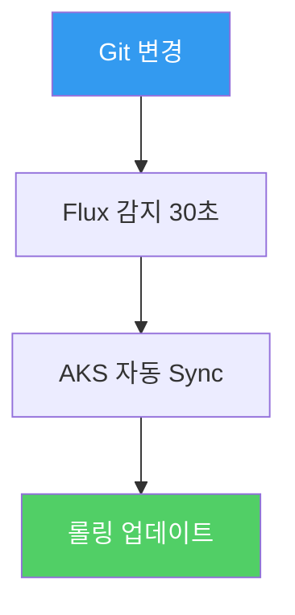
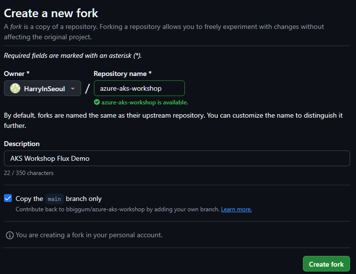
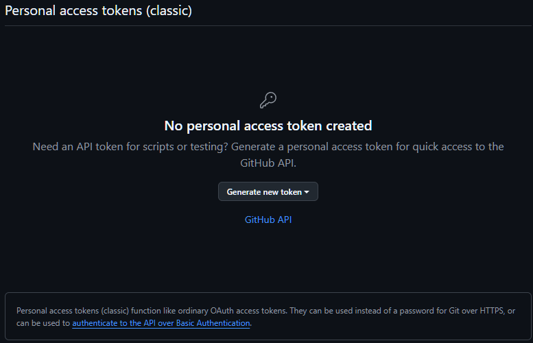
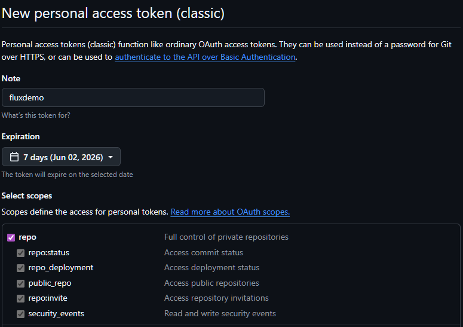
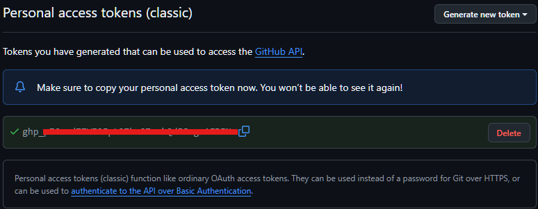
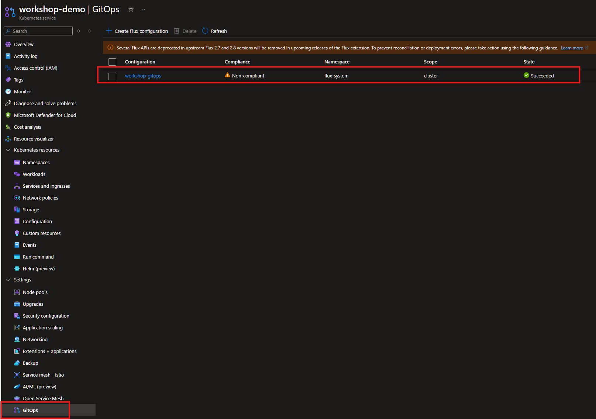
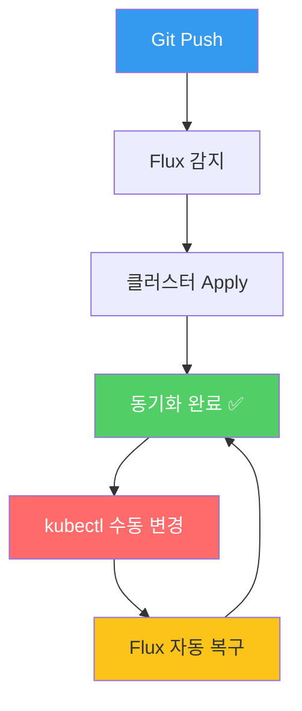

# 10. GitOps — Flux v2로 배포 자동화

<details>
<summary><strong>⚠️ Cloud Shell 세션이 만료된 경우 — 환경 변수 재설정</strong></summary>

```bash
export RESOURCE_GROUP="WorkshopDemo-RG"
export CLUSTER_NAME="workshop-demo"
az aks get-credentials --name $CLUSTER_NAME --resource-group $RESOURCE_GROUP --overwrite-existing
```

</details>

## 개요

지금까지는 `kubectl apply`로 직접 배포했지만, 프로덕션 환경에서는 **선언적 배포 자동화**가 필수입니다.  
**GitOps**는 Git 저장소를 단일 진실 원천(Single Source of Truth)으로 사용하여 클러스터 상태를 선언적으로 관리하는 운영 방식입니다.
이 섹션에서는 AKS의 **매니지드 Flux v2** (Azure Arc 기반 GitOps 확장)를 활용하여
Git 저장소의 매니페스트 변경이 자동으로 클러스터에 반영되는 과정을 체험합니다.

### 이 섹션에서 배우는 것

- **GitOps 개념** — 명령형(imperative) vs 선언형(declarative) 배포의 차이
- **Flux v2 확장** — AKS에서 기본 지원하는 GitOps 컨트롤러 설정
- **자동 Sync** — Git 커밋 → 30초 내 클러스터 자동 반영
- **드리프트 복구** — 수동 변경을 감지하고 Git 상태로 자동 되돌리기

### GitOps vs 전통적 배포 비교

| 항목 | `kubectl apply` (전통적) | GitOps (Flux v2) |
|------|------------------------|------------------|
| 배포 주체 | 사람 (CLI 실행) | Flux가 자동 감지 & 배포 |
| 상태 관리 | 명령형 (imperative) | 선언형 (declarative) |
| 이력 추적 | CLI 히스토리에 의존 | Git 커밋 이력으로 추적 |
| 드리프트 감지 | 수동 확인 | 자동 감지 & 복구 |
| 롤백 | `kubectl rollout undo` | Git revert → 자동 반영 |

### 핸즈온 시나리오



---

## 10-0. 사전 준비 — 개인 GitHub 저장소 구성

GitOps는 **"Git 저장소 → 클러스터" 단방향 동기화**가 핵심입니다. Flux가 polling할 URL은 **본인이 push 권한을 가진 저장소**여야 하며, 워크샵 진행 중 매니페스트를 직접 커밋·푸시하므로 각자 **개인 fork**가 필요합니다.

> [!NOTE]
> **여러 명이 같은 repo를 공유할 수 없는 이유**: push 권한 충돌, 한 명의 변경이 모두의 클러스터에 반영됨, 드리프트 실험 격리 불가. 1인 1 fork가 필수입니다.

### Step 1: 워크샵 저장소 Fork

브라우저에서 [https://github.com/bbiggum/azure-aks-workshop](https://github.com/bbiggum/azure-aks-workshop) 접속 → 우측 상단 **Fork** 버튼 클릭 → 본인 계정으로 복제합니다.

> 📸 **스크린샷**: Fork 화면 — `Owner`는 본인 GitHub 계정, `Repository name`은 그대로 두면 됨
>
> 

### Step 2: Cloud Shell에서 본인 fork 연결 + 로컬 main 브랜치 준비

이전 절(`01-prerequisites`)에서 이미 `bbiggum/azure-aks-workshop` 을 clone 한 상태라고 가정합니다.

> [!NOTE]
> 01절에서 `git clone -b my-change ...` 형태로 받았다면 로컬에 **`main` 브랜치가 없는 상태**입니다(my-change 브랜치만 받음). 아래 절차의 `git fetch` + `checkout -B main origin/main` 단계가 이 함정을 해결해 줍니다.

```bash
# (a) 본인 GitHub 사용자명을 환경 변수로 (이후 모든 단계에서 재사용)
export GITHUB_USERNAME="<YOUR_GITHUB_USERNAME>"

cd ~/azure-aks-workshop

# (b) 기존 origin(bbiggum)을 upstream으로 이름 변경 — 나중에 원본 변경 동기화 시 사용
git remote rename origin upstream

# (c) 본인 fork를 새 origin으로 등록
git remote add origin https://github.com/$GITHUB_USERNAME/azure-aks-workshop.git

# (d) 본인 fork의 브랜치 정보 가져오기
git fetch origin

# (e) 로컬 main 브랜치를 본인 fork의 main 기준으로 생성/체크아웃
git checkout -B main origin/main

# (f) 확인 — origin 두 줄(본인 fork), upstream 두 줄(bbiggum) 모두 보여야 정상
git remote -v
git branch
```

기대 출력:

```
origin    https://github.com/<YOUR_GITHUB_USERNAME>/azure-aks-workshop.git (fetch)
origin    https://github.com/<YOUR_GITHUB_USERNAME>/azure-aks-workshop.git (push)
upstream  https://github.com/bbiggum/azure-aks-workshop (fetch)
upstream  https://github.com/bbiggum/azure-aks-workshop (push)

* main
  my-change
```

<details>
<summary><strong>처음부터 clone하는 경우 (01절을 건너뛴 분)</strong></summary>

```bash
export GITHUB_USERNAME="<YOUR_GITHUB_USERNAME>"

# 본인 fork를 직접 clone — origin이 자동으로 본인 fork가 됨
git clone https://github.com/$GITHUB_USERNAME/azure-aks-workshop.git
cd azure-aks-workshop

# 원본 repo를 upstream으로 등록 (선택 — 동기화 필요할 때만)
git remote add upstream https://github.com/bbiggum/azure-aks-workshop.git
```

</details>

> [!TIP]
> 워크샵 진행 중 원본 repo(`bbiggum/azure-aks-workshop`)에 업데이트가 있을 때 본인 fork에 반영하려면:
> ```bash
> git fetch upstream
> git checkout main
> git merge upstream/main           # 또는 git reset --hard upstream/main (본인 변경 폐기)
> git push origin main
> ```
> 또는 GitHub UI에서 본인 fork 페이지 → **`Sync fork`** 버튼 한 번이면 끝.

### Step 3: GitHub 인증 토큰(PAT) 준비 — 선택 사항

> [!IMPORTANT]
> **Azure Cloud Shell 사용자(대부분의 워크샵 환경)는 이 단계를 건너뛰어도 됩니다.**  
> Cloud Shell에는 **Git Credential Manager (GCM)** 가 사전 설치되어 있어, 첫 `git push` 시 자동으로 브라우저 OAuth 창이 열리고 본인의 GitHub/EMU SSO 세션으로 인증이 즉시 완료됩니다. 발급된 OAuth 토큰은 Cloud Shell이 자동으로 캐시하므로 별도의 PAT 입력이 필요 없습니다.
>
> 바로 [Step 4 — 빈 커밋 push 검증](#step-4-확인--빈-커밋으로-push-권한-검증)으로 이동하세요.

다음 경우에는 PAT이 필요합니다:

- 로컬 머신(macOS/Linux/Windows)에서 GCM 없이 진행하는 경우
- CI/CD 파이프라인 같은 **비대화형 환경**
- GCM이 거부하는 특수한 프라이빗 fork

Cloud Shell에서 만약 OAuth 자동 흐름이 동작하지 않거나(드물게 발생), 위 케이스에 해당한다면 아래로 PAT을 생성하세요.

1. [https://github.com/settings/tokens](https://github.com/settings/tokens) 접속 → **Generate new token (classic)**

   

2. 권한(Scopes): **`repo`** 체크 (전체) — fork가 public이어도 push에는 필요
3. **Expiration**: 워크샵 기간만큼 짧게 (예: 7일) 설정 — 보안상 권장

   

4. 생성된 토큰을 안전한 곳에 복사 (한 번만 표시됨)

   

> [!TIP]
> 첫 push 시 사용자명/비밀번호 프롬프트가 뜨면 **비밀번호 자리에 PAT을 그대로 붙여넣으세요**. Cloud Shell은 인증 정보를 세션 동안만 캐시합니다.
>
> 토큰을 자주 입력하기 싫다면 git credential helper를 잠시 켭니다:
> ```bash
> git config --global credential.helper cache
> ```

### Step 4: 확인 — 빈 커밋으로 push 권한 검증

본격적인 변경 전에 **푸시 권한이 동작하는지 한 번 확인**합니다.

```bash
# 빈 커밋 후 push
git commit --allow-empty -m "chore: verify push access for GitOps workshop"
git push origin main
```

성공 메시지가 보이고 본인 GitHub fork의 commit 이력에 새 커밋이 나타나면 준비 완료입니다. 인증 오류가 나면 Step 3을 다시 확인하세요.

### 사전 준비 체크리스트

- [ ] 본인 GitHub 계정에 `azure-aks-workshop` fork 존재
- [ ] `git remote -v` → `origin`이 본인 fork, `upstream`이 `bbiggum/azure-aks-workshop`
- [ ] `git branch` → 로컬에 `main` 브랜치 존재 (현재 브랜치이면 더 좋음)
- [ ] (선택) Cloud Shell 외 환경 / GCM 미사용 시 PAT을 만들어 안전한 곳에 저장
- [ ] `git push origin main` 빈 커밋이 성공
- [ ] 본인 GitHub 저장소 페이지에서 새 커밋 확인

---

## 10-1. AKS GitOps 확장 (Flux v2) 활성화

AKS에서는 **Flux v2** 기반의 GitOps 확장을 기본 지원합니다.  
먼저 CLI 확장을 설치하고 클러스터에 GitOps를 활성화합니다.

```bash
# k8s-configuration CLI 확장 설치
az extension add --name k8s-configuration --upgrade
```

## 10-2. GitOps 구성 생성

Git 저장소를 클러스터에 연결하는 Flux 구성을 생성합니다.

```bash
# GitOps 매니페스트 디렉터리 생성
mkdir -p gitops-manifests
```

### store-front 전용 GitOps 매니페스트 준비

간단한 시나리오로 `store-front`의 이미지 태그를 GitOps로 관리합니다.

```bash
cat > gitops-manifests/store-front-deployment.yaml << 'EOF'
apiVersion: apps/v1
kind: Deployment
metadata:
  name: store-front
  namespace: pets
spec:
  replicas: 2
  selector:
    matchLabels:
      app: store-front
  template:
    metadata:
      labels:
        app: store-front
    spec:
      nodeSelector:
        "kubernetes.io/os": linux
      containers:
        - name: store-front
          image: aksworkshopkoea6e.azurecr.io/store-front:ko
          ports:
            - containerPort: 8080
          env:
            - name: VUE_APP_ORDER_SERVICE_URL
              value: "http://order-service:3000/"
            - name: VUE_APP_PRODUCT_SERVICE_URL
              value: "http://product-service:3002/"
          resources:
            requests:
              cpu: 50m
              memory: 64Mi
            limits:
              cpu: 500m
              memory: 512Mi
          readinessProbe:
            httpGet:
              path: /health
              port: 8080
            initialDelaySeconds: 3
            periodSeconds: 5
          livenessProbe:
            httpGet:
              path: /health
              port: 8080
            initialDelaySeconds: 5
            periodSeconds: 10
EOF
```

### Git 저장소에 매니페스트 푸시

> [!NOTE]
> 본인 fork로 remote 변경과 PAT 준비는 [10-0. 사전 준비](#10-0-사전-준비--개인-github-저장소-구성)에서 이미 완료되었어야 합니다. 아직이라면 먼저 10-0을 진행하세요.

> [!TIP]
> 실제 GitOps 운영에서는 애플리케이션 코드와 배포 매니페스트를 분리된 저장소로 관리하는 것이 모범 사례입니다.

```bash
# 워크샵에서는 현재 저장소의 gitops-manifests 디렉터리를 활용합니다
cd ~/azure-aks-workshop
git add gitops-manifests/
git commit -m "feat: add GitOps manifests for store-front"
git push origin main
```

## 10-3. Flux GitOps 구성 적용

AKS에 Flux 구성을 생성하여 Git 저장소를 연결합니다.

```bash
az k8s-configuration flux create \
  --name workshop-gitops \
  --cluster-name $CLUSTER_NAME \
  --resource-group $RESOURCE_GROUP \
  --cluster-type managedClusters \
  --namespace flux-system \
  --scope cluster \
  --url https://github.com/$GITHUB_USERNAME/azure-aks-workshop \
  --branch main \
  --kustomization name=store-front path=./gitops-manifests prune=true sync_interval=30s
```

> [!NOTE]
> `$GITHUB_USERNAME` 변수는 [10-0 Step 2](#step-2-cloud-shell에서-본인-fork로-remote-변경)에서 설정한 것입니다. 변수가 비어 있다면 `export GITHUB_USERNAME="<본인 사용자명>"` 으로 다시 설정하세요.

> **프라이빗 저장소**인 경우 `--https-user`와 `--https-key` 옵션을 추가하세요:
> ```bash
> az k8s-configuration flux create \
>   ... \
>   --https-user <GITHUB_USERNAME> \
>   --https-key <GITHUB_PAT>
> ```

### 구성 상태 확인

```bash
az k8s-configuration flux show \
  --name workshop-gitops \
  --cluster-name $CLUSTER_NAME \
  --resource-group $RESOURCE_GROUP \
  --cluster-type managedClusters \
  -o table
```

### Flux 컨트롤러 확인

```bash
# Flux 컴포넌트 확인
kubectl get pods -n flux-system
```

### 예상 출력

```
NAME                                       READY   STATUS    RESTARTS   AGE
fluxconfig-agent-6b8688c7d5-c4mmh          2/2     Running   0          110m
fluxconfig-controller-5f7b4878f4-r2scc     2/2     Running   0          110m
helm-controller-5579b4b4b6-ws6jd           1/1     Running   0          110m
kustomize-controller-568bcf7b57-6ssc9      1/1     Running   0          110m
notification-controller-66b7bfb489-2hdjw   1/1     Running   0          110m
source-controller-54f4cc9f5b-rj8lw         1/1     Running   1          110m
```

### Azure Portal에서 확인

CLI 외에 **Azure Portal**에서도 동일한 정보를 GUI로 볼 수 있습니다.

**Azure Portal → AKS 클러스터(`workshop-demo`) → 좌측 메뉴 `GitOps`** 에서 방금 만든 `workshop-gitops` 구성과 Sync 상태, 소스 저장소, Kustomization 목록 등을 확인합니다.



> [!NOTE]
> AKS Portal의 GitOps 블레이드는 **상태 조회 + 구성 편집/삭제** 위주이고, "지금 즉시 Sync" 버튼은 제공하지 않습니다. 즉시 reconcile이 필요하면 다음을 사용하세요:
> ```bash
> # 방법 1 — kubectl annotate (가장 호환성 좋음)
> kubectl annotate gitrepositories.source.toolkit.fluxcd.io -n flux-system workshop-gitops \
>   reconcile.fluxcd.io/requestedAt="$(date +%s)" --overwrite
>
> # 방법 2 — Flux CLI (curl -s https://fluxcd.io/install.sh | sudo bash 로 설치 후)
> flux reconcile source git workshop-gitops -n flux-system
> ```
> 그 외에는 기본 `sync_interval=30s` 가 알아서 처리하므로 보통은 그냥 기다리면 됩니다.

## 10-4. GitOps Sync 확인

Flux가 Git 저장소의 매니페스트를 클러스터에 동기화하는지 확인합니다.

```bash
# Kustomization 상태 확인
kubectl get kustomizations.kustomize.toolkit.fluxcd.io -n flux-system
```

```
NAME                          AGE   READY     STATUS
workshop-gitops-store-front   14h   Unknown   Reconciliation in progress
```


```bash
# store-front Deployment 확인
kubectl get deployment store-front -n pets -o jsonpath='{.spec.template.spec.containers[0].image}'
echo
```

## 10-5. GitOps 워크플로우 체험 — 이미지 태그 변경

Git에서 매니페스트를 수정하면 Flux가 자동으로 클러스터에 반영합니다.

### Step 1: 매니페스트에서 replica 수 변경

```bash
# replicas를 2 → 4로 변경
sed -i 's/replicas: 2/replicas: 4/' gitops-manifests/store-front-deployment.yaml
```

### Step 2: Git에 커밋 & 푸시

```bash
cd ~/azure-aks-workshop
git add gitops-manifests/store-front-deployment.yaml
git commit -m "scale: store-front replicas 2 → 4"
git push origin main
```

### Step 3: 자동 Sync 관찰

```bash
# Flux가 변경을 감지하고 적용하는 과정 관찰 (30초 내 반영)
kubectl get pods -n pets -l app=store-front -w
```

> [!NOTE]
> ⏱ `sync_interval=30s`로 설정했으므로 최대 30초 내에 변경이 반영됩니다.

### 예상 결과

```
NAME                           READY   STATUS    RESTARTS   AGE
store-front-xxxxx-aaa          1/1     Running   0          10m
store-front-xxxxx-bbb          1/1     Running   0          10m
store-front-xxxxx-ccc          1/1     Running   0          15s    ← 새로 추가
store-front-xxxxx-ddd          1/1     Running   0          15s    ← 새로 추가
```

> 📸 **스크린샷**: GitOps로 자동 반영된 Pod 수 변경
>
> 📸 *스크린샷 준비 중 — `images/gitops-auto-sync.png`*

## 10-6. 드리프트 감지 & 자동 복구

GitOps의 핵심 장점 중 하나는 **드리프트(drift) 자동 복구**입니다.  
누군가 `kubectl`로 직접 변경해도 Flux가 Git 상태로 자동 되돌립니다.

### 실험: 수동 변경 후 복구 관찰

```bash
# 수동으로 replicas를 1로 축소
kubectl scale deployment/store-front -n pets --replicas=1

# Pod 수 확인 (일시적으로 1개)
kubectl get pods -n pets -l app=store-front

# 30초 후 Flux가 자동으로 4개로 복구
kubectl get pods -n pets -l app=store-front -w
```

> Flux가 Git 저장소의 `replicas: 4`와 클러스터 상태가 다른 것을 감지하여 자동으로 복구합니다.

## 10-7. (선택) 정리

```bash
# Flux GitOps 구성 삭제
az k8s-configuration flux delete \
  --name workshop-gitops \
  --cluster-name $CLUSTER_NAME \
  --resource-group $RESOURCE_GROUP \
  --cluster-type managedClusters \
  --yes

# replicas를 원래 값으로 복구
sed -i 's/replicas: 4/replicas: 2/' gitops-manifests/store-front-deployment.yaml
kubectl apply -f workshop-manifests/aks-store-all-in-one-ko.yaml
```

## 핵심 개념 정리



## 점검 체크리스트

- [ ] `kubectl get pods -n flux-system` — Flux 컨트롤러 3개 Running
- [ ] `kubectl get kustomizations -n flux-system` — Ready=True
- [ ] Git에서 replicas 변경 → 30초 내 클러스터 반영 확인
- [ ] `kubectl scale` 수동 변경 → Flux가 자동 복구하는지 확인

---

| | |
|:---|---:|
| [⬅️ 09. 모니터링 & 트러블슈팅](09-monitoring-troubleshooting.md) | [11. 정리 ➡️](11-cleanup.md) |
